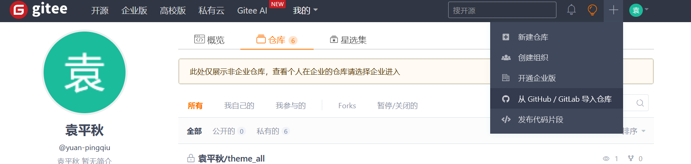

# Git_Learn

## 功能

- 参考教程
  - [菜鸟教程](https://www.runoob.com/git/git-tutorial.html)

### 分支改名

```shell
git branch -m master main
```


### Gitee私密个人项目

```shell
## 初始化
git init
## 添加远程仓库
git remote add origin-gitee <repos-url>
```



### 分支：

- 在新分支中开发
- 成功后合并到主分支-main


### 实操

```shell
##创建分支并切换过去
git checkout -b <branch_name> 	
## 切换至主分支
git checkout main
## 删除新分支
git branch -d <branch_name>\
## 推送分支
git push origin <branch>
```

### 更新与合并

```shell
## 更新本地仓库
git pull
## 合并其他分支到当前分支
git merge <branch>

```

### 替换本地改动

```shell
## 替换掉本地改动
git checkout --<filename>
## 丢弃本地的所有改动与提交，服务器获取最新版本
git fetch origin
git reset --hard origin/master
```

|      | word |      |
| ---- | ---- | ---- |
|      |      |      |
|      |      |      |
|      |      |      |
|      |      |      |
|      |      |      |


****
