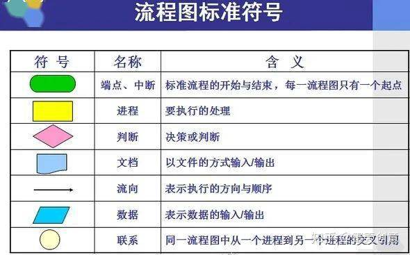
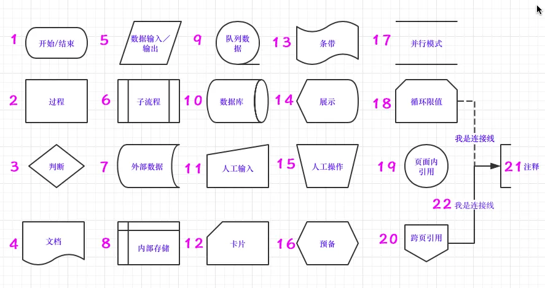
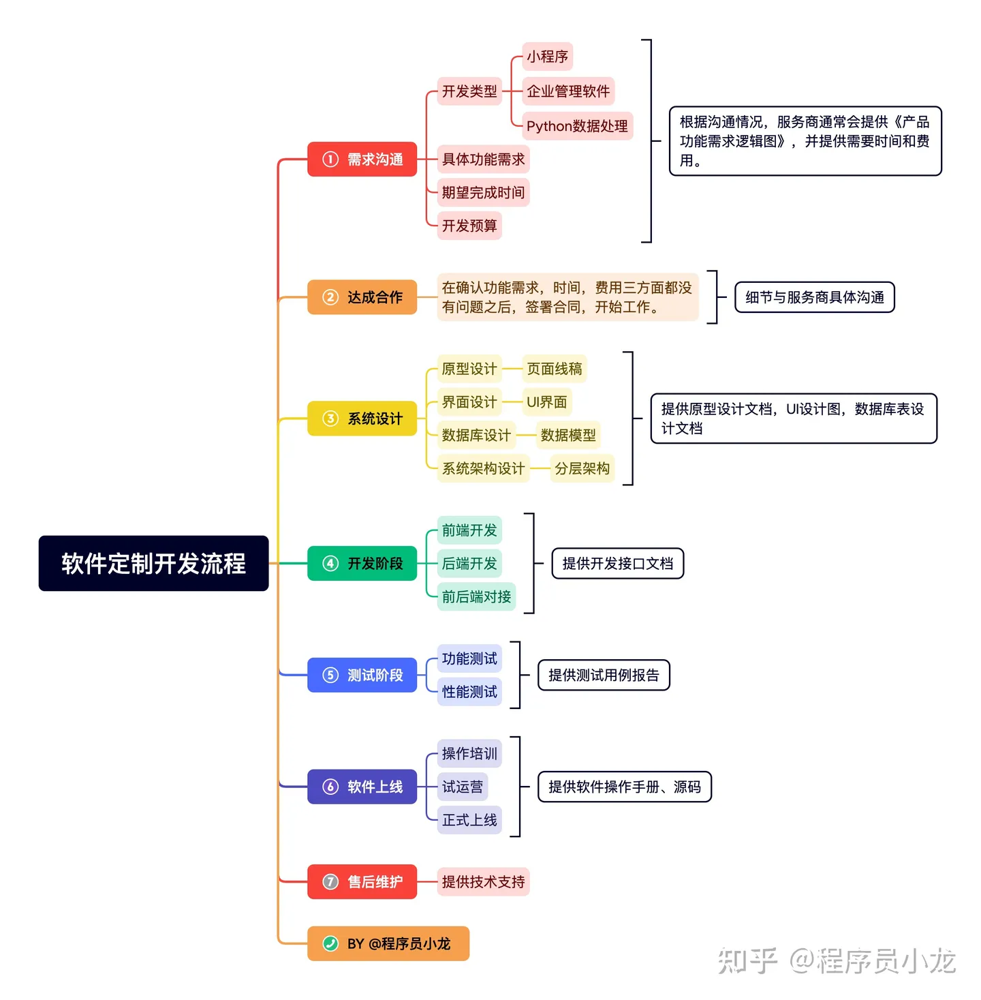

[toc]

# IDE

## Window

### VSCode

#### 基础设置

- 官网
  - [Download Visual Studio Code - Mac, Linux, Windows](https://code.visualstudio.com/download#)
  - docs：[Documentation for Visual Studio Code](https://code.visualstudio.com/docs/?dv=win64user)
- 配置
  - 设置>> 颜色主题 
  - 常用设置>> 字体
- 插件
  - Material Icon Theme
  - Material  Theme
  - Rainbow Brackets
  - Highlight Matching Tag
  - MarkDown All in One
  - MarkDown Preview Enhanced
  - Leetcode
  - Tabnine AI

#### 快捷键及简易功能

### Pycharm

- 插件

> [以下是一些在PyCharm中常用且实用的插件](https://zhuanlan.zhihu.com/p/339798430)[1](https://zhuanlan.zhihu.com/p/339798430)[2](https://blog.csdn.net/cqcre/article/details/113207681)[3](https://blog.csdn.net/qq_34160248/article/details/122930696)[4](https://blog.csdn.net/weixin_43552143/article/details/119952802)：
>
> 1. [**Key Promoter X**：这是一个快捷键管理工具，它可以帮助你更快地掌握PyCharm的快捷键](https://zhuanlan.zhihu.com/p/339798430)[1](https://zhuanlan.zhihu.com/p/339798430)[2](https://blog.csdn.net/cqcre/article/details/113207681)[3](https://blog.csdn.net/qq_34160248/article/details/122930696)[4](https://blog.csdn.net/weixin_43552143/article/details/119952802)。
> 2. [**IdeaVim**：这个插件可以让你在PyCharm中使用Vim的命令来编辑代码](https://zhuanlan.zhihu.com/p/339798430)[1](https://zhuanlan.zhihu.com/p/339798430)[2](https://blog.csdn.net/cqcre/article/details/113207681)[3](https://blog.csdn.net/qq_34160248/article/details/122930696)[4](https://blog.csdn.net/weixin_43552143/article/details/119952802)。
> 3. [**Markdown support**：这个插件可以让你在PyCharm中阅读和编辑Markdown文档](https://zhuanlan.zhihu.com/p/339798430)[1](https://zhuanlan.zhihu.com/p/339798430)[2](https://blog.csdn.net/cqcre/article/details/113207681)[3](https://blog.csdn.net/qq_34160248/article/details/122930696)[4](https://blog.csdn.net/weixin_43552143/article/details/119952802)。
> 4. [**Jupyter Notebook**：这个工具可以让你在PyCharm中使用Jupyter Notebook](https://zhuanlan.zhihu.com/p/339798430)[1](https://zhuanlan.zhihu.com/p/339798430)[2](https://blog.csdn.net/cqcre/article/details/113207681)[3](https://blog.csdn.net/qq_34160248/article/details/122930696)[4](https://blog.csdn.net/weixin_43552143/article/details/119952802)。
> 5. [**Regex Tester**：这是一个正则表达式测试工具，可以帮助你测试和调试正则表达式](https://zhuanlan.zhihu.com/p/339798430)[1](https://zhuanlan.zhihu.com/p/339798430)[2](https://blog.csdn.net/cqcre/article/details/113207681)[3](https://blog.csdn.net/qq_34160248/article/details/122930696)[4](https://blog.csdn.net/weixin_43552143/article/details/119952802)。
> 6. [**Auto PEP8**：这个工具可以自动将你的代码格式化为符合PEP8规范的样式](https://zhuanlan.zhihu.com/p/339798430)[1](https://zhuanlan.zhihu.com/p/339798430)[2](https://blog.csdn.net/cqcre/article/details/113207681)[3](https://blog.csdn.net/qq_34160248/article/details/122930696)[4](https://blog.csdn.net/weixin_43552143/article/details/119952802)。
> 7. [**Test RESTful Web Service**：这个工具提供了RESTful接口测试界面，提供了get、post，put等http方法](https://zhuanlan.zhihu.com/p/339798430)[1](https://zhuanlan.zhihu.com/p/339798430)[2](https://blog.csdn.net/cqcre/article/details/113207681)[3](https://blog.csdn.net/qq_34160248/article/details/122930696)[4](https://blog.csdn.net/weixin_43552143/article/details/119952802)。
> 8. atom_material icons 
> 9. translation 
>

----

# 流程图

## 参考

https://zhuanlan.zhihu.com/p/538103486

### 相关概念定义

> 系统业务流程图、程序流程图、开发流程图
>
> 标准规范：ANSI

### 规范

- 标准符号

- 相关准则
  - 进程编号从1开始，同级别为1.1，命名为动宾结构
  - 单输入单输出
  - 连接线避免交叉，判断语句标明判断结果
  - 同一路径只可有一个箭头
  - 合并同类项

- 开发流程

