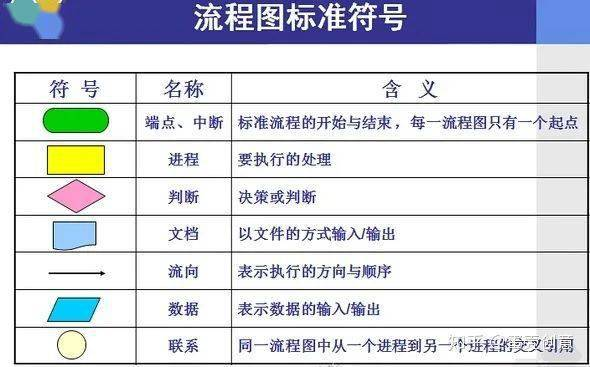
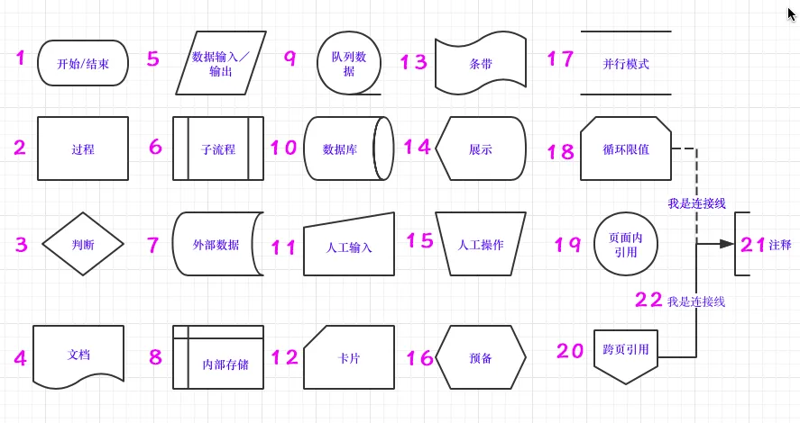
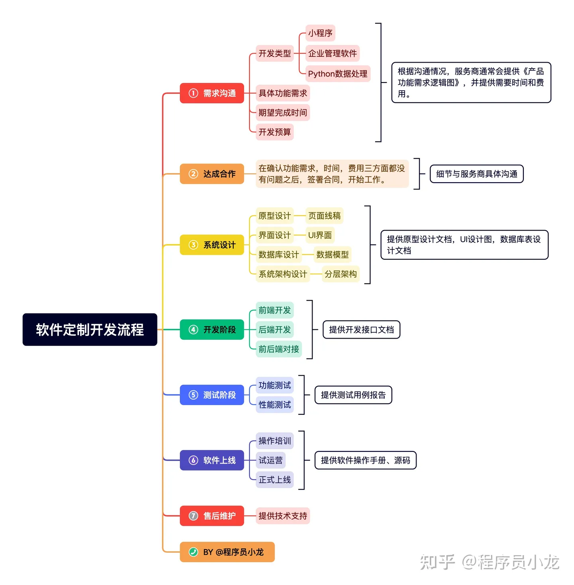

# 流程图

## 参考

https://zhuanlan.zhihu.com/p/538103486

### 相关概念定义

> 系统业务流程图、程序流程图、开发流程图
>
> 标准规范：ANSI

### 规范

- 标准符号

 

 

- 相关准则
  - 进程编号从1开始，同级别为1.1，命名为动宾结构
  - 单输入单输出
  - 连接线避免交叉，判断语句标明判断结果
  - 同一路径只可有一个箭头
  - 合并同类项

- 开发流程

 
