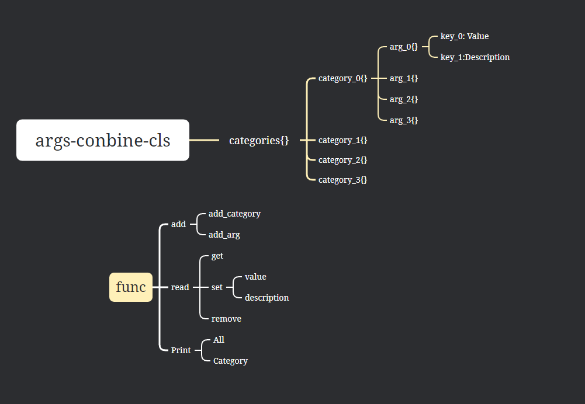

# 实参类

## 简介

### 需求

- 问题描述

> 编写大型程序中，多模块、多函数、函数间存在复杂的调用：
>
> 1. 参数传递臃肿：模块间调用和模块内调用函数， 阅读、维护和调试困难
> 2. 参数传递臃肿：模块间调用和模块内调用函数， 阅读、维护和调试困难
> 3. 参数关系复杂：有必须参数、可选参数、默认参数、依赖性参数、选项参数、互斥参数
> 4. 维护问题：参数命名及作用功能等，混淆、遗忘和使用方法复杂，添加注释、文本也许会好

- 需求描述

> 功能实现-配置文件保存变量：
>
> 1. 将参数保存为配置文件（yaml,XML）或是数据库（db,MySQL）
> 2. 加载、编辑配置文件（读写改删存）
> 3. 配置数据转化为整合参数，类似于argparser。（自定义的封装类）
> 4. 参数结构：名称、类型、数量、文档、注释、依赖性、互斥性
> 5. 编程维护便利：注释文本打印提升，构建中？

- 方案参考
  - [YAML菜鸟教程](https://www.runoob.com/w3cnote/yaml-intro.html)
  - [XML菜鸟教程](https://www.runoob.com/xml/xml-tutorial.html)

```python
# Yaml方案
import yaml

# 读取 YAML 文件
with open('config.yaml', 'r') as file:
    config = yaml.safe_load(file)

# 修改配置
config['database']['password'] = 'new_password'

# 写入修改后的配置
with open('config.yaml', 'w') as file:
    yaml.dump(config, file)

    
# XML格式
import xml.etree.ElementTree as ET

# 读取 XML 文件
tree = ET.parse('config.xml')
root = tree.getroot()

# 修改配置
for elem in root.findall('.//password'):
    elem.text = 'new_password'

# 写入修改后的配置
tree.write('config.xml')

```

## 实现



- 逻辑：
          1.字典嵌套
          2.编辑字典键值对
          3.顶层字典是用于保存实参的类目
          4.类目以字典的形式保存实参
- 使用：
          1.创建对象
          2.添加类目，并以此添加实参和描述
          3.打印实参表检查

## 其他功能

- 未完成
  - 检查：互斥、依赖参数

```python
import yaml

# 读取 YAML 文件
with open('my_config.yaml', 'r') as file:
    yaml_data = yaml.safe_load(file)

# 创建 MyConfig 类的实例
my_config = MyConfig(**yaml_data)#等价于my_config = MyConfig(arg1=yaml_data['arg1'], arg2=yaml_data['arg2'], arg3=yaml_data['arg3'])
# 使用参数
print(my_config.arg1)
```

### 类的保存和导出

- 流程
  - 内置方法：保存、加载
  - :file_folder:`cfg`

- 方案1：pickle

```python
# 保存对象
with open('my_obj.pkl', 'wb') as f:
    pickle.dump(obj, f)
# 加载对象
with open('my_obj.pkl', 'rb') as f:
    loaded_obj = pickle.load(f)
```

- 方案2：YAML

```python
import yaml
# 将字典保存为YAML文件
with open('my_dict.yaml', 'w') as f:
    yaml.dump(my_dict, f)
```

