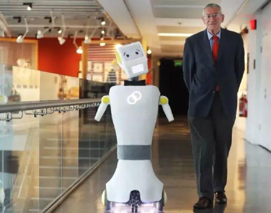
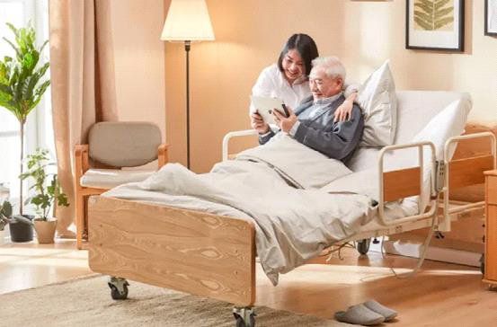
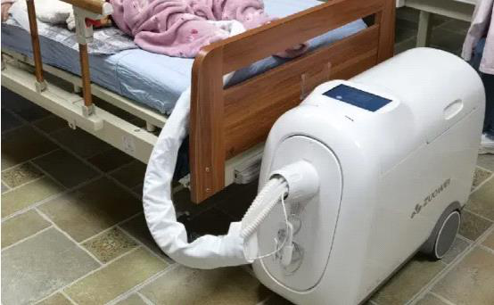
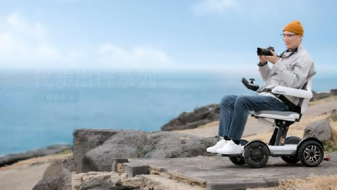
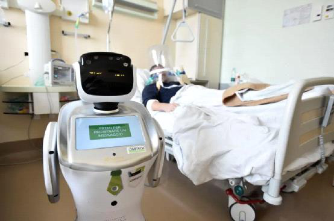
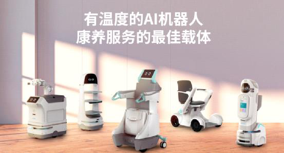
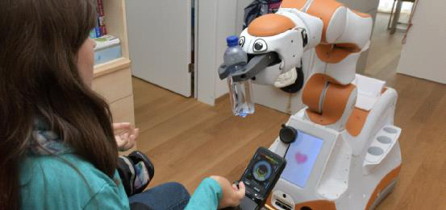

养老领域机器人需求愈发迫切，却为何入局者寥寥？机遇与挑战到底有哪些？

星期日, 九月 25, 2022

2:44 下午

养老领域机器人需求愈发迫切，却为何入局者寥寥？机遇与挑战到底有哪些？ 
=====================================================================

收录于合集

\#产业趋势 89 个

\#机器人 381 个

8月24日，中国老年人才网正式上线，将为老年人再就业拓宽渠道、搭建平台。老年人的问题再一次得到全社会关注。\
 

 

2022年，中国老年人数已经增加明显，有预估认为，至"十四五"期末，老年人口将突破三亿人。《中国发展报告：中国人口老龄化的发展趋势和政策》提到目前我国的老龄化程度已进入加速阶段，自2000年迈入老龄化社会之后人口老龄化的程度持续加深，到2050年，中国老龄化将达到峰值，中国65岁以上人口将占到总人口的27.9%。

 

 

随着银发社会的如期而至，"智慧养老"被提升至国家战略，全面贯彻智慧养老的发展路线被愈发重视。在智能养老普及阶段，十多年时间里，中国养老2.0时代产品"养老机器人"随之孕育而来。

 

 

但综合了多种类养老机器人来看，距离其真正良性落地却依然有着不远的距离。

 

 

 

 

AgeClub根据机器人能够解决的老年人需求类型进行划分，**将养老机器人主要分为护理机器人、康复机器人和陪伴机器人三大类，目前我们也按照这三类大致来区分不同企业。**

 

 

护理机器人集安全看护、主动提醒、危险预警、日常巡逻、社交陪护、健康管理等应用为一体，以帮助老年人日常起居为目标。主要包括移动辅助、生活辅助、护理检测三大类。

 

 

康复机器人包括外骨骼机器人、日常康复机器人，主要用于老人日常起居以及保健康复。用于养老保健的外骨骼机器人以轻型为主，悬挂式、牵引式等便于穿脱的产品为主流类型。

 

 

陪伴机器人则主要是人工智能与养老服务深度融合的智慧结晶，它既可以是智能语音助手等软件应用程序，也可以是承担照护服务的硬件设备，能够提供生活陪伴、行动辅助、基础诊疗、精神慰藉等多样化养老服务。

 

 

**综合而言，目前尽管养老服务机器人的框架设计以及趋于成熟，但真正完美落地的产品并不算多。**中国的养老机器人企业主要聚焦外骨骼以及较简单的陪伴机器人上，护理机器人产品相对不多且与医疗器械很难区分，需要更多大企业入局和引领。从现实的应用情况来看，养老服务机器人未来的生产、普及、使用必然还有更大的空间。

 

 

**▍护理机器人的大落差**

 

 

先来看护理机器人，这类产品主要针对失能老人研发，按照国际通行的日常生活活动能力量表："吃饭、穿衣、上下床、上厕所、室内走动和洗澡"六项指标，护理机器人的诞生初衷就是为了帮助老人完成这些动作。因为对于人类而言，一到两项难以自主完成定义为"轻度失能"；三到四项难以自主完成定义为"中度失能"；五到六项难以自主完成的定义为"重度失能"，**部分老人还会经历从中度到重度失能的过程。**

 

 

全国老龄办公布过一组数据：**我国有4200万+（半）失能老人，**较之健全老人，失能老人兼具失能人群与老人的双重弱势，且这部分老人呈现增长趋势。**对于这部分老人相对应的护理市场的需求正在加大，但人力资源的缺失矛盾问题一直客观存在。**

 

 

因为专业机构在护理失能老人的人员配置上，轻度失能老人的护理配置是4比1，即4个老人配置一个护理员；中度失能老人护理配置是3比1，重度失能老人的配置是2比1。如果按照3比1来推算，我国养老护理员的需求量将达到1500万。但根据民政部发布的数据，2020年我国仅有50余万名养老护理员，远不能满足失能失智老人的照护需求，市场缺口超千万。

 

 

 

 

全球护理机器人的形态都与传统医疗工具的差异并不大，因为所需功能较多且复杂，**因此外观都偏向于大型器械。**中国的护理机器人设计路线与日本有着非常多的相似之处，即解决老年人更多的介护服务难题同时降低成本。

 

 

例如传统意义上护工帮助老人下床、散步、穿衣与如厕等，会让老人觉得没有尊严和隐私，因此这些护理机器人的设计初衷都主要用于辅助失能、半失能、残疾或无家属照料的老年患者，以半自主工作或全自主工作的形式提供护理服务，**功能上则主要解决通便、翻身、警报、健康监测等问题，**提升老人的生活质量和自主能动性，减少护工人员的工作负担。

 

 

**但另一个问题在于，就买单客群来看，全球护理机器人企业产品的主要购买群体为医院以及疗养机构，少部分为个人，这与中国市场其实又有着较大区别。**

 

 

就中国的多款护理机器人产品市场情况来看，目前就排便机器人种类的销售较正常，其次还有护理床。护理床因为主要用于按时翻身以防生褥疮、对老人掉落造成骨折和死亡事故提供警报、检测病人呼吸、心率等指数，受到了部分医院的青睐从而得以存活。

 

 

在这类产品的基础上，目前也有类似可由床变成轮椅等多功能的融合式机器人，以及通过柔性机械臂实现运送拿取餐具、食物等，辅助部分肢体不便的老人自行进食的喂食机器人。但这部分市场由于预期尚不明朗，资本关注较少且买单人群并不算多。

 

 

排便机器人这个产品的市场经验其实具有一定参考价值，简单来看，养老机器人还是应该聚焦于功能。**我国伊利诺以及作为科技等企业都有**专门为生活不能自理的老年人以及其他卧床失能的患者研发的智能护理产品，主要用于自动解决卧床患者的大小便问题。

 

 

其技术原理我们也较为容易理解，例如伊利诺护理机器人由主机、工作头、软管三部分组成，采用微电脑控制技术，能智能检测技术自动感应患者大小便排泄情况，通过真空水气分离技术，采用多级系统处理，实现大小便的自动清洁与烘干，及时有效的私处清洁，可防止局部感染、尿路感染、褥疮等，阻止败血症的发生。从市场销售情况来看，这种机器人除了被当做医疗器械购买使用，因为占地面积不大且功能性极强，已经开始得到部分个人消费者的认可。

 

 

 

 

当然，也有将护理机器人当成整体解决方案进行设计和研发的企业，例如**博视医疗旗下柔机人公司**研发生产的场景助力护理机器人系统，该产品就设计了一个老人的空间，系统化解决失能老人上下床、室内走动，上厕所，沐浴的问题，卧床不起老人可以声控或一键控制，将自己从床上飘移到轮椅上，再带到浴室自动洗澡，带到厕所智能马桶上大小便，随后自动送回床上。据悉，目前此套产品已完成样机制作，但由于资本关注少，在量化生产、推广应用上仍然进展较为缓慢。

 

 

机器人大讲堂了解到，护理机器人进入市场，大多必须解决几个问题，首先由于要与人体密切接触并互动，**机器人本身不能有伤害老人的隐患，**往往必须经过严格的医疗器械认证及相关检验。**其次这类是护理机器人一般体积太大，**在中国3室1厅或2室1厅家里很难实现有效使用，同时价格往往太高。

 

 

**这导致大部分护理机器人目前主要意向客户群体为护理机构和医院ICU等科室，但这又与中国传统家庭90－7－3的养老模式和观念相违背，中国提倡的社区养老模式多年来成效并不明显，养老机器人的大规模铺开，可能需要更中国社区养老基建快速发展。**因为以上种种原因，使得中国对应医疗护理机器人的研发应用进展并不算迅速，大多是上市企业的子公司在进行相关方向的探索。

 

 

但毫无疑问，人工成本必然会成为未来中国20-50年的问题，加上就护理市场而言，再专业的纯人工护理都会有自己的情绪，都会有疲劳、犯错、没耐心的时候，比如护工忘记送药延误老人身体康复，送餐不准时影响老人身体健康，给老年人脸色让老人精神紧张......这些情况会直接影响老人年的生活体验。

 

 

 

 

因此，养老护理服务可以预见将走向精细化，机构、社区等养老服务提供者，未来都会围绕老人不同需求去做精细化的服务。目前，助安、助医、助餐、助办、助浴、助乐等等康养场景都在跟科技紧密结合，以给老人更好的服务体验，养老机器人也必然会走到与未来社区等场所的增值服务结合，迎来更大的行业发展高潮。

 

 

**▍康复机器人渐成现实**

 

 

再来看康复机器人，这部分领域的发展源于各国对康复医疗领域的逐渐重视，以及消费者对轻型康复医疗设备的巨大需求，相对于护理机器人而言，康复机器人在中国市场更受欢迎。

 

 

康复机器人最初服务对象主要是脑卒中、脊髓损伤等神经系统损伤的半失能老人，2015年后转而主要解决老年人或者半失能人士的出行问题，可穿戴康复+辅助行走的外骨骼机器人横空出世，在2018年前后由于康复机器人可以通过多次训练数据，最终以报告的形式反馈给医师，人们发现这能提高康复方案的准确性和康复率，从而开始迅速被医疗机构认可并得到资本热捧。

 

 

而后康复机器人也根据场景不同，演变出了轮式以及其他类似移动的康复机器人，例如霍金的轮椅以及类似Kinova机械臂+电动轮椅组合，**这些产品进一步丰富了康复机器人的种类。**

 

 

一般而言，康复机器人技术应该需要融合传感、控制、信息、融合、移动计算，为作为操作者的人提供一种可穿戴机械机构的综合技术。但自2016年以来，工信部、国务院、发改委等多部门陆续发布了支持外骨骼机器人行业发展的政策，康复机器人的场景和定义开始偏向于外骨骼机器人。

 

 

例如2020年以来，广东、河北、上海、浙江等多省均出台了外骨骼机器人相关政策，**支持外骨骼机器人产业的发展及其在医疗康复、养老等领域的应用，后续外骨骼机器人一度成为康复机器人的唯一代表。**

 

 

得益于从国家到地方政策上的支持，许多外骨骼机器人头部企业开始重点开展医疗外骨骼的研发。例如在2018年，北京大艾机器人科技有限公司就成为第一个获得CFDA认证的外骨骼机器人企业，而后大艾机器人也快速完成Pre-A到A轮的融资，实现了从前期被动康复、中期主动康复、到后期辅助行走的全生命周期产品类别布局。

 

 

 

 

不仅是大艾机器人，在外骨骼赛道上，傅利叶智能、迈步机器人、迈宝智能、尖叫智能、睿瀚医疗、安阳神方、璟和机器人、广东一康等作用于不同外骨骼领域和功能的企业也愈发受到市场和资本的关注。

 

 

但在2021年底，国务院发布的《"十四五"国家老龄事业发展和养老服务体系规划》，进一步提出加快人工智能、脑科学、虚拟现实、可穿戴等新技术在健康促进**类康复辅助器具中的集成应用、加大机器人等产品在老年人康复训练、行为辅助、健康理疗和安全监护中的应用力度，**促进我国老龄事业发展和养老体系的完善化建设。

 

 

**在外骨骼机器人之外，开始有类似智能助行机器人企业获得大额融资。**例如今年6月，上海邦邦机器人就宣布完成近亿元B轮融资，其辅助出行机器人产品主要用于满足出行困难群体对\"智能化服务+主动式安全防护+多环境适应能力\"的需求，邦邦机器人目前已先后上市了两款代表性智能产品：其中，智能辅助移动机器人主要面向移动困难的残障人士，消费级代步机器人则面向帮助行动不便的各类用户。

 

 

 

 

但就产品而言，该类产品很像电动轮椅，但由于加入ESP、Slam，实现了轮椅在特定情况下的实现自主行驶轨迹校正功能，同时具有自主导航、语音交互等多种功能，自动化智能化程度更高，一些变体也能够完成辅助坐下和站起、行走等动作，类似产品包括作为科技、新松等企业进行试水。

 

 

有业内专家表示，目前国内很多康复机器人产品依然自主性、自主性不足，语音识别技术的准确度与运算速度也有待提高。**未来康复机器人为了更大限度满足人类的需求，设计上应该从人机交互体验上越来越倾向于体察人类的情感和意图，产品整体轻量化程度更高，**这样才能区分于一般传统设备，真正当得起"机器人"这个称呼。

 

 

这就可能需要企业尝试采用更符合人体工学的机构优化设计、选取轻型化选型的材料，实现机构的便携性，才有可能适用于室内、室外多种地面的移动模式，真正打开走向室外复杂场景的可能性，帮助老人走向更广阔天地。

 

 

**▍陪伴机器人还需要时间**

 

 

养老陪伴机器人一般被认为是服务机器人的一个分支，该部分机器人主要通过语音交流，以人工智能、语音语义交互理解为技术基础，为老年人提供聊天工具，少数为老年人提供娱乐功能。

 

 

例如优必选科技曾与中国老龄协会老年人才信息中心、中国中医药科技开发交流中心联合成立了"智慧康养服务机器人研究院"，曾开发了面向家庭的智慧康养陪护机器人------笑宝。这款具备舞蹈、运动、播放音乐戏曲、主动问候、闲谈聊天等功能的机器人，针对老年人精神需求设计，得到了许多老人的认可。

 

 

同时，养老陪伴机器人企业还在发展的过程中不断通过功能强化产品价值，进阶陪伴机器人在各个场景下的家居联动功能，升级智能生态系统，使机器人成为环境的一部分。例如开始加入更大的屏幕，更强的移动灵活性，量血压、提醒吃药等更灵活的护理照护，又例如提供居家安防、智能AIot、一键呼救、视频语音通话等功能，可24小时跟踪并陪伴老年人的起居生活，还可与医院等机构实现远程诊断医疗。

 

 

 

 

例如科大讯飞就曾推出两款可服务老年人的康护机器人，集"测、诊、疗、管、陪"于一体，具有体征测量、智能诊断等实用化功能，可实现人体安全看护、环境安全监测、健康闭环管理、精神娱乐陪护等功能。

 

 

当然，在这些基础功能上，许多机器人厂商也在尝试人形机器人的突破，用于执行复杂的家务工作并提供更全面的智慧养老服务。但因为人形机器人涉及行走、感知、交互与智能化三大技术问题，因此其发展进程在极大程度上取决于机构设计、控制技术、传感器技术，以及人工智能技术的发展进程，加之可能出现的恐怖谷效应，人形机器人作为养老陪伴的伙伴真正深入家人类家庭生活中可能还有非常长的距离。目前例如优必选等企业正在朝着多元化养老产业不断进发，具体成果也涵盖了多个养老机器人样式。

 

 

 

 

**▍结语与未来**

 

 

虽然国内从2015年开始各路人马都看到了养老机器人的商业机会，纷纷投入养老机器人领域创业，许多在国外有相关研发经验，背靠各大研究机构的研究人员、创业者也开始加入养老服务机器人行业，**但2019年Ageclub的数据表明活下来的企业只有100多家。**

 

 

到了2020年后，得益于整个机器人行业的关注度飞速提升，加之政策持续向康复护理机器人领域倾斜，扶持智能科技企业在起步阶段平稳发展，养老机器人这条相对不那么拥挤的赛道受重视程度陡增，**截至目前企查查能找到有超过 3000 条养老机器人及相关结果。**

 

 

中国的老年化程度开始提升，但全社会对于养老产业的关注还未达到一个爆发的临界点，要谈整体结论尚且缺乏实际支撑，但我们可以从日本政府推动养老产业的发展案例获得一些启发。

 

 

 

 

日本的人口老龄化程度非常高，**日本智慧养老体系建设的特点之一是政府主导和企业参与，扶持政策和资金补贴覆盖全面。**在2010年前后日本已经十分重视将先进的科技应用到老年人生活辅助设施上，每年投入大量研发经费鼓励企业开发新产品、新技术，让老人能够享受到科技进步的红利。

 

 

2018年起，日本中央和各地政府加大投入，每台护理机器人的最大援助金额从10万日元增加到30万日元，补贴率高达50%。经过十数年的经验积累，目前日本养老产业形成了以养老服务为核心，以旅游娱乐、健康保健、养老金融、老年用品等各个产业为支撑的养老健康生态系统。

 

 

但**同样日本市场护理机器人的成本和售价也十分高昂，**单个设备的造价就在几十万甚至几百万不等，对于许多家庭抑或是养老机构都难以承受。**为此"租赁"便成为目前日本护理机器人市场适用普遍的商业模式，**企业面向享有政府补助的养老社区或养老机构，投放"免费共享式"的护理机器人，**提高售后维护收益也成为一种较为盛行的商业模式，**这类商业模式对于整构建早期养老社区的中国同样具有普适性。

 

 

对老年人的关注度不应该仅仅局限于眼前，更长远来看机器人等新科技养老服务适老化反映了从智能化到智慧化的发展态势。

 

 

针对老年人的机器人，必然首先需要让老人能用、会用、敢用、想用，这需要从政府到全社会的共同努力。例如实现机器人辅助生活服务与康复训练，补齐养老护理人员短缺问题；又例如打造科技适老平台、社区养老渠道，营造优待善待老年的良性氛围，构建老年友好型社会，只有在满足老年人需求的基础上，我国不断加快推进康养机器人的成果转化和实用性落地，才有可能帮助更多老人"老骥思千里，飞鸿阅九洲"。

 

 

**排版 \| 麦子**

 

\-\-\-\-\-\-\-\-\-\-\-\-\-\-\-\--END\-\-\-\-\-\-\-\-\-\-\-\-\-\-\-\-\-\--

[]{.underline}[]{.underline}

**更多精彩**

[＊机器人+纺织真的是一门好生意吗？]{.underline}\
 

[＊雷军跟马斯克学"做人"，小米首款人形机器人是「商业操作」还是「技术延伸」？]{.underline}

[＊继大疆之后，这个拥有万亿级市场的空中赛道，有望颠覆世界交通！]{.underline}

[＊遨博在淄博市建立协作机器人生产基地，将进一步建立协作机器人产业链智慧工厂]{.underline}

[＊世界机器人大会 \| 协作机器人新势力强势来袭，后发先至背后秘诀全幕揭露！]{.underline}

[＊宇树亮相2022世界机器人大会，130只机器狗现场表演，背后彩蛋大揭秘]{.underline}

[＊2022世界机器人展｜达闼重磅发布智能执行器2.0和双臂机器人]{.underline}

[＊家庭服务机器人的切入点到底在哪？1999元，支持语言交互，商汤找到了吗？]{.underline}

[＊iRobot被收购，中国企业要背锅？挤泡沫后，服务机器人行业崛起正当时]{.underline}\
 

[＊零部件价格上调，引发明显连锁效应，2022机器人涨价风暴正在形成！]{.underline}

[＊定了！核酸检测机器人第三类医疗器械单独注册，全新采购法发布]{.underline}

[＊"轮腿"技术增强自控力，漫步车有望在火星"撒点野"]{.underline}

[＊视比特｜AI+3D视觉快递包裹分拣机器人，助力物流行业智能化升级]{.underline}

[＊一造科技｜发布全球首台元宇宙3D打印机]{.underline}

[＊一睹为快｜艾利特展示工站全在这了！]{.underline}

[＊协作移动机器人概念全新解析，软件赋能，开放未来]{.underline}

[＊"传统x科技"的碰撞 艾灸智能理疗新突破]{.underline}

[＊干货满满，KUKA AMR如何实现360°安全"小心机"？]{.underline}

[＊"稳"赢"芯"机遇∣节卡机器人牵手半导体龙头 构建中国智造"芯"格局]{.underline}

[＊活检交给机器人，你敢吗？天津大学等团队研发"小胶囊"采集样本稳准狠]{.underline}

 

 

**加入社群**

**欢迎加入【机器人大讲堂】读者讨论群， **共同探讨机器人相关领域话题，共享前沿科技及产业动态。

 

教育机器人、医疗机器人、腿足机器人、工业机器人、服务机器人、特种机器人、无人机、软体机器人等专业讨论群正在招募， 关注机器人大讲堂公众号，发送" **交流群 **"获取入群方式！

 

**招募作者**

机器人大讲堂正在招募【兼职内容创作者】，如果您对撰写机器人【科技类】或【产业类】文章感兴趣，可**将简历和原创作品投至邮箱： **[LDjqrdjt@163.com]{.underline}  

 

我们对职业、所在地等没有要求，欢迎朋友们的加入！

 

 

 

 \
 \
\
 

看累了吗？戳一下"在看"支持我们吧！

预览时标签不可点

微信扫一扫\
关注该公众号

[知道了]{.underline}

微信扫一扫\
使用小程序

[取消]{.underline} [允许]{.underline}

[取消]{.underline} [允许]{.underline}

： ， 。   视频 小程序 赞 ，轻点两下取消赞 在看 ，轻点两下取消在看 [\<From: https://mp.weixin.qq.com/s/tuM5qK7XB5auGfrYExP3NQ\>]{.underline}
