人形机器人行业专题报告：伺服电机再探讨

星期日, 九月 25, 2022

2:47 下午

 

人形机器人行业专题报告：伺服电机再探讨 
=======================================

收录于合集

（报告出品方/作者：国盛证券，张一鸣、刘高畅、欧阳蕤）

**一、电机技术日趋成熟，伺服电机和步进电机是行业主流**
======================================================

**1.1 历经 200 年技术更迭与产业磨砺，电机逐步走向成熟**

"电机"广义上来说包括电动机、发动机和原动机等所有可实现电能、机械能相互转化 的装臵，但通常情况下所谓电机指的是电动机。电动机也称马达，它的作用是将电能转 化为机械能，产生驱动力矩，作为用电器和机械设备的动力源。电机发展至今已有 200 多年的历史，其发展历程可分为以下四个重要阶段。

第一阶段：基本理论建立，直流电机产生（1821-1870）。1821 年法拉第制成了世界上 第一个实验电机的模型，并在 1831 年发现了电磁感应定律。1832 年皮克西利用磁铁和 线圈的相对运动，制成了一台原始型旋转磁极式直流发动机，这就是现在直流发电机的 雏形。1834-1870 年期间，发电机领域产生了三项重大发明和改进，即永磁体转变到电 流线圈、西门子兄弟从蓄电池他励发展到发电机自励、格拉姆提出环形绕组，此后发电 机与电动机的可逆原理被广泛接受，两者同步发展。

第二阶段：直流电机趋于成熟，交流电机开始受到关注（1870-1880）。1873 年，海夫 纳阿尔泰涅克发明了鼓形绕组，提高了导线的利用率。1880 年爱迪生提出采用叠片铁芯， 进一步降低了铁芯损耗与绕组温升。鼓形电枢绕组和有槽叠片铁芯结构一直沿用至今。随着直流电机的广泛应用，其固有缺点也很快暴露出来，主要问题在于远距离输电、电 机换向存在困难，因此 19 世纪 80 年代后，人们注意力逐渐向交流电机方向转移。

第三阶段：交流电机诞生并不断向前发展（1885-1890）。1885 年加利莱奥费拉里斯提 出了旋转磁场原理，并研制出厂二相异步电动机模型，1886 年移居尼古拉〃特斯拉也独 立地研制出二相异步电动机。1889 年多利沃多勃〃罗沃利斯基制成一台三相交流单鼠笼 异步电动机，与单相和两相系统相比，三相系统效率高、用铜少，电机性价比、容量体 积比和材料利用率均有明显改进。交流电机的研制和发展，特别是三相交流电机的研制 成功为远距离输电创造了条件，把电工技术提高到一个新的阶段。

第四阶段：电机理论和设计、制造技术逐步完善（20 世纪至 21 世纪）。进入 20 世纪， 工业的高速发展不断对电机提出新的要求，而自动化方面的特殊需要则使控制电机和特 种电机迅速发展。同时，这一时期电机理论不断丰富，材料和冷却技术不断改进，交、 直流电机的单机容量、功率密度与材料利用率都有显著提高。

第五阶段：永磁电机是 21 世纪电机发展方向（21 世纪至今）。进入 21 世纪，专用性、 轻量化、高性能是电机行业发展方向。在专门化的基础上，专用电机的节电潜能很大。而永磁电机控制性能好，节能且体积小，可通过频率的变化调速，又容易做成低速直接 驱动等优点，在医疗器械、视听产品、计算机、数控机床、电动车辆、航空航天产品等 领域得到广泛应用。同时轻量化需求下，属于永磁伺服电机中的小功率的空心杯电机等 微型电机开始得到各个行业的重视。

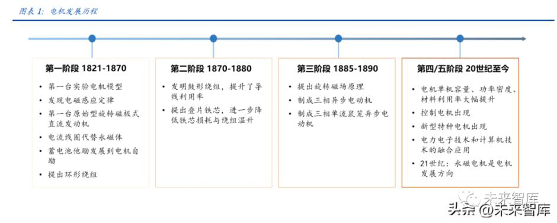

**1.2 人形机器人新增电机需求，伺服电机在众多分类中脱颖而出**

电机种类繁多，按用途可分为动力电机和控制电机两大类，动力电机功率较大，侧重于 电机的启动、运行和制动方面的性能指标，而控制电机输出功率较小，侧重于电机控制 精度和响应速度等指标。动力电机：按运动方式，可分为旋转电机和直线电机。旋转电机按电压性质分为直流电 机与交流电机，其中直流电机按内部有无碳刷可分为有刷电机和无刷电机两种；交流电 机按结构可分为同步电机和异步电机，按相数不同可分为三相交流电机和单相交流电机。交流电机按其转子结构不同，还可分为笼型和绕线转子型，其中笼型三相异步电动机为 应用最广的动力电机。控制电机：根据控制方法与用途的不同，可分为步进电机、伺服电机、测速电机、力矩 电机（也叫直驱电机）等，其中步进电机是一种电脉冲信号转换成角位移或者线位移的 电动机，每一个脉冲信号，对应的有一个角度，转速与脉冲频率有关。整体看，控制电 机相较于动力电机，增加了控制电路，但电机部分与动力电机并无本质区别，仍可按动 力电机的分类方式进行划分。

伺服和步进电机是控制电机下的主要产品，其中伺服电机优势更加明显。步进电机是一种将电脉冲信号转换成相应角位移或线位移的电动机，每输入一个脉冲信号，转子就转 动一个角度或前进一步，其输出的角位移或线位移与输入的脉冲数成正比，转速与脉冲 频率成正比。伺服电机则是一种补助马达间接变速装臵，其可以控制速度，位臵精度非 常准确，伺服电机分为直流和交流伺服电动机两大类，其主要特点是当信号电压为零时 无自转现象，转速随着转矩的增加而匀速下降。在数字控制的发展趋势下，运动控制系 统中大多采用步进电机或全数字式交流伺服电机作为执行电动机。两者在控制方式上相 似（脉冲和方向信号），但在使用性能和应用场合上存在着差异。步进电机通常为开环控 制，易出现失速或与控制器失去同步的情况。伺服电机为闭环控制，通过实时的闭环信 号反馈来调整，实现更精密的控制。综合来讲，伺服电机在控制精度、低频特性、过载 能力、速度响应等许多性能方面都优于步进电机，更适用于工业自动化、机器人等领域， 但步进电机具备性价比优势，在一些要求不高的场合仍可使用。

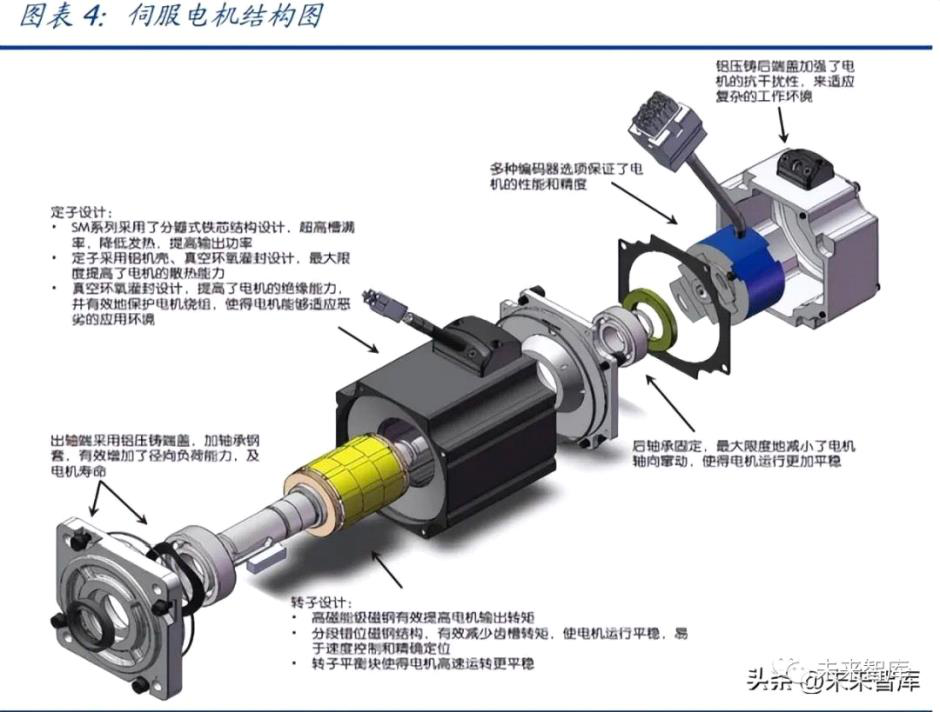

人形机器人新增更多电机需求，伺服电机和步进电机均具备适配性。特斯拉预计在 9 月 30 日的特斯拉第二个人工智能日（AI Day）发布人形机器人产品，人形机器人有望催生 更大的电机用量需求。从电机用量来看，单台人型机器人电机用量超 40 个，而对于所 使用的电机产品而言，具备更高控制精度并广泛使用于工业机器人、通用自动化领域的 伺服电机将是未来人形机器人的主要配臵。此外，对于步进电机而言，其在人形机器人的眼睛部位具备较好适配性，目前现有学术研究和实验设计中，在机器人仿生眼中使用 步进电机是较为理想和可靠的选择，因为仿生眼在需要具有人类一样的视觉功能，并且 体积较小，要求驱动摄像头的驱动机构具备小体积并能提供各自的两个自由度运动 （180°），而步进电机可以实现无位臵传感器的位臵控制，并保证平稳运行，因此在人 形机器人眼部安装步进电机具备较好适配性。

**二、人形机器人大时代来临，伺服电机需求有望爆发**
==================================================

**2.1 伺服电机种类众多，高效+轻量化+微型化产品是未来发展方向**

伺服电机产业链层次明晰，稀土磁材是必备原材料。伺服电机产业链涉及稀土磁材、电 子原器件、伺服系统制造、机器人等，上游来看，伺服电机行业的上游主要是稀土磁材 和电子零部件等其他材料，稀土磁材是伺服电机制造过程中必需的重要原材料。中游来 看，除伺服电机制造以外，伺服系统还包括伺服驱动器制造以及数控系统研发等环节。下游来看，伺服电机可以广泛应用于医疗器械、机器人制造、汽车制造和工业装备制造 等领域，具备广阔的应用前景。

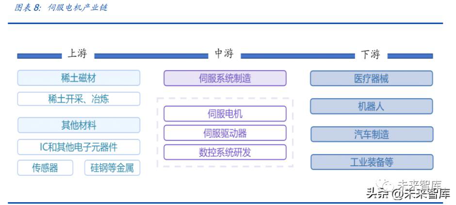

国内伺服电机市场规模近 200 亿元，汇川技术引领国产替代浪潮。近看来，我国伺服电 机市场规模稳步增长，根据工控网数据，2021 年我国伺服电机市场约 169 亿元， 2017-2021 年 CAGR 约为 10%，受到下游工业机器人、医疗器械、电子制造设备等产业 扩张的影响，伺服电机在新兴产业应用规模也不断增加。从竞争格局上看，汇川技术已 占领国内龙头地位，根据 MIR DATABANK 的数据显示，2021 年上半年，国产品牌中， 汇川技术在国内市场份额首次排名第一，市占率达 15.9%，除汇川外，排名靠前的电机 厂商依然以日本和中国台湾为主，包括日本安川（11.9%）、台湾台达（8.9%）、日本松下（8.8%） 和日本三菱（8.3%），行业 CR5 为 53.8%，集中度较高。但从国内其他厂商竞争力角度 看，在汇川引领下，众多国内电机企业开始奋起直追，包括禾川科技、江苏雷利、鸣志 电器在内的众多国内品牌都推出自己成熟的伺服电机产品，并开始在市场上崭露头角。

从分类上看，普通伺服电机、舵机和空心杯电机是主要类型。普通的伺服电机主要分为 直流伺服电机和交流伺服电机，其中直流电机是将直流电能转换为机械能，其按励磁方 式分为永磁、他励和自励 3 类，此外，对于直流电机而言，其还可以按照有无电刷（碳 刷）分为有刷直流伺服电机和无刷直流伺服电机。

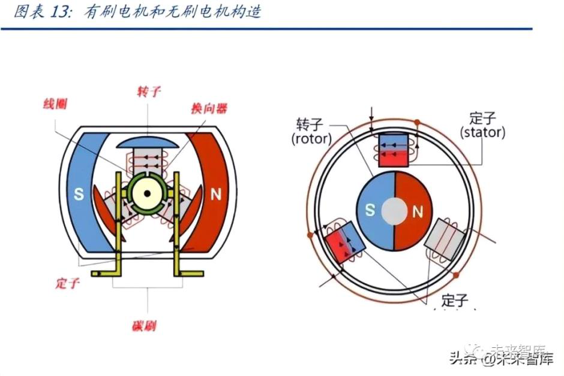

碳刷：碳刷是用于电机的换向器或滑环上，作为导出导入电流的滑动接触体。其导 电，导热以及润滑性能良好，并具有一定的机械强度和换向性火花的本能，几乎所 有的有刷电机都使用碳刷，它是有刷电机的重要组成部件。根据有无碳刷，直流伺 服电机分为有刷电机和无刷电机，有刷电机成本低，结构简单，控制容易，需要维 护，但由于维护不方便（换碳刷），产生电磁干扰，为了提高直流电机的使用寿命、运转稳定性以及降低直流电机的噪声和电磁干扰，无刷直流电机有逐步取代有刷电 机的趋势。对于交流伺服电机来说，一般不用恒磁场，所以用不着换向器，也就无 须电刷，故其也是无刷电机一种，分为同步和异步电机。

空心杯电机是直流电机的特殊形式。伺服电机中还存在一种直流永磁的伺服控制电 机，即空心杯电机，其体积较小且效率较高，属于微特电机的一种。空心杯电动机 由机壳、线圈、后盖、磁体和换向器组成，线圈看起来像一个水杯，故称空心杯， 其在结构上突破了传统电机的转子结构形式，采用的是无铁芯转子，也叫空心杯型 转子，这种转子结构彻底消除了由于铁芯形成涡流而造成的电能损耗，同时其重量 和转动惯量大幅降低，从而减少了转子自身的机械能损耗。此外，根据有无电刷， 空心杯电机亦可分为有刷空心杯电机和无刷空心杯电机。

以空心杯电机为代表的新型电机具备高效、轻量化、微型化等特点，其亦是伺服电机的 未来发展方向。在全世界节能环保理念广泛普及的背景下，高效率环保节能电机变成全 世界电机产业发展规划的共识，空心杯电机、直流无刷电机、伺服电缸等电机均具备更 高功率密度，符合绿色环保和低碳理念，未来在耗电量大、使用频率高的家电、机器人 等领域还将逐步渗透。此外，工业机器人、家用电器等设备越来越趋于高效节能化、小 型化及智能化，电机作为执行元器件的重要组成部分，对轻量化、微型化和响应速度的 要求也越来越高。以无槽无刷电机为例，近来年无刷直流电机已越来越多地替代有刷直 流电机，尤其在高速和长使用寿命的应用场景中，而无刷直流电机的铁芯为了安放电子 绕组，一般采用开槽设计，而铁芯的齿槽在磁场中会产生齿槽转矩，造成电机转矩波动、振动和嗓音，影响电机在速度控制系统中的低速性能和精度。因此无槽设计的无刷直流 电机逐渐被开发出来，与传统有槽无刷电机相比，其具备体积更小、成本低、功率密度 更高、过载能力更强等多个优点。整体看，我们认为，以空心杯电机、伺服电缸、无槽 无刷电机等为代表的新型电机在技术路径上正逐步向高效率、轻量化、低成本的方向持 续突破，这种技术导向有望成为一种产业发展趋势，各类产品也将在在机器人、家电、 汽车等领域进一步加速渗透。

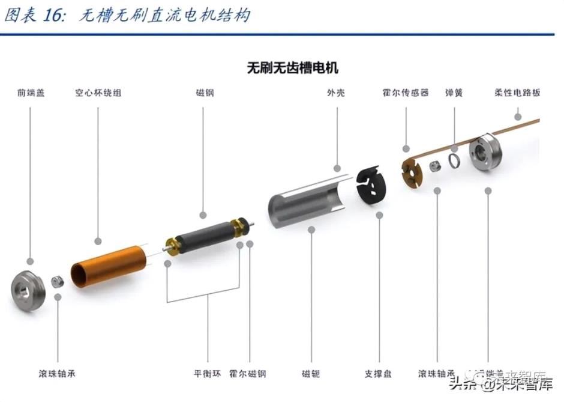

**2.2 仿真人形结构带动伺服电机用量迎来指数级增长**

特斯拉 Bot 即将推出，人形机器人带来更大想象空间。特斯拉预计在 9 月 30 日的特斯 拉第二个人工智能日（AI Day）发布人形机器人产品。这款机器人运用了特斯拉最先进 的 AI 技术，基于特斯拉在自动驾驶领域的技术积累进行开发，被称为是 2022 年最重要 的产品开发项目，甚至可能比汽车业务更重要。从已公布的参数看，特斯拉人形机器人 主要配臵包括：1）身高 5 尺 8 寸（约 1.73 米）；2）头部带有显示屏，用以展示信息；3）采用 Autopilot 的摄像头作为视觉感知传感器，共八个摄像头；4）采用 FSD Computer 作为计算核心；5）脖子、胳膊、手、腿、躯干累计搭载了 40 个机电传动器；6）搭载 多相机神经网络、基于神经网络的规化、自动标记、算法训练等；7）以轻量材料打造， 最高时速达 5 英里/小时。

单台人形机器人电机用量超 40 个，较传统工业机器人的电机用量大幅增长。从传统工 业机器人看，其可以分为多关节、SCARA、delta、协作机器人几大类，我们按照其各自 的自由度（关节数量）进行细分，多关节机器人和协作机器人多以六轴为主，单台六轴 机器人的六个自由度对应 6 台电机需求，SCARA 机器人拥有三个互相平行的旋转轴和一 个线性轴，故 4 个自由度对应 4 台电机，delta 机器人为并联结构，由三条从动臂组成， 对应 3 台电机，同时在旋转末端执行器位臵配备第四台电机，目前新一代的 Delta 机器 人一般是用直驱力矩电机取代伺服电机的设计，但数量上看单台机器人电机用量仍为 4 个。而特斯拉 Optimus 将搭载约 40 个电机，实现对颈部、手臂、手指、躯干、腿部等 部位的控制，电机数量较传统工业机械人和服务机器人有大幅提升。

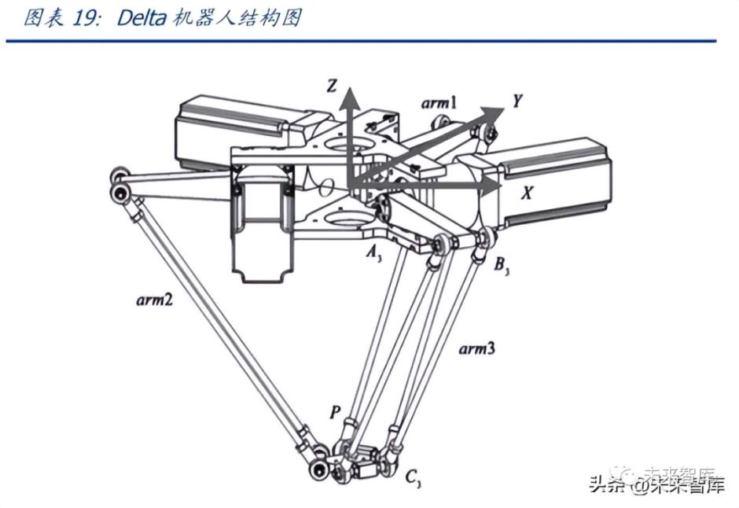

工业机器人：伺服电机用量需求保持稳定增长。根据 MIR 数据，2021 年我国工业 机器人销量为 25.7 万台，其中多关节/SCARA/delta/协作机器人占比分别为 61.9%/29.1%/6.0%/3.0%。假设各类机器人销量占比保持基本稳定，预计 2025 年 我国工业机器人销量有望突破 45 万台。同时，我们做出如下假设：1）假设多关节 机器人和协作机器人均为六轴机器人；2）delta 机器人均采用伺服电机而非新一代 的力矩电机；3）按照多关节/SCARA/delta/协作机器人的单台伺服电机用量 6/4/4/6 台进行计算。在此假设下，预计 2025 年我国工业机器人电机用量有望超过 240 万 台，整体需求保持稳定向上增长。

人形机器人：伺服电机需求量呈指数级增长，产业链迎来黄金时代。人形机器人关 节预计在 40 个以上，我们按照 40 个关节数量计算，对应 40 台电机用量，包括颈 部、手臂、手指、躯干、腿部等各个部位，我们在人形机器人销量达到 100 万台的 中性假设下，预计对应人形机器人电机用量达到 4000 万台，较传统工业机器人电 机需求量大幅增长。考虑到不同部位配臵的电机功率、大小存在差异，其价格也存 在差异，我们假设单台电机均价 1200 元，则单台人形机器人电机价值量有望达到 4.8 万元，按 100 万台销量计算，人形机器人有望带来 480 亿的增量市场空间。

**2.3 人形机器人手指关节自由度提升，空心杯电机具备较强契合度**

更加灵活的应用场景驱动下人形机器人手指应具备更高的自由度。人形机器人的重点在 于替代人的部分工作场景，同时进行更好的交互以辅助人进行工作，因此其会面临更加 多样化、更加复杂的应用场景，故赋予其手指关节更高自由度使得其具备抓取、传递等 基本功能是关键。考虑到人形机器人的仿真性，其手指关节处需要配备体积小且能输出 较大力的电机。我们认为，具备节能、灵敏且体积较小的空心杯电机和将伺服电机与丝 杠集成的模块化产品电缸，天然适配于人形机器人手指关节。

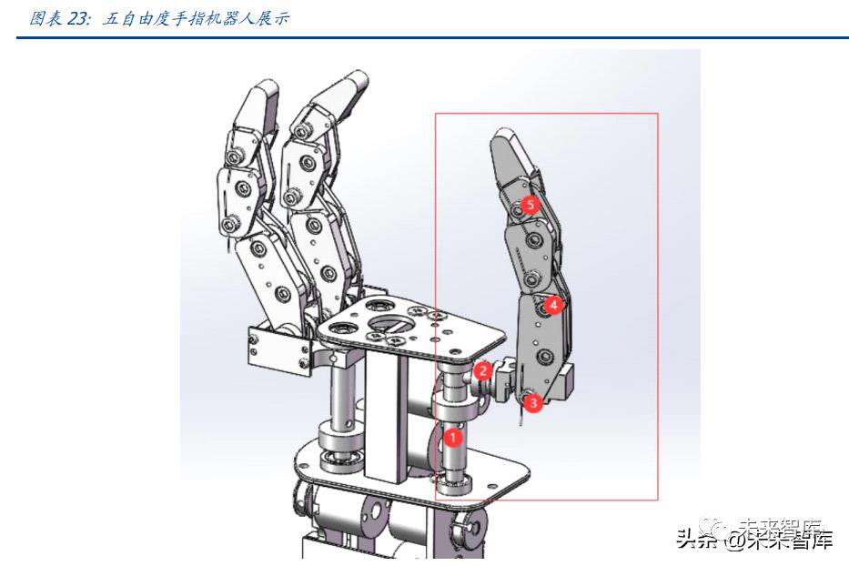

空心杯电机：优点明显，与人形机器人完美适配。空心杯电动机属于微型直流永磁 伺服电动机，它可以利用永磁铁产生磁场，从而实现直流供电。与传统电机的不同 之处在于，空心杯电机结构为转子无铁芯，转子无铁芯的结构设计一是可以降低电 机质量，二是可以降低电机的机械损耗，便于延长电机寿命，从根本上杜绝了因铁 芯而产生的铁耗，提升效率。空心杯电机可以分为无刷空心杯电机和有刷空心杯电 机，作为高效率的能量转换装臵，优点明显：1）节能性：能量转换效率高，其最大 效率一般在 70%以上；2）控制特性：起动、制动迅速，响应极快，在高速运转状 态下，可以方便地对转速进行灵敏的调节；3）运行稳定且十分可靠，转速波动很小， 能够容易的控制在 2%以内；4）重量轻，体积小：空心杯电动机的能量密度大幅度 提高，与同等功率的铁芯电动机相比，其重量、体积减轻超过三分之一。由于空心杯电动机克服了有铁芯电动机不可逾越的技术障碍，其在军事、各类工业产品、高 科技、民用电器等各领域应用广泛。而对工业机器人、仿生义肢等，空心杯电机凭 借其快速响应的随动系统能够很好发挥作用。对于人形机器人而言，空心杯电机除 快速响应外，体积小、重量轻、节能等各种特点都符合人形机器人需要，随着人形 机器人大时代来临，空心杯电机有望迎来需求爆发。

海外品牌占据高端市场，国内产品性价比优势明显。由于空心杯电机属于微特电机 的一种，而微特电机属于技术密集行业，其兴起于瑞士，发展于日本，而后随技术 扩散逐步向发展中国家转移，因此我国的空心杯电机产品较国外还存在一定差距。从微特电机的下游看，信息处理、家用电器和武器、航空等领域占据主要份额，而 目前在 IT 微特电机领域，日本企业相对领先，其中硬盘主轴电机是技术含量较高 的微电机，Nidec（电产）、inebea（美蓓亚）都是代表厂商，手机用线性震动电机 仅 SEMCO（三星电机）等少数企业可以供货。在汽车微特电机领域，同样是日本 企业主导市场，Nidec（电产）、ASMO（阿斯莫）、Mitsuba （三叶）、Denso（电装） 占据主要市场份额，空心杯电机作为电机的新的发展方向，国外厂商也纷纷加强产 品布局，如 Maxon（瑞士）、Faulhaber（德国）等著名微电机厂商都已经大量申请 空心杯电机相关的专利技术。目前，国内厂商在微特电机，尤其是空心杯电机领域 开始奋起直追，不断加速国产替代，从价格上看，国内厂商微特电机产品价格在几 百元不等，且性能上开始逐步收敛国外同类型产品，性价比优势凸显。

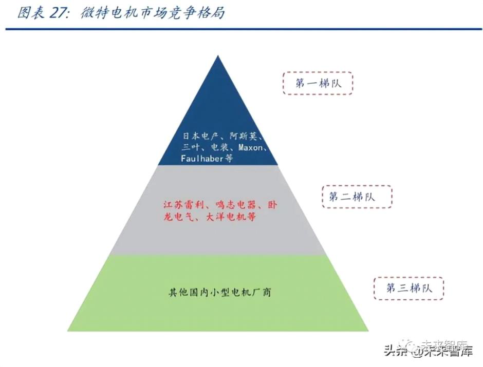

人形机器人有望带动空心杯电机用量大幅增长。考虑到空心杯电机体积较小，更易 于装配在机器人小关节处，保守假设下，我们假设空心杯电机仅用在人形机器人手 指关节处，且仅考虑三根手指装配空心杯电机（一只手臂），则单台机器人所需空心 杯电机数量为 6 台，中性假设人形机器人销量达到 100 万台，对应空心杯电机需求 量为 600 万台。

**2.4 伺服电缸符合人形机器人降能耗目标，产品需求有望持续推升**

动力问题是机器人的核心问题，波士顿动力采用液压执行器进行辅助驱动。波士顿动力 早期机器人主要是电机通过齿轮驱动连杆机构，对于没有载荷要求的机器人而言足够， 但 BigDog 这类以内燃机为动力且需搭载较大负荷的机器人产品系统能耗高，能量的多 次转换、多环节传递造成了大能量损失，原有设计方案无法满足。为了提高机器人运行 的效率、减小功率消耗以及提高运动稳健性，波士顿动力通过判断关节承受的载荷类型 和大小，以选择适当的液压或电动制动器，使得机器人的功率消耗最低。但从其动力来 源看，最主要依靠的驱动方式仍为液压驱动，在腿部上肢和下肢的连接处采取的多以液 压执行器为主，相比于纯电动执行器，在降功耗、提效率上仍存在一定不足。

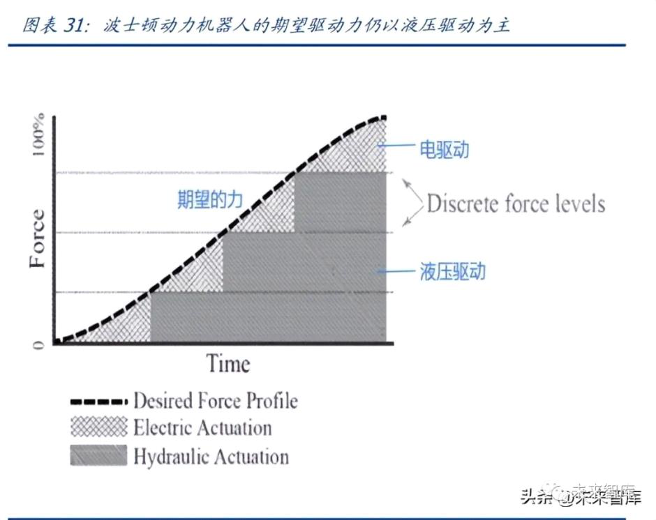

伺服电缸：有望替代液压执行器，完美符合人形机器人产品需求导向。伺服电缸是 将伺服电机与丝杠一体化设计的模块化产品，将伺服电机的旋转运动转换成直线运 动。伺服电缸通过结构上的改造将伺服电机自身优势转变成精确速度控制，精确位 臵控制和精确推力控制，从而实现高精度直线运动。从优点上看，伺服电缸能够快 速与 PLC 等控制系统连接，实现高精密运动控制，同时具备噪音低，节能，干净， 高刚性，抗冲击力，超长寿命，操作维护简单等优势，并且可以适应在恶劣环境下 的工作，广泛适用于造纸行业，化工行业，汽车行业，电子行业，机械自动化行业， 焊接行业等各领域。对于人形机器人而言，伺服电缸的节能、轻量化特点相比于液 压驱动具备较好的优势，符合特斯拉本身的电动化导向，也符合人形机器人产品未 来的要求。

伺服电缸契合人形机器人未来多方位的应用场景，需求量有望随之提升。伺服电缸 高精密运动控制的特点符合人形机器人的要求，同时低噪、节能、高刚性以及能够 适应恶劣环境工作的特点符合当前用户端对人形机器人应用场景的期望。从产品适 配上看，伺服电缸主要针对人形机器人膝关节、肘关节和肩关节的连接处，起到辅 助驱动的作用，使用伺服电缸相比于采用液压执行器，在控制成本的同时，也能够 降低机器人的重量，降低耗电量。我们按照保守情况做出预测，假设伺服电缸仅用 在人形机器人膝关节、肘关节和肩关节三处使用，则单台机器人所需伺服电缸数量 为 6 台，中性假设人形机器人销量达到 100 万台，对应空心杯电机需求量为 600 万 台。

**三、重点公司分析**
====================

**3.1 江苏雷利：中高端微特电机领军企业**

公司是全球家用微特电机领军企业，通过外延并购切入医疗器械、新能源汽车零部件、 工控等高景气赛道，打开新的成长空间。通过横向拓展应用领域，公司 2021 年实现收 入 29.2 亿元，同比增长 20.5%，收入增速边际改善。公司经过多年经营，已成为全球 知名的微特电机供应商。公司借鉴海外龙头经验，通过并购等方式切入医疗器械、新能 源、工控等高端应用场景。2021 年公司"多应用领域"战略成效显著，实现了工控市场 的重大突破，同时新能源、医疗器械领域也取得快速增长，实现营业收入 29.2 亿元，同 比增长 20.5%，收入增速边际改善。

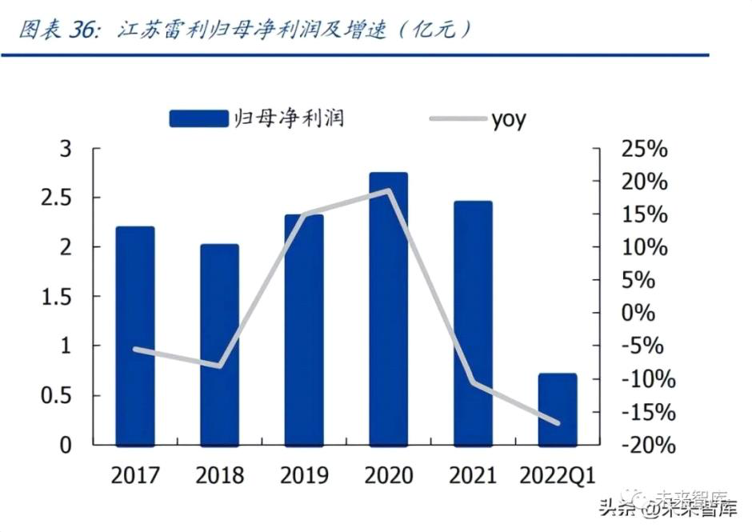

家用电机为基本盘，工控、医疗、新能源等高毛利产品快速放量。公司基本盘为家用电 机及组件，包括空调、冰箱、洗衣机等电机和组件，2021 年家用电机及组件（空调+冰 箱+洗衣机）收入为 16.4 亿元，占总收入比重 64.0%。工控产品主要为丝杆电机、无刷 电机及组件，主要应用于工业设备的阀门电机等，2021 年实现收入 2.95 亿元，同比增 长 60%。汽车零部件主要为汽车水泵、汽车电机及冲压件，医疗及运动健康电机及组件 主要为丝杆电机、跑步机电机及组件。从毛利率来看，工控、医疗等产品相较于传统家 电产品毛利率更高，有利于公司产品结构优化。

**3.2 鸣志电器：混合式步进电机龙头，加码无刷电机打造解决方案供应商**

公司是全球领先的电机及驱动系统制造商，在步入电机、伺服系统、无刷电机、空心杯 电机及驱动系统等方面实现了深入布局。其中混合式步进电机产品在全球市场一直享有 较高的市场地位，占据全球 10%以上市场份额，打破了日本企业对混合式步进电机的垄 断。从股权结构看，公司实控人为常建鸣先生，持有鸣志投资 90%股权，目前公司已形 成了以控制电机、驱动控制系统为核心，贸易代理及工业互联网等业务协同发展的业务 架构，其中鸣志国贸和鸣志美洲控股等核心子公司加速了公司全球范围内的业务布局。

业绩稳定增长，2021 年增长提速。公司深耕运动控制领域二十余年，业绩增长稳健， 2017-2020 年营业收入 CAGR 为 10.8%，归母净利润 CAGR 为 6.6%。2021 年公司布局 的工厂自动化、医疗器械、生化分析、移动服务机器人等新兴、高附加值领域业务成效 显著，通用自动化、驱动控制系统类业务也取得快速成长，实现营业收入 27.1 亿元，同 比增长 22.7%；实现净母净利润 2.8 亿元，同比增长 39.3%。2022 年以来受疫情影响， 业绩增速有所下滑。

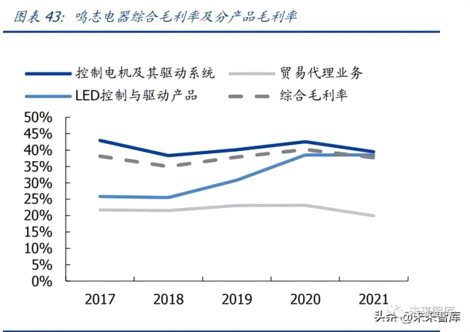

加码无刷电机，公司着力打造电机与丝杠一体化设计的模块化产品，优势明显。2020 年，公司通过变更募集资金投资约 0.62 亿元设立"无刷电机的新增产能项目"，项目达 产后将形成新增年产 227 万台高标准无刷电机的生产能力，预计将为公司新增营业收入 约 2.5 亿元/年。2021 年公司无刷电机业务实现营收 1.1 亿元，同比增长 81.5%，主要 源于产能的稳步提升以及得益于在移动服务机器人、高端医疗仪器等应用领域的增长。此外，公司自 2015 年开始组建精密直线传动系统业务，专注于打造电机与丝杠一体化 设计的模块化产品，目前公司精密直线传动系统业务聚焦重点行业，努力扩大存量市场 份额，通过持续完善平台化产品在增量市场上获得竞争优势，2021 年公司精密直线传动 系统业务实现营业收入 7310 万元，较上年同期增长 73.6%。整体看，公司"运动控制 器+电机驱动器+控制电机+精密直线传动系统"的组合形成了完整的运动控制业务系统， 标志着公司在自动化领域真正向解决方案级供应商的目标迈进。

（本文仅供参考，不代表我们的任何投资建议）

 

**来源 \| 未来智库**

**排版 \| 麦子**\
 

 

\-\-\-\-\-\-\-\-\-\-\-\-\-\-\-\--END\-\-\-\-\-\-\-\-\-\-\-\-\-\-\-\-\-\--

 

[]{.underline}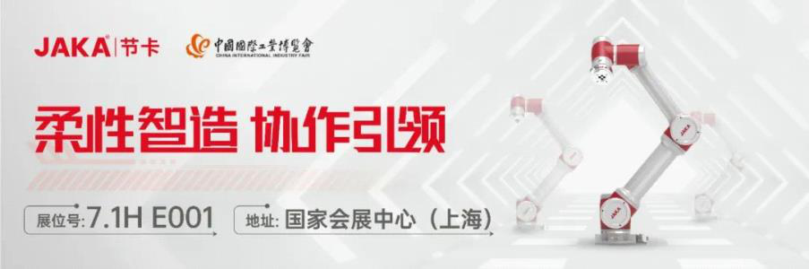[]{.underline}

 

**更多精彩**

[＊机器人+纺织真的是一门好生意吗？]{.underline}\
 

[＊雷军跟马斯克学"做人"，小米首款人形机器人是「商业操作」还是「技术延伸」？]{.underline}

[＊继大疆之后，这个拥有万亿级市场的空中赛道，有望颠覆世界交通！]{.underline}

[＊遨博在淄博市建立协作机器人生产基地，将进一步建立协作机器人产业链智慧工厂]{.underline}

[＊世界机器人大会 \| 协作机器人新势力强势来袭，后发先至背后秘诀全幕揭露！]{.underline}

[＊宇树亮相2022世界机器人大会，130只机器狗现场表演，背后彩蛋大揭秘]{.underline}

[＊2022世界机器人展｜达闼重磅发布智能执行器2.0和双臂机器人]{.underline}

[＊家庭服务机器人的切入点到底在哪？1999元，支持语言交互，商汤找到了吗？]{.underline}

[＊iRobot被收购，中国企业要背锅？挤泡沫后，服务机器人行业崛起正当时]{.underline}\
 

[＊零部件价格上调，引发明显连锁效应，2022机器人涨价风暴正在形成！]{.underline}

[＊定了！核酸检测机器人第三类医疗器械单独注册，全新采购法发布]{.underline}

[＊"轮腿"技术增强自控力，漫步车有望在火星"撒点野"]{.underline}

[＊视比特｜AI+3D视觉快递包裹分拣机器人，助力物流行业智能化升级]{.underline}

[＊一造科技｜发布全球首台元宇宙3D打印机]{.underline}

[＊一睹为快｜艾利特展示工站全在这了！]{.underline}

[＊协作移动机器人概念全新解析，软件赋能，开放未来]{.underline}

[＊"传统x科技"的碰撞 艾灸智能理疗新突破]{.underline}

[＊干货满满，KUKA AMR如何实现360°安全"小心机"？]{.underline}

[＊"稳"赢"芯"机遇∣节卡机器人牵手半导体龙头 构建中国智造"芯"格局]{.underline}

[＊活检交给机器人，你敢吗？天津大学等团队研发"小胶囊"采集样本稳准狠]{.underline}

 

 

**加入社群**

**欢迎加入【机器人大讲堂】读者讨论群， **共同探讨机器人相关领域话题，共享前沿科技及产业动态。

 

教育机器人、医疗机器人、腿足机器人、工业机器人、服务机器人、特种机器人、无人机、软体机器人等专业讨论群正在招募， 关注机器人大讲堂公众号，发送" **交流群 **"获取入群方式！

 

**招募作者**

机器人大讲堂正在招募【兼职内容创作者】，如果您对撰写机器人【科技类】或【产业类】文章感兴趣，可**将简历和原创作品投至邮箱： **[LDjqrdjt@163.com]{.underline}  

 

我们对职业、所在地等没有要求，欢迎朋友们的加入！

 

 

 

 \
 \
\
 

看累了吗？戳一下"在看"支持我们吧！

预览时标签不可点

微信扫一扫\
关注该公众号

[知道了]{.underline}

微信扫一扫\
使用小程序

[取消]{.underline} [允许]{.underline}

[取消]{.underline} [允许]{.underline}

： ， 。   视频 小程序 赞 ，轻点两下取消赞 在看 ，轻点两下取消在看 [\<From: https://mp.weixin.qq.com/s/3y7WJ5QWURhbpRfAz7XccQ\>]{.underline}
