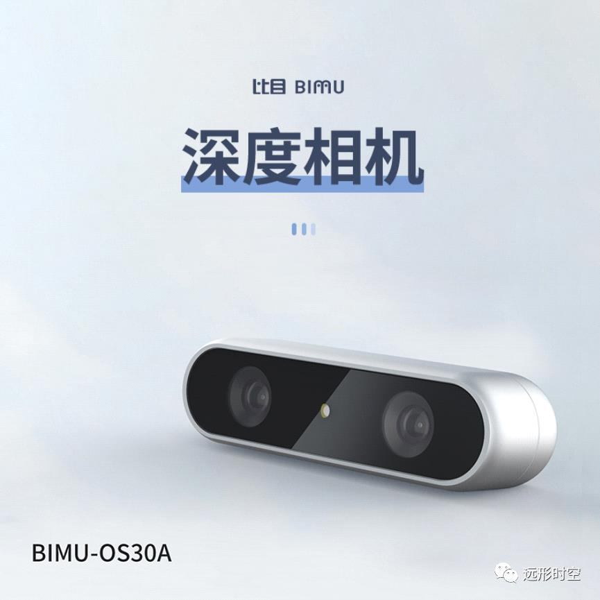

为机器人避障而生！

星期日, 九月 25, 2022

2:51 下午

 

为机器人避障而生！ 
===================

> 收录于合集
>
> 随着智能机器人的普及，越来越多的机器人开始工作在工厂，餐厅，商场，医院等场所。远形时空推出的BIMU-OS30A深度相机为智能机器人专门打造，在多个方面进行了精心设计。产品具备高性能、超低功耗、高性价比等诸多优势，为智能机器人在非结构化场景下提供高精准避障的能力。
>
>  
>
> 
>
>  
>
> BIMU-OS30A集成了远形时空在机器人和传感器领域的的多年积累，完美解决了视觉深度传感器在多种非结构化场景中的诸多挑战，包括：重复纹理导致的深度错误；阳光干扰导致的深度输出失效；机器人快速移动和旋转导致的光照快速变化，引起的深度测量滞后等问题。同时机器人长期运行在多变的环境中对传感器提出了高可靠性的要求，高低温，防水，防震等性能成为传感器的关键。最后，成本和可量产性成为传感器能够普及的关键。
>
>  
>
> **▍多种优化设计应对智能机器人使用场景**
>
>  
>
> **对抗重复纹理**\
>  
>
>  

-   **增加IR pass filter**

> 模组集成IR Pass filter，确保滤除干扰的重复纹理，提升有效纹理的对比度，在室内使用时有效解决墙面重复纹理装饰，空调栅格等场景的深度输出。

-   **高密度随机散斑**

> BIMU-OS30A采用10K以上随机散斑点，在提升了散斑点数量的情况下，有效提升了细小物体的识别，并提升了对抗重复纹理的性能。
>
>  

-   **深度滤波算法**

> 经过场景打磨的深度滤波算法，优化了各种极端场景下的效果。
>
>  
>
> **对抗阳光干扰**\
>  
>
>  

-   **超大像素，增加感光**

> 行业内率先采用超大1/3"传感器，3.75um大像素，比普通的传感器大56%的感光尺寸，感光能力高达6500mV/lux-sec。提升有效光照的基础上，减少了阳光的干扰。
>
>  

-   **特制IR pass filter**

> 模组集成IR Pass filter，提升了主动光的对比度，有效抑制阳光干扰。
>
>  

-   **定制红外激光发射器**

> 发射距离大于5m，无惧环境光干扰
>
>  
>
> **应对快速光照变化场景**
>
>  

-   **快速AE算法**

> 可实现5帧内收敛，满足机器人在多变光照环境下避障需求，助力机器人及时准确做出决策、执行的要求。
>
>  

-   **深度图优化**

> BIMU-OS30A针对过曝等场景做深度图优化
>
>  
>
> 
>
>  
>
> **▍高可靠性应对工业级使用环境**
>
>  
>
> **防水**
>
>  
>
> BIMU-OS30A采用整体防水防尘设计，轻松应对多种工业场景。
>
>  
>
> **耐高低温**
>
>  
>
> 模组的外部和内部材质都采用耐高低温材质。金属外壳配合内部的特制玻塑混合镜头，即使经历多次高低温冲击，依然能够品质如初。
>
>  
>
> **防震**
>
>  

-   全金属外壳设计

>  

-   康宁玻璃面板，增加防划伤镀膜

>  

-   内部结构采用高强度固化胶水等设计，抵御震动冲击等伤害

>  
>
> **低功耗**
>
>  
>
> 三合一集成设计，ISP图像处理单元+Depth深度处理引擎+USB处理IC，模组整体功耗降至最低1.5 W，有效减轻后端系统负担。
>
>  
>
> **▍展示视频**
>
>  
>
> 远形时空在机器人视觉SLAM和感知传感器领域深耕多年，产品累计量产达到数十万台。随着智能机器人的普及，未来机器视觉将实现从二维到三维的跨越式提升。远形时空希望继续深耕机器人领域，助力合作伙伴在丰富的场景应用下实现更大成功。
>
>  
>
> BIMU-OS30A已经处于量产状态，并通过多项第三方可靠性测试和认证。具体情况请咨询远形时空获取。
>
>  
>
> **远形时空科技（北京）有限公司**
>
>  
>
>  
>
> **地址：**北京市海淀区上地创业路8号1号楼1-1-302
>
> **电话：**010-56252542
>
> **邮箱：**info@hyperci.com
>
> **官网：**www.hyperci.com
>
>  
>
> **来源 \| 远形时空**
>
> **排版 \| 麦子**\
>  
>
>  
>
> \-\-\-\-\-\-\-\-\-\-\-\-\-\-\-\--END\-\-\-\-\-\-\-\-\-\-\-\-\-\-\-\-\-\--
>
>  
>
> 
>
>  
>
> **更多精彩**
>
> [＊机器人+纺织真的是一门好生意吗？]{.underline}\
>  
>
> [＊雷军跟马斯克学"做人"，小米首款人形机器人是「商业操作」还是「技术延伸」？]{.underline}
>
> [＊继大疆之后，这个拥有万亿级市场的空中赛道，有望颠覆世界交通！]{.underline}
>
> [＊遨博在淄博市建立协作机器人生产基地，将进一步建立协作机器人产业链智慧工厂]{.underline}
>
> [＊世界机器人大会 \| 协作机器人新势力强势来袭，后发先至背后秘诀全幕揭露！]{.underline}
>
> [＊宇树亮相2022世界机器人大会，130只机器狗现场表演，背后彩蛋大揭秘]{.underline}
>
> [＊2022世界机器人展｜达闼重磅发布智能执行器2.0和双臂机器人]{.underline}
>
> [＊家庭服务机器人的切入点到底在哪？1999元，支持语言交互，商汤找到了吗？]{.underline}
>
> [＊iRobot被收购，中国企业要背锅？挤泡沫后，服务机器人行业崛起正当时]{.underline}\
>  
>
> [＊零部件价格上调，引发明显连锁效应，2022机器人涨价风暴正在形成！]{.underline}
>
> [＊定了！核酸检测机器人第三类医疗器械单独注册，全新采购法发布]{.underline}
>
> [＊"轮腿"技术增强自控力，漫步车有望在火星"撒点野"]{.underline}
>
> [＊视比特｜AI+3D视觉快递包裹分拣机器人，助力物流行业智能化升级]{.underline}
>
> [＊一造科技｜发布全球首台元宇宙3D打印机]{.underline}
>
> [＊一睹为快｜艾利特展示工站全在这了！]{.underline}
>
> [＊协作移动机器人概念全新解析，软件赋能，开放未来]{.underline}
>
> [＊"传统x科技"的碰撞 艾灸智能理疗新突破]{.underline}
>
> [＊干货满满，KUKA AMR如何实现360°安全"小心机"？]{.underline}
>
> [＊"稳"赢"芯"机遇∣节卡机器人牵手半导体龙头 构建中国智造"芯"格局]{.underline}
>
> [＊活检交给机器人，你敢吗？天津大学等团队研发"小胶囊"采集样本稳准狠]{.underline}
>
>  
>
>  
>
> **加入社群**
>
> **欢迎加入【机器人大讲堂】读者讨论群， **共同探讨机器人相关领域话题，共享前沿科技及产业动态。
>
>  
>
> 教育机器人、医疗机器人、腿足机器人、工业机器人、服务机器人、特种机器人、无人机、软体机器人等专业讨论群正在招募， 关注机器人大讲堂公众号，发送" **交流群 **"获取入群方式！
>
>  
>
> **招募作者**
>
> 机器人大讲堂正在招募【兼职内容创作者】，如果您对撰写机器人【科技类】或【产业类】文章感兴趣，可**将简历和原创作品投至邮箱： **[LDjqrdjt@163.com]{.underline}  
>
>  
>
> 我们对职业、所在地等没有要求，欢迎朋友们的加入！
>
>  
>
>  
>
> 
>
> 
>
>  
>
>  \
>  \
> \
>  
>
> 看累了吗？戳一下"在看"支持我们吧！
>
> 预览时标签不可点
>
> 
>
> 微信扫一扫\
> 关注该公众号
>
> [知道了]{.underline}
>
> 
>
> 微信扫一扫\
> 使用小程序
>
> [取消]{.underline} [允许]{.underline}
>
> [取消]{.underline} [允许]{.underline}
>
> ： ， 。   视频 小程序 赞 ，轻点两下取消赞 在看 ，轻点两下取消在看 [\<From: https://mp.weixin.qq.com/s/AzGPRkd65sgmS2dESHeE-g\>]{.underline}
