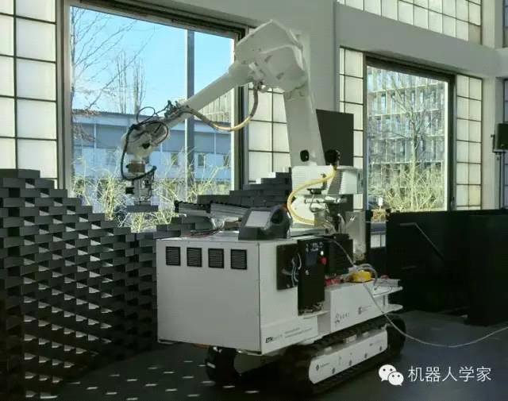
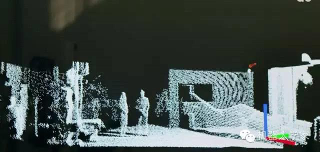
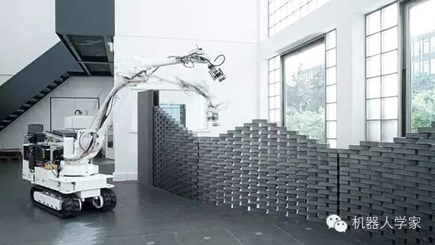

前沿丨ETH创办数字化建造实验室，将机器人推向工地

星期三, 五月 17, 2023

4:49 下午

已剪辑自: [https://mp.weixin.qq.com/s?\_\_biz=MzA3ODQ1NDEzMw==&mid=208426247&idx=2&sn=a8d04eff40c1b0a0ec1ff51bc3ee827b&chksm=16da791d21adf00b7e2583aa61b748ff62dc611823ebf63c6895882b161bed97455539205952&mpshare=1&scene=24&srcid=1029S4Yx8542T5nxWBS1GGcp&sharer\_sharetime=1667020069114&sharer\_shareid=ff2a8143f2589bdc0dabe2e52541346b\#rd]{.underline}

**来源：机器人学家**

上周，我们报道过一些能高效自动化盖楼的机器人。而在瑞士的国家科学中心------ETH苏黎世，一个数字化建造实验室（Digital Fabrication Lab）刚刚成立。它存在的目的便是探索在建筑自动化这件事上，机器人究竟能走多远。而现在，他们已经有了一些非常酷的想法。

实验室的旗舰项目（目前看来完成度最高的）是"在位建筑师（In-situ Fabricator）"。这台智能建筑机器人是一个装载在移动平台上的工业机械臂。和其他建筑机器人一样，它也可以叠放砖块，区别在于这台系统是完全独立运行的，不需要任何外部定位系统。机器人身上配备一台平面激光雷达，当它到达工地后，会对地形进行3D建模，并与现有的建筑结构规划进行匹配。这样一来，机器人永远知道自己在哪里，并可以独立地在工地自由移动。它甚至可以学会自动适应设计的较小变化。\
 

图："在位建筑师"3D重构得到的地形\
\
虽然说"在位建筑师"比之前的建筑机器人要更为智能，但它也同时距离商业化更加遥远------它需要人工递给它砖头。另外，目前它砌墙是不会刷水泥的，如果你希望它造出来的屋子能维持一段时间，你需要记住这一点。当然，这些问题最终都会被解决的，因为项目的目标就是要造一个完全商业化的建筑机器人。

 
