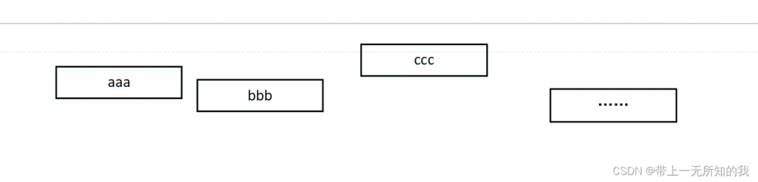
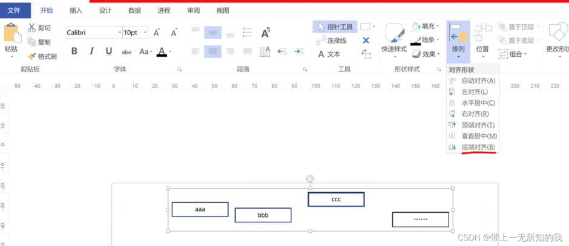
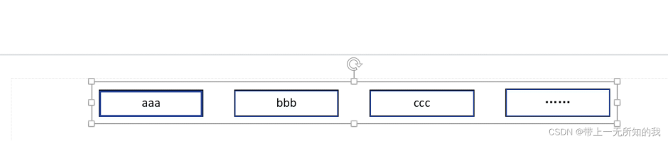
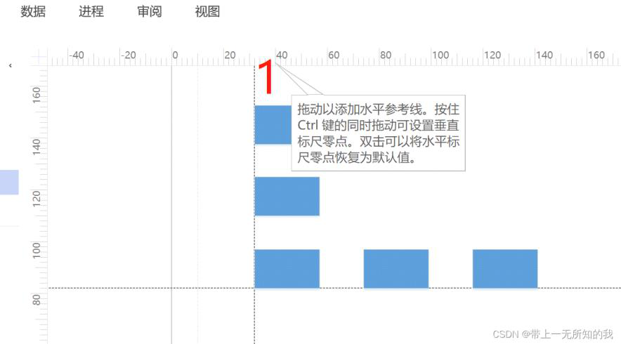
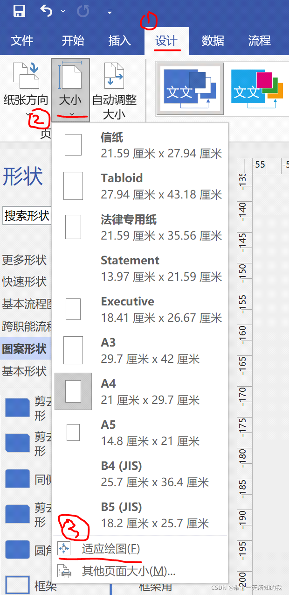
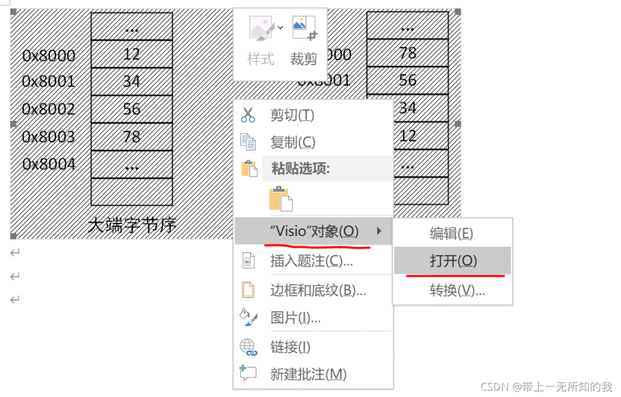

visio 教程-绘图技巧、快捷键大全\_

星期一, 二月 20, 2023

2:36 下午

 

已剪辑自: [https://blog.csdn.net/weixin\_37840904/article/details/120481848]{.underline}

一、常用快捷键
==============

功能快捷键

|            |                          |
|------------|--------------------------|
|            |                          |
| 格式刷     | ctrl + shift + p         |
| 指针工具   | ctrl + 1                 |
| 文本工具   | ctrl + 2                 |
| 连接线工具 | ctrl + 3                 |
| 组合所选项 | ctrl + g（group）        |
| 取消组合   | ctrl + shift + u（undo） |
| 置于顶层   | ctrl + f（foreground）   |
| 置于底层   | ctrl + b（background）   |
| 移动所选项 | 方向键                   |
| 按像素移动 | shift + 方向键           |

二、使用技巧
============

对象移动
--------

-   shift + 方向键对对象进行微调整（移动）

-   将页面整体放大，调整时会更为精确，也更容易出现对齐辅助线

对象复制
--------

-   按住 ctrl移动对象可完成复制

绘制直线
--------

-   按住 shift可以绘制直线

-   按住 shift可以水平或者垂直移动直线

一键对齐 自动排列（非常好用）
-----------------------------

假定我有四个水平排列不一的形状需要底部对齐，并且间距保持一致。

选中所有需排列形状，开始 -\> 排列 -\> 底端对齐，形状会完成底部对齐；开始 -\> 位置 -\> 横向分布，初始图和最终效果如下。

 

辅助线对齐
----------

-   鼠标按住尺规的边缘往面板上面拉，会拉出一条绘图辅助线，帮助绘图（精确定位，将你的图形往辅助线上拉，可以粘在辅助线上，保持对齐和整体移动，非常好用）

-   按del键就会消失，而且选中这条线，按Ctrl+L会旋转90°

> 

图像边缘空白消除
----------------

-   菜单栏 设计 -\> 大小-\>适应绘图，即可减少边缘空白

> 

word中visio图编辑技巧
---------------------

-   在word中使用visio时，点击打开而不是编辑（编辑的图非常小，很难操作），或者直接双击

> 

-   word 中的visio图显示不完整时，拷贝到 visio 中重新编辑，然后再拷贝回word，即可正常（不知道原因，但是确实能解决问题）

去掉直线交叉点
--------------

-   两根直线交叉时，总是默认会出现一个跨线的标志，很是不爽，去除方法：菜单栏 设计-\> 连接线-\> 显示跨线，将勾选项去掉。

-   去除前

> 

-   去除后

> 

增加连接点
----------

一般visio的连接点是固定的，当你想要连接到自定义位置时，需要添加连接点。

-   增加连接点。在连接线的右侧有个叉叉符号，就是连接点的命令了，点击连接点符号（或ctrl+shift+1），选中需要增加的框图，按住ctrl+左键，即可增加连接点。

> 
