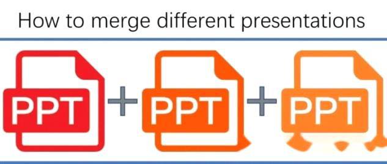
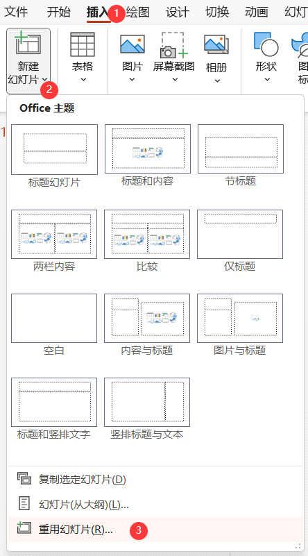
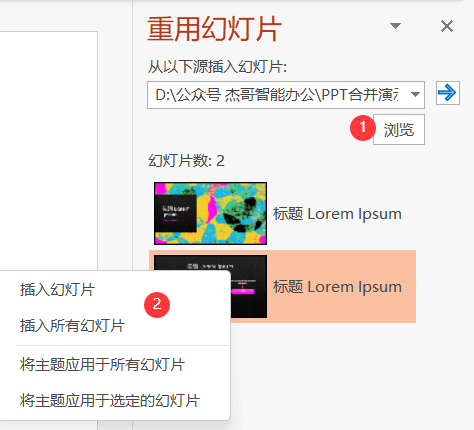
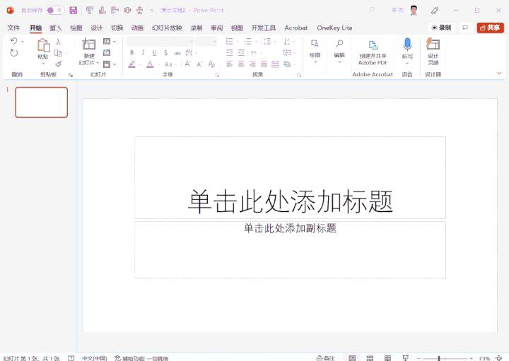
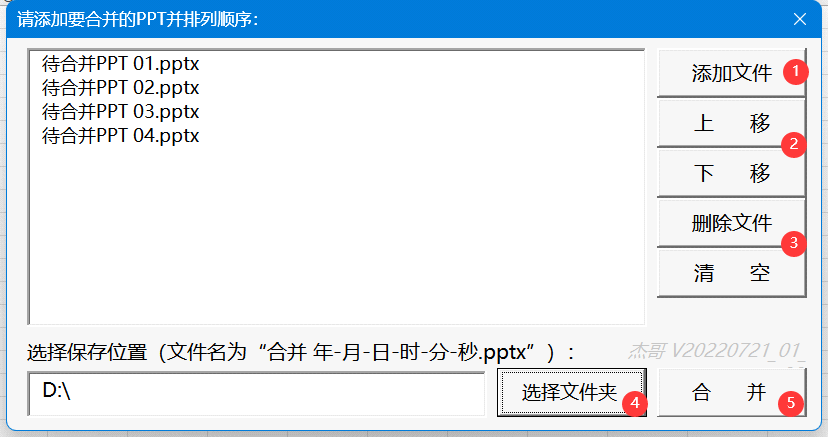
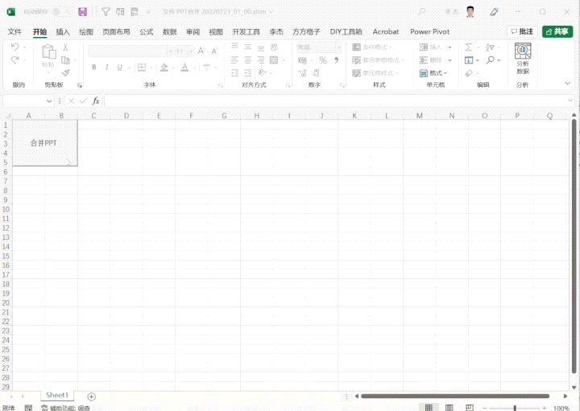

PPT批量合并的几种方法

星期六, 三月 18, 2023

12:12 下午

 

[https://zhuanlan.zhihu.com/p/557060276]{.underline}

**前言**

最近，杰哥工作中需要将多个PPT合并到一起。经过调研发现，合并多个PPT文件的方法有2种，即利用PPT自带的重用幻灯片和利用PPT插件。其中，重用幻灯片只能合并2个PPT，如果需要一次性合并大于等于3个PPT就只能两个两个来处理；PPT插件多种多样，其中免费有好用的就是OK插件。在杰哥发现好用的插件之前，曾经在业余时间利用VBA编写了一个简单的PPT合并程序。今天一并分享给大家。

**方法1：重用幻灯片**

重用幻灯片位于"插入"选项卡→新建幻灯片→重用幻灯片。如下图所示：\
 

 

 

选择需要插入的PPT文件后，就可以插入全部或部分幻灯片，见下图：\
 

 

 

重用幻灯片演示如下：

 

 

注意，该种方法每次只能加载1个新的幻灯片，如果要合并多个幻灯片，需要依次加载。

**方法2：OK插件**

这个插件是一款免费开源的PPT插件，可以支持MS PPT和WPS，下载网址是：[http://oktools.xyz/]{.underline}。官网界面如下：

 

 

它可以实现多个ppt的批量合并，演示如下：

 

 

注意，该种方法可以合并多个幻灯片，但缺点是无法控制幻灯片的合并顺序。

**方法3：自开发PPT合并工具V1.0**

 

 

本工具建立在Excel中，其功能特色为：

1、一次性合并多个.pptx文件。本工具可以点击"添加文件"按钮（见图中①）在列表框中多次添加多个PPT文件。

2、通过点击"上移"或"下移"按钮手动调整所要合并的PPT文件顺序，见图中②。

3、删除列表框中选中的文件或者直接清空列表，见图中③。

4、自定义保存合并PPT文件的位置，见图中④。

该工具的动态演示如下：

 

 

特殊说明：

1、本工具建立在Excel系统中，需要运行宏。

2、本工具的核心语言使用了VBA中的FileDialog对象，字典对象和窗体Active控件列表框对象。

**下载链接：**

链接：[https://pan.baidu.com/s/1xZC\_sdqVL-3Sh7b78sBDSQ?pwd=jgzn]{.underline}

提取码：jgzn
