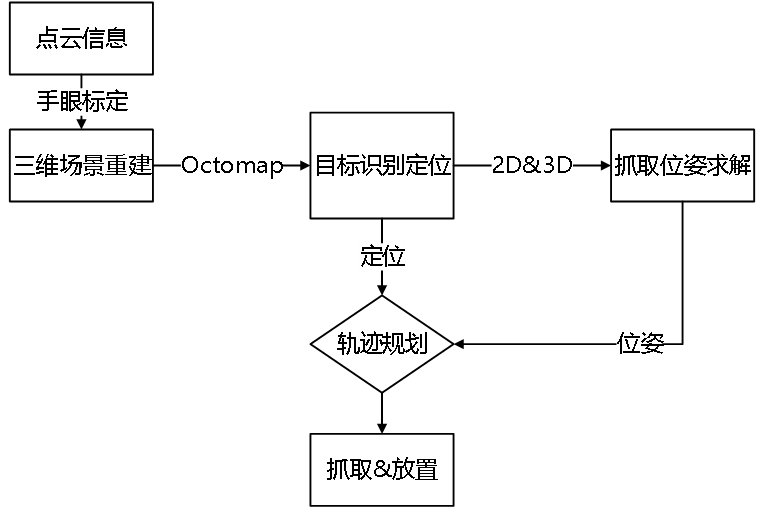
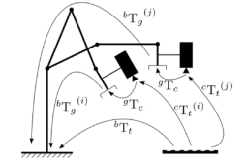
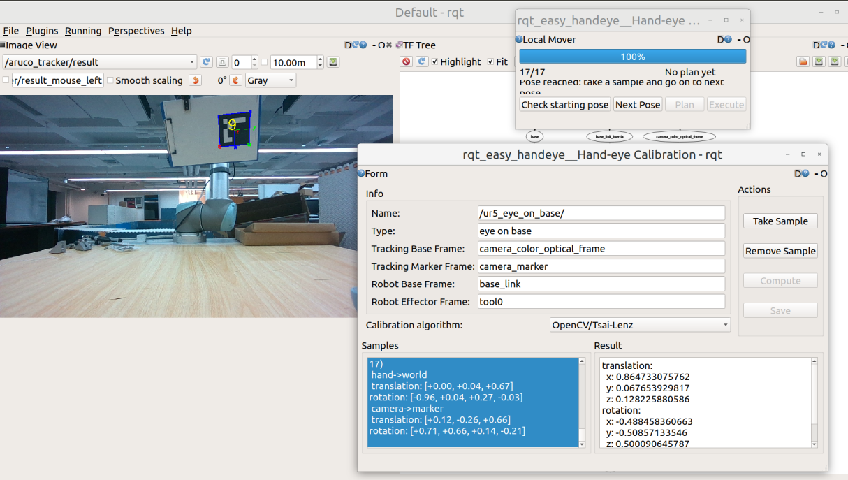
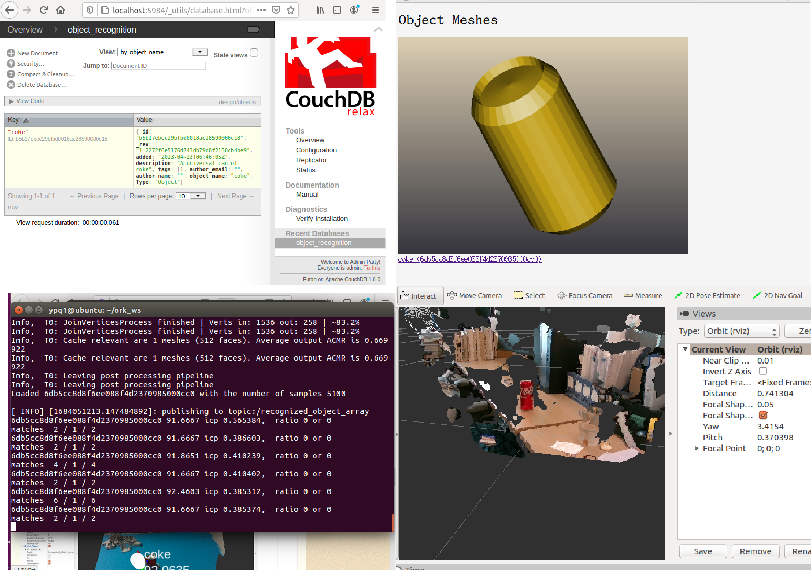
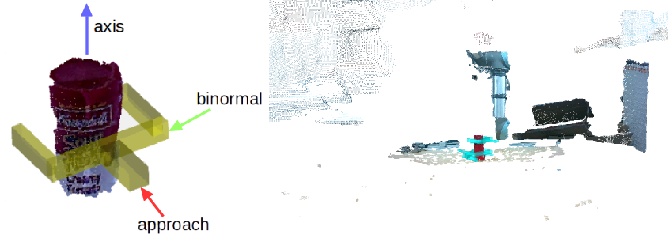
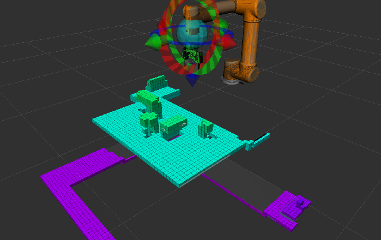
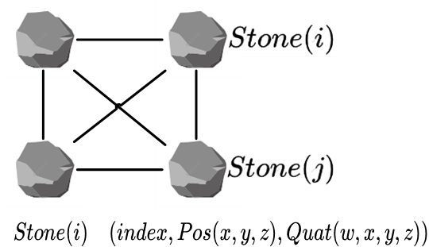

# 开题

## 系统申请

- 论文类型
  - 综合研究
- 论文选题来源
  - 中央各部门项目
  - 省项目
  
  面向非结构化复杂环境下的自然石块堆叠的感知与规划方法

## 量化指标

- 参考文献-80
- 字数-1.2w
- 图表数量-20+
- 其余大容量工作
  - 技术路线图
  - 引文-语义-条目对应
  - Zotero自动编译系统
  - 模板-封面、图片自动标号
- 其余备注
  - 标黄：改表达
  - 斜体：添加论据
  - 解释框：图表参考文献

## 题目

	- 基于强化学习的面向现场施工（非结构化环境、就地取材）的自然石块（不规则、未加工）码垛机器人（定性、实现方法）研究

### 关键词

基于视觉机械臂、抓取-放置、石块码垛、堆叠、智能算法、

## 开题报告

### 研究背景及选题依据

人工智能技术的快速发展不仅在本领域取得了惊人的成果，并且广泛的渗透至各个相关产业，加速了传统产业的转型升级。在人工智能赋能的推动下，智慧农业、智能制造、智能物流等相关产业取得了显著的进展。然而在国民经济地位和产业体量较为庞大的建筑建造领域，其智能化进程还未达到如前文中所提及领域一般的较高水平。***建造业掌握国民经济命脉，具有庞大的经济价值，（插入事实论据)推进建造业自动化和智能化的发展具有经济效应；建造业作为劳动力密集型产业，目前存在管理粗放、安全隐患高、统筹效率低下等问题，施工场地恶劣的工作环境也使得目前建造领域劳动力短缺的局面；所以，促进其产业升级，提高自动化和智能化水平是解决当前所面临问题的必然途径。***

面向建造领域所面临的的困境，智能制造应运而生，机器人技术和人工智能技术推动了智能建造的发展。智能建造发展离不开自动化建造和机器人建造领域的发展，自动化建造的概念，早在二战期间便有了相关的概念雏形，从早期的预制化建筑的提出，通过将建筑的结构简化从而降低整个场景复杂度，一方面为了提高生产效率，另一方面也为自动化建造和机器人建造提供了有力条件；在建造自动化的基础上机器人的应用进一步提高了自动化水平，早在xx日本清水建筑、鹿岛建设就提出了机器人建造、家政系统的高度自动化的场景构思。近年来，机器人技术的进一步发展推动工程机械自动化、智能建造系统以及智能远程管理等相关研究领域近年来取得了突破性进展，例如碧桂园的建造机器人系列产品，用于完成建造中的xx、xx、xx任务（例子），澳洲砌砖国外荷兰比利时根特砌砖（）国内盈创，将机器人用于建造领域具有广阔的发展前景。

目前智能建造领域，多为非结构化场景：复杂度高、自动化水平低、突发情况较难预测。例如，建筑工地的路面存在软泥土路面，存在砂石、钢筋、混凝土等，建筑机器人具有稳定作业、快速响应干扰和意外情况的性能是实现机器人建造的必要条件，这为机器人建造提出了较大挑战。现如今人工智能技术例如深度学习和强化学习等领域的进步，使得智能技术在复杂环境和问题的处理上具有良好的表现-（列举打游戏和足球），其策略具有较好的泛化能力。面对复杂的非结构化场景的机器人建造任务，人工智能技术具有较好的鲁棒性。（列举几个例子-）面向戈壁、沙漠、山区道路、堤坝等原材料运输难度和经济成本较大的施工场景，就低取材的建造（in-site）是野外建造新着眼点，未经加工处理的石块是常见的就地取材的原材料，利用石块作为建材进行设计和建造具有一定的研究价值，并且复合绿色建筑的概念。石块作为古老的建材，从古至今不乏石块构建的建筑，小至篱笆墙、石桥、景观等，大至金字塔等都是人类智慧在其中的重要体现，而体现在机器人建造领域，如何利用形状不规则的石块进行现场施工堆砌成预期建筑体是研究的核心问题，基于已经取得的机器视觉等技术实现对非结构化环境进行三维重建，并对现场可利用石材进行识别；并通过智能算法技术结合石块堆叠的相关力学模型和非数字化经验进行智能规划，最终在机器人堆叠系统上实现抓取、放置等一系列离散动作实现复杂的建造任务。

### 国内外研究现状

#### 机器人石块堆叠的相关研究

2017年，苏黎世联邦理工首次在实验室内提出了一个堆叠石块的机器人系统并发比表于ICRA，系统组成为机械臂UR10和三指夹爪及末端的RGB-D相机，上位机装载ROS（Robot Operation Systems机器人操作系统）完成机器人的运动控制和基于深度图像的视觉处理，并基于视觉和力传感器的信息实现石块的位姿规划和力位控制，基于力学对预扫描石块的三维模型进行建模并与物理学引擎中进行仿真以获得相关物理学指标，物理学指标构建了成本函数，使用梯度下降算法进行最优位姿的求解，并通过贪婪算法通过将每下一块位姿取得局部最优来执行决策。任务执行时，基于贪婪算法求解下一个堆叠石块候选，并通过梯度下降局部优化堆叠位姿，对于目标石块的识别则采用基于模板的ICP（迭代最近点算法，通过手眼标定将视觉坐标系映射至机器人世界坐标系以便运动学计算，基于目标坐标和堆叠位姿最终实现了四层石块的堆叠。

2020年，苏黎世联邦理工的warmerlinger提出了一个现场堆叠石块的液压机器人系统，其由全地面挖掘机HEAP搭载RGB-D和激光雷达组成，其负载可达-并实现了户外的石墙搭建，通过自动化石块堆叠软件生产石块的堆叠次序及位姿，结合现有的石块堆叠技术指导经验，通过轨迹线包裹和下沉尺寸等指标评价石块的堆叠位姿以实现石块的堆叠规划；通过单次堆叠后每次对现场砌体的扫描和重建，解决此前研究中存在的规划与执行后石块位姿偏差的误差累积的问题。并在2021年，进一步优化了系统中的抓取策略和堆叠运动的规划问题，发表于RAL期刊。在此前系统和任务的基础上，通过CNN网络生成并筛选可行的二指夹爪策略，提高抓取成功率降低作业耗时；并且对于由于堆叠位姿和当前石块的摆放位姿的偏差而导致的抓取-放置执行中的运动学无解问题，提供了一个重定向的任务规划的方法，使得在运动学求解失败的情况下进行抓取-重定向-放置的作业。

2023年，苏黎世warmerlinger团队，实现了现场石块堆叠的机器人建造任务，在此前研究的基础上引入了现场石块的语义分割和识别并利用夹爪进行现场的扫描和规划。对于现场石块堆叠任务，其实现了完整地现场三维建图、分割与识别定位、抓取放置及重规划的机器人石块码垛系统，并建造了一个xxm的石墙。采用CNN实现石块模型至石墙模型转化并获取相关堆叠位姿，；采用mask-cnn进行石块的语义分割以现场识别可用石材；并基于多角度二维图像离散扫描生成三维模型，并发表于Science Robotics

Warmerlinger团队在机器人石块堆叠领域的系统性工作具有开拓性和完整性，涵盖了机器人动作规划、三维场景重建、目标检测与识别等，并且完成了四层石塔和双面石墙的堆叠。分别研究了石块位姿求解及优化、抓取-堆叠的策略生成及可行解规划、现场扫描三维建图等相关任务，提出了机器人石块堆叠系统的组成和相关规划求解算法的基础力学模型，为后续相关领域的研究提供了研究基础和分析问题的基点。

石块堆叠的系统性研究仍存在一些可以完善改进的方面，在石块堆叠系统中，最核心的研究问题是石块目标堆叠位姿的求解，这是任务成功的关键指标，正确的或是更好的位姿不仅是最终结构稳定的保障，也决定了机器人抓取-堆叠的运动学和动力学的精度要求，良好的位姿在任务执行中中对于碰撞和滑移等动力学过程的干扰具有一定的容错率，提高石块堆叠机器人在非结构化环境中的鲁棒性。其次，便是sim2real gap，三维重建的场景及预扫描的模型受限于计算效率和硬件性能制约，会对模型细节、纹理等信息进行一定程度的简化和忽略，这会导致规划后执行过程中出现石块实际位姿与规划位姿存在一定的偏差和误差，累积的误差的忽略会影响最优位姿的判定甚至会导致整体结构的失效。

对于当前的两个位姿，warmer团队出于系统性工作的考虑并未深入研究，对于石块堆叠位姿求解的问题，采用贪婪策略并用梯度下架对随机位姿进行局部优化以实现石块的堆叠位姿的求解，从实验结果中可以发现，石块位姿求解中，衡量位姿优劣的成本函数在后续石块的求解中数值上呈现指数型增长。这是因为贪婪策略结合石块堆叠这个具体问题所导致的，贪婪策略实现了求解速度和性能上的较好的表现，却大大降低后续位姿的质量，这是因为石块堆叠中每一个石块的位姿之间存在一定的关联和影响，简单的局部取的最优解会出现整体求解失败的情况，如何将后续的石块堆叠的成本纳入当前石块的评价体系中是一个可行的改进方法，或者采用正向双向两个方向同时求解取可行空间的策略。

对于石块的位姿偏差问题，warmerlinger采用的是动态规划的方法，即每次执行后都对场景进行一次重新扫描修正，并将当前的石块位姿导入物理引擎以同步，并进行下一步最优位姿的规划。（不行就删除

石块位姿的评价模型，基于力学模型进行建模，并实现评价，其中在结果中可以发现，评价模型不够准确，因为本身就是一些稳定结构的特征的量化指标后的代数和，评价模型的并不能完全准确的体现最终位姿组成的结构稳定性，即高分位姿未必稳定，稳定位姿未必高分。机器学习中类似召回率等评价标准。可以从研究结果中看到部分样本存在：虽然堆叠成功但是成本函数值非常高，也存在成本非常低的失败案例。一方面如何不断设计迭代以加深对石块结构稳定性的研究，即不断建立更精确的力学模型是一个研究方向，或者可以采用智能算法训练来不断提高评价模型的准确率，二者不是对立的关系，对于石块稳定性的力学评价模型有助于指导学习过程。

### 课题研究问题与内容

#### 研究目标

面向非结构化自然石块堆叠场景，提出一个智能石块堆叠机器人的系统。在石块堆叠的任务规划上，利用深度强化学习算法结合物理仿真引擎去求解石块堆叠可行位姿，基于Actor-Critic机制优化石块可行位姿的求解及评价过程，以获取综合性能更好的规划策略，并提出一个结合经验和力学分析的模型，用于优化石块位姿及结构稳定性的评价器。在石块堆叠的任务执行上，依赖于基于视觉的机器人抓取-放置系统完成，基于深度相机对场景进行三维重建，并完成对目标的识别与定位以便于机械臂的运动学计算。为了进一步提高石块堆叠机器人系统的鲁棒性和泛化能力，以执行后的石块结构与规划位姿之间的偏差为主要指标对可行位姿进行动态重规划，基于现实石块执行结果训练机器人系统的石块候选筛选-评价。最终完成一个具有类人智能基于视觉的机械臂石块码垛系统，在非结构化场景下完成自然石块的识别定位、位姿规划求解、抓取放置、动态重规划等动作。

#### 研究问题

- 石块可行位姿的求解及结构稳定性判断

石块可行的目标堆叠位姿是整体结构的稳定性基础，如何基于视觉和模型信息建立恰当的模型，以使得石块位姿求解精确是石块堆叠的首要问题；评价模型用于精确判别位姿的优劣也是迭代算法能否收敛的重要因素。石块堆叠位姿的求解主要由建模求解和评价方式两部分研究内容组成，这架构与强化学习算法中的Actor-Critic机制相对应，利用此机制用于生成良好的位姿具有一定的可行性。整体结构稳定性不但由每个构建石块的位姿优劣决定，同时也受组成结构的石块间的力学-位置关系影响，也即每个石块的单个最优值的简单组合不能带来更好的整体结构稳定性，贪婪策略并不适用于处理整个石块结构整体稳定性，建立独立于单个石块位姿的评价模型有助于进一步提高结构稳定性。

- 基于现场执行的偏差的动态重规划

石块堆叠任务中，影响结构稳定的另一个重要因素是模拟到真实转移差距（Sim2Real Gap），由于物理学引擎中模型的拟合面的简化及其他过程，真实石块的堆叠位姿与规划位姿存在一定的偏差。这个偏差主要影响此前石块规划的位姿有效性和整体结构稳定性，一方面，此偏差的忽略使得后续石块的堆叠位姿求解过程基于错误的条件之上；另一方面，偏差累计至每个石块位姿后，石块的整体结构稳定性的评价模型的输入的偏差会导致错误判定。通过深度视觉信息对已有结构在堆叠任务执行中进行多次重建是获取这一偏差的可行手段，主要过程为识别定位、语义分隔等。基于已有的偏差通过构建神经网络，主要用于重规划后续石块的堆叠位姿和迭代堆叠位姿求解过程中的误差余量。基于此偏差进行动态重规划对堆叠位姿可行解的有效执行和适应非结构化环境有重要意义。

#### 研究内容

- 理论部分：石块堆叠规划模型建立
  - 建立石块堆叠位姿及评价模型
  - 整体结构稳定性的学习策略建模
  - 基于视觉的经验-力学评价模型优化
- 强化学习：石块堆叠任务规划
  - 物理学引擎及强化学习环境搭建
  - 石块堆叠策略训练
  - 石块稳定性评价模型构建及训练
  - 塔、桥、拱形结构建模及策略训练
- 实验部分：基于视觉的抓取-放置定位系统
  - 机械臂系统搭建
  - 三维场景重建
  - 目标识别与定位
  - 轨迹规划与避障
  - 抓取-放置
- 面向非结构化：堆叠系统优化
  - 基于现实偏差的石块位姿重规划
  - 数据驱动的石块候选评价模型
  - 基于视觉的现场扫描分割技术

### 技术路线及技术难点

#### 技术路线

- 整体实现方案

基于现有的石块建筑力学指标和堆叠经验进行建模，并设计石块位姿评价模型，实现石块堆叠的规划设计。利用三维重建技术在物理学引擎中建立石块的三维模型，并抽象拆解基于视觉的石块堆叠任务，建立学习环境，设计学习步骤和物理学仿真步骤，实现在物理引擎中训练堆叠位姿和整体结构的求解策略和评价模型。通过深度强化学习获得的策略，对目标石块结构进行堆叠。建立基于视觉的机械臂抓取放置系统，通过三维场景重建、目标识别与定位、轨迹规划等动作完成石块的抓取和放置动作。最后，基于面向非结构化场景的需求，对石块真实堆叠后的位姿偏差进行检测和计算，作为动态重规划石块堆叠和结构稳定性评价的主要指标，完成预期结构的准确堆放。此外，针对非结构化环境，利用语义分割技术对现场石块进行扫描来代替预扫描石块，提高石块堆叠系统的灵活性和鲁棒性。

#### 技术难点

#### 已有工作进展积累及研究条件

- 实验条件部分

  - 基于视觉的机械臂软硬件系统

  机械臂抓取系统由搭载ROS-Melodic-Ubuntu20.04的上位机系统及UR 5 机械臂、Robotiq 二指夹爪和眼在手上（eye in hand）的RGB-D深度相机构成，可以完成基于视觉的抓取和放置任务。夹爪末端最大负载3.75 kg，可抓取物体最大尺寸85 mm。并在ROS系统下可以实现，基于视觉目标识别与定位、逆运动学求解、轨迹规划和抓取放置等功能。

  | **型号品牌** |                         |                               |
  | ------------ | ----------------------- | ----------------------------- |
  | 上位机系统   | ROS-Melodic             | 视觉处理、运动学求解、规划等  |
  | 机械臂       | UR5                     | 有效负载：5kg 工作范围：1.25m |
  | 二指机械爪   | ROBOTIQ-2f-85           | 重量：1.25kg                  |
  | RGB-D相机    | Intel® Realsense™ D4505 | 分辨率、帧率、视场角、延迟    |

  - 基于视觉的识别与抓取

    基于视觉的机器人自动抓取流程如下，基于深度相机的点云信息，通过手眼标定所得变换矩阵，实现将目标映射至机器人世界坐标系，并基于模板的目标识别与定位实现针对目标的抓取位姿生成，通过抓取位姿和目标的定位信息和进行轨迹规划实现抓取和放置。

 

    - 手眼标定

    手眼标定（hand-eye calibration）是一种求解机器人的工具（手爪、末端执行器等）与相机的坐标系之间变换关系的手段。也是基于视觉抓取的基础，其标定的精度直接影响目标的定位坐标计算，是机器人抓取和放置的关键步骤。本研究中，在ROS系统下使用easy-handeye包完成了eye in hand 标定，并使用标定后的外参矩阵实现了三维场景重建。

 

 

    - 基于模板的目标识别

    ORK（Object Recognition and Kitchen）机器人视觉中关键技术之一，此技术主要用于物体识别和位姿估计，通过Linemod算法对三维图像进行特征点识别，实现对相机三维图像的目标识别、位姿估计、检测定位等处理，在CouchDB中建立三维模型数据库，并在训练中提取线特征最终实现对目标物的识别定位和位姿求解 。

    - 基于GPD的抓取策略生成

    在ROS中，GPD（Grasp Pose Detection）算法是一种用于抓取姿态检测的开源算法。它在机械臂操作、物体拾取和机器人操作等领域有着广泛的应用。GPD是基于三维点云信息生成抓取候选策略，在ROS通过使用GPD算法与ORK算法进行通讯可以实现对已有三维模型的识别并定位以及抓取检测，抓取检测候选由抓取中心点坐标和抓取法向量构成。GPD算法通过深度学习实现，在Caffe架构上对三维图像进行特征训练学习并评估抓取姿态，并基于评分进行抓取策略排序。

 

  - 轨迹规划与避障

  在完成对目标的识别定位和抓取检测后，对生成的抓取策略依据评价网络的分数进行排序后，生成了预抓取位姿，由夹爪中心点和approach法向量组成。基于此法向量进行机械臂的轨迹规划和逆运动学求解，并在Moveit!中配置生成抓取和放置规划。根据夹爪中心点和法向量生成笛卡尔路径并通过八叉图算法简化点云信息降低避障计算负担。并分别于仿真环境Gazebo和真实机械臂上完成了基于视觉的轨迹规划和抓取任务。

 

 

- 理论建模

  - 位姿求解模型

 

基于强化学习的理论，石块的堆叠位姿及次序组合一个复合高层次的行动空间，由离散变量（堆叠次序）对应着的连续变量（对应目标石块的位姿）嵌套而成，观察空间和奖励函数是参照warmerlinger提出的基于力学稳定性分析的成本函数构建，针对石块堆叠的任务，行动空间连续、且样本量较大，故而采用DDPG（Deep Deterministic Policy Gradient）的强化学习算法，这是一种用于解决连续动作空间下的强化学习问题的算法。利用了深度神经网络来近似值函数和策略函数，值函数用于评价石块堆叠位姿的优劣，策略函数用于生成石块的堆叠位姿。通过不断迭代更新以上两个网络以获得石块堆叠最大化奖励的策略，为使得石块堆叠位姿的策略函数可以在迭代学习中实现全局最优，即消除贪婪策略导致的整体结构稳定性较差的问题，对于值函数的贝尔曼方程进行了修正以优化评价网络：

 

- 强化学习环境搭建

  - 物理引擎及学习环境建立

  强化学习环境和石块力学观测数据通过Gym封装的MuJoCo物理学引擎实现，Gym是一个开源的强化学习库，由OpenAI开发和维护。它提供了一系列标准化的环境，用于训练和评估强化学习算法。Mujoco（Multi-Joint dynamics with Contact）是一种用于模拟连续多关节机器人动力学的物理引擎，被广泛应用于强化学习领域，特别是用于测试和训练各种机器人控制算法。在本石块堆叠策略训练中，Gym是提供封装的强化学习环境用于训练DDPG策略，MuJoCo提供物理学引擎接口用于计算石块的碰撞、接触等力学参数。

  石块通过三维场景重建技术获取相关三维模型网络，主要流程通过VisualSFM进行二维扫描和多角度重建，将多角度二维图像转化为点云信息，并使用point-Net2转化为网格模型。使用meshlab进行处理获取相关几何信息并导入MuJoCo引擎中进行仿真。

 

- 

### 关键创新点

- 基于深度强化学习的石块堆叠位姿求解及结构稳定性判断

基于梯度下降的局部位姿迭代求解算法，有一定概率收敛至局部最优解。并且利用贪婪的策略用与将每次堆叠目标的成本函数取每一步最优解进行累计，并代替为全局最优解。

首先，对于石块堆叠位姿的建模的传统方法是通过力学模型建立成本函数进行迭代求解。由于模型本身的误差和评价模型的精确率使得求解的位姿无法达到期望的稳定性，从而使得堆叠的结构坍塌。通过深度强化学习的Actor-Critic机制在训练中不断修正评价网络可以进一步提高策略的精确性。

其次，整体石块结构的稳定性不仅仅取决于单石块位姿的优劣，也与石块位姿的组合以及整体结构几何有关，因此，对整体几何结构的建模并融合经验评价模型，在强化学习的环境中训练迭代是修正石块模型的模型误差的有效途径，并且弥补贪婪策略忽略的整体结构稳定性因素，降低了对建模的依赖。

- 基于偏差修正的动态重规划石块堆叠

对于Sim2Real Gap，目前的方案是通过每次执行之后在物理引擎中同步真实位姿，并以此为初始条件进行重新求解和规划策略。Sim2Real Gap由于当前机器人框架的原因不可避免，并且对于最终结构稳定性的影响较大。在机器人作业中，获取偏差的基础，基于偏差进行整体结构稳定性的重规划，有助于提高石块堆叠规划算法的泛化能力和对非结构化场景的适应能力。通过设计偏差的处理神经网络建立现有石块堆叠位姿和真实位姿偏差的映射，使得规划算法对石块堆叠任务中由于三维模型精度所造成的偏差有一定的预补偿能力。

### 研究进度安排-预期成果

- 研究计划表

| time                 | contant                                                    |
| -------------------- | ---------------------------------------------------------- |
| 2023年7月~2023年12月 | 查阅资料；构建机器人视觉系统；                             |
| 2024年1月~2024年6月  | 石块堆叠位姿建模；求解策略训练；                           |
| 2024年7月~2024年12月 | 实验堆叠验证位姿可行性；整体稳定性评价模型建模、策略训练； |
| 2025年1月~2025年6月  | 多结构模型建模及策略训练；                                 |
| 2025年7月~2025年1月  | 动态重规划建模及相关网络训练；现场石块语义分割；           |
| 2026年1月~2026年6月  | 动态重规划实验论证；石块候选评价模型建模仿真；             |
| 2026年7月~2026年12月 | 撰写论文；答辩                                             |

- 预期成果

（1）发表论文3篇，分别为基于深度强化学习的机器人石块码垛系统的整体结构稳定性分析研究；基于经验建模融合的石块堆叠评价模型的设计与优化；基于Sim2Real Gap的石块堆叠位姿重规划算法及位姿余量研究。

专利2项，基于石块堆叠机器人的石块堆叠结构稳定性评价模型，石块堆叠位姿求解算法。

（2）一套基于深度相机的机械臂抓取堆叠软硬件系统

（3）石块堆叠位姿求解算法及评价模型和石块堆叠整体结构稳定性评价模型

（4）基于Sim2Real Gap的石块堆叠动态重规划算法