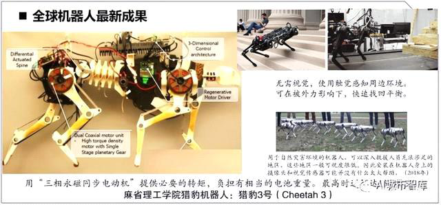
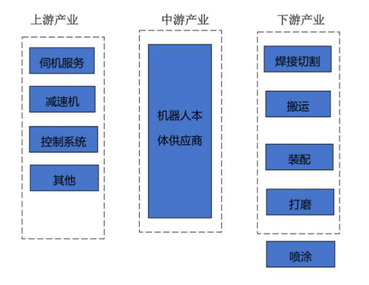
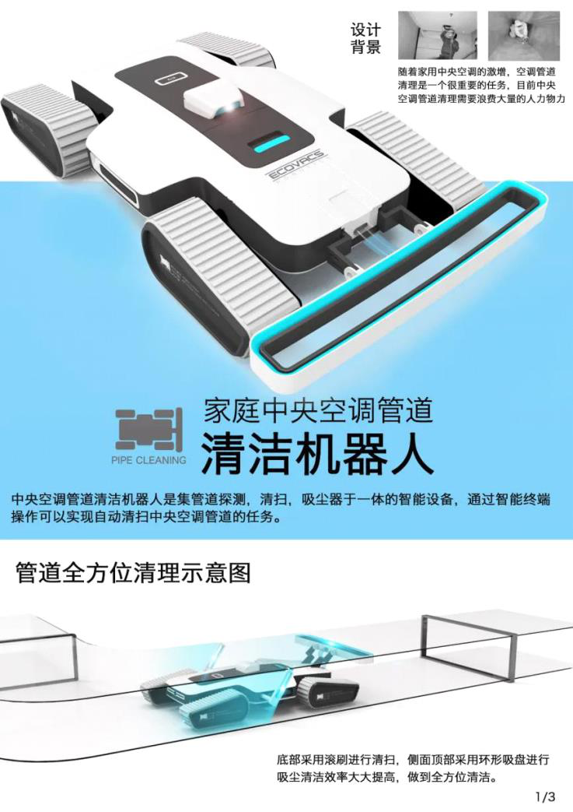
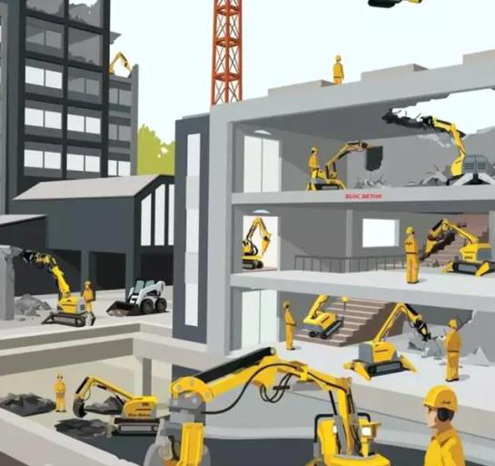
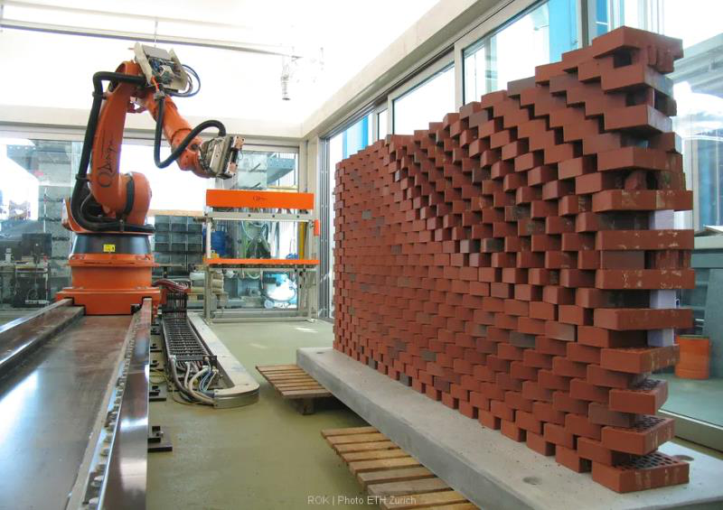
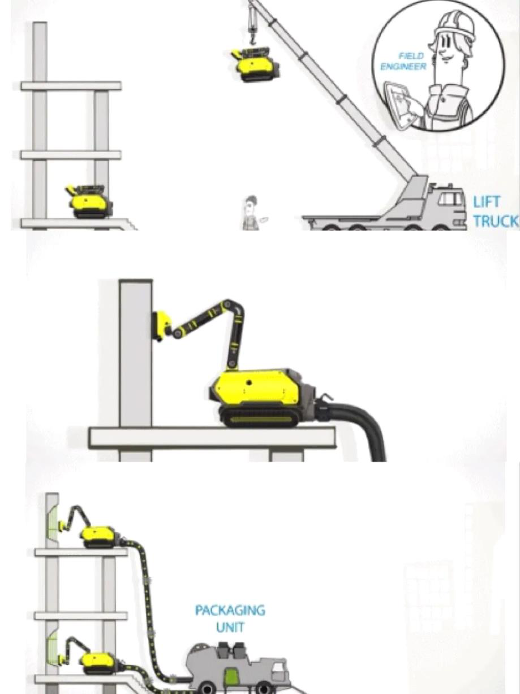
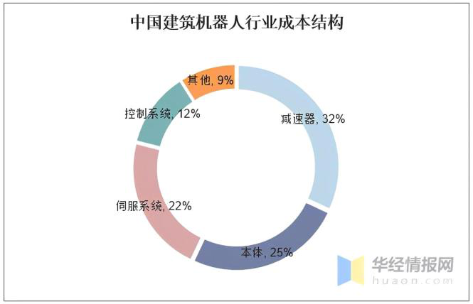

机器人

2022年10月18日

17:16

 

机器人技术的发展大致经历了三个阶段。第一个阶段是可编程示教再现机器人。这种机器人在工作现场进行实时编程控制，一旦被编程后，机器人就会按照程序动作。第二个阶段是简单智能型离线编程机器人。这种机器人依靠视觉、听觉、力觉、触觉等传感器感受外部环境，通过控制系统控制机器人运动。可实现路径自动纠偏等自动化功能，具有一定的环境自适应能力。第三个阶段是智能机器人阶段。这类机器人具有复杂环境感知、高难度运动智能控制、自主决策、自主学习等能力，并部分的拥有人类智慧。

从类别上来讲，机器人可分为工业机器人、服务机器人、军用机器人、医疗机器人、农业机器人、 建筑机器人、水下机器人、娱乐机器人、空天机器人等。第一台可编程的商用工业机器人是于1974年1月由瑞典的ABB公司创造的，这是世界上第一台由微处理器控制的机器人，并且实现了量产。之后机器人在生产车间被大规模使用，代替了大量的人力，降低了运营成本，实现了标准化生产，并提升了生产效率和产品良率。特种机器人有些分支发展很快，如：服务机器人：迎宾机器人、金融服务机器人、助老助残机器人等。建筑机器人：施工机器人、搬运机器人、维保机器人、管道检测机器人、安防机器人、消防机器人、家庭健康监测机器人等。 机器人是典型的机电一体化产品，一般由五部分组成：机械本体、感知系统、驱动系统、控制系统、人机交互系统（输入/输出接口）。为对本体进行精确控制，传感器应提供机器人本体或其所处环境的信息；控制系统依据控制程序产生指令信号，通过控制各关节运动坐标的驱动器，使各臂杆端点按照要求的轨迹、速度和加速度，以一定的姿态达到空间指定的位置；驱动器将控制系统输出的信号变换成大功率信号，以驱动执行器工作。

 

仅适用于平坦地形，复杂地形适应能力弱，对不同地貌环境的自动识别能力差（地形地貌机器学习能力不是很强）。能够自动适应不同地形地貌的环境感知及智能控制方法仍需进一步研究和探索。就建筑机器人而言，对各种建筑空间下不同作业环境的自适应能力较差，不能根据作业环境自动调整结构和算法。

机器人：核心技术

> 三大零部件 减速器、伺服电机、减速器
>
> 

 

！！！管道机器人idea 双螺旋结构 两个毛巾

固建机器人

 

 

 
