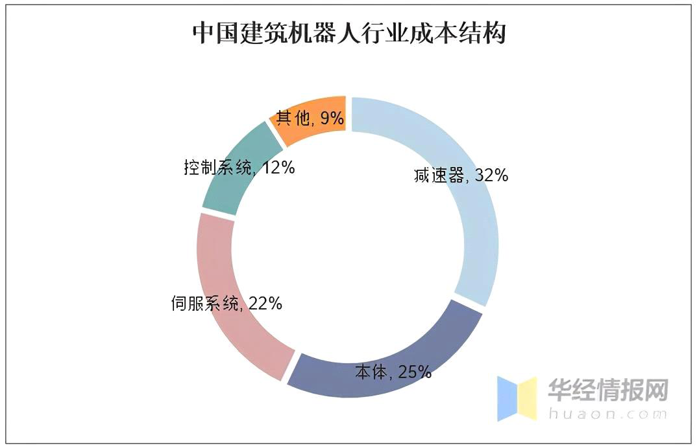
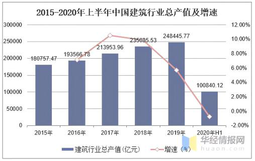
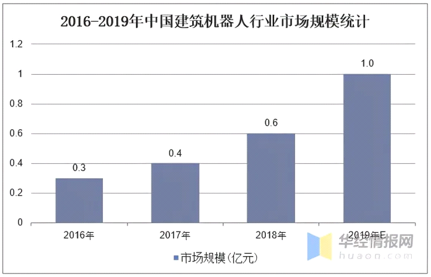
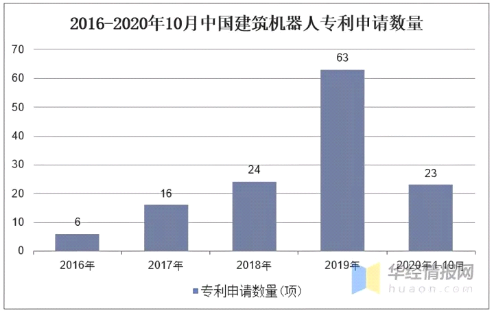

建筑机器人

2022年10月18日

17:34

 

以三个体系"BIM+FMS+WMS"为例。

简单来说，BIM协同平台就是一个功能强大的智能施工任务规划中心，规划的内容核心包括两方面：建筑机器人如何施工、相关物料如何保障，这两者的详细信息纳入工单派发给FMS系统。

FMS系统就是一个现场施工的超级指挥中枢，一方面能够调度全部机器人按指定路径自主前往指定区域、自主施工，另一方面也同步呼唤WMS系统提供物料支持。

WMS系统就是一个高度协同、实时响应机器人需求的强大物料供应管理中枢，是"首席物流官"和"物料管理大师"，能够全程监控物料的出库、运输和机器人加料，保证与BIM协同平台的物料保障计划实时匹配，真正实现"每一种物料从哪来、用哪去、用多少"的精益管理。

可以看到，WMS系统对工地物料消耗的管理可以精确到任一楼栋、楼层、户型，使用了多少涂料、多少块瓷砖。

 

一、建筑机器人行业概况

建筑机器人是指自动或半自动执行建筑工作的机器装置，其可通过运行预先编制的程序或人工智能技术制定的原则纲领进行运动，替代或协助建筑人员完成如焊接、砌墙、搬运、天花板安装、喷漆等建筑施工工序，能有效提高施工效率和施工质量、保障工作人员安全及降低工程建筑成本。

建筑机器人行业产业链上游为减速器、伺服系统、控制系统等核心零部件的生产；中游为建筑机器人本体生产；下游主要包括系统集成商、工程施工与装修、建筑工程管理等应用领域。

建筑机器人行业产业链

 

 

资料来源：华经产业研究院整理

数据显示，建筑机器人行业成本主要用于减速器、本体以及伺服系统，分别占比32%、25%、22%，合计占比近80%。

 

 

资料来源：公开资料整理

二、建筑机器人行业现状

中国是建筑大国，拥有世界上最大的建筑市场。据国家统计局数据显示，2015-2019年中国建筑行业总产值稳步增长，2019年我国建筑业总产值为248445.77亿元，同比增长10.02%，截止至2020年上半年，中国建筑行业总产值为100840.12亿元，较2019年同期下降0.76%。

 

 

资料来源：国家统计局，华经产业研究院整理

按销售额计，2016至2018年，中国建筑机器人行业市场规模由0.3增长至0.6亿元，预计2019年市场规模将达到1亿元，同比增长66.67%。

 

 

资料来源：公开资料整理

专利方面，据佰腾网数据统计，2019年中国建筑机器人专利申请数量实现爆发式增长，达到63项，较2018年增加39项，截止至2020年10月19日，中国建筑机器人专利申请数量为23项。

 

 

资料来源：佰腾网，华经产业研究院整理

注：数据统计截止至2020年10月19日

相关报告：华经产业研究院发布的《2020-2025年中国建筑机器人行业市场前景预测及投资战略咨询报告》

三、建筑机器人在推广应用中的难点

尽管建筑机器人进入建筑业领域是必然趋势，但短时间内，其要在我国得到推广应用仍面临诸多难题。

 

 

资料来源：公开资料整理

四、建筑机器人行业发展方向分析

1、加速传统建筑设备的机器人化改造

对现有的建筑施工设备进行机器人化改造，是发展建筑机器人技术并使其快速投入应用的一

条捷径。例如，对于建筑用工程施工车辆，如挖掘机、推土机、压路机、渣土车等，可基于遥操作、自主导航与避障，路径规划与运动控制、智能环境感知、无人驾驶等技术对其进行改造，实现相关车辆操作的遥控化、半自主化，甚至完全自主化，减少操作人员的工作负担、优化工作环境、提升作业安全性和效率，推进施工作业的标准化和精细化。参照这一模式，亦可考虑对塔吊、起重机等提举系统进行遥操作改造，通过远程遥控操作彻底解除施工人员的安全威胁。

2、促进既有机器人技术在建筑业中的应用

目前研发的很多机器人技术均属于通用技术。它们在建筑业中具有广阔的应用前景。例如，在环境感知与建模方面，可利用无人飞行器(UAV)、轮式/履带机器人等移动平台搭载激光雷达，结构光摄像头、3D 视觉等环境感知设备，基于多源信息融合、同时定位与地图创建(SLAM)等环境建模技术，实现建筑物内外结构及周边环境的自主列绘与 3D 建模；利用 UAV 并配合 SLAM技术，实现土方开挖、废料清运及结构物施工进度及工程量的实时监测，为大尺度施工作业中多设备任务优化与协调提供铺垫。再如，基于机械手，移动机器人底盘搭建的通用移动操作平台，有望替代人工完成诸如砌筑、抹灰、平整、抛光、编织、铺贴、钻孔等多种操作。

3、大力推动建筑业专用机器人系统研发

建筑业有其独有的特殊性，故通用技术不可能解决所有问题。为了能够更好地实施营建，根据建筑业之特性研发专用建筑机器人，是极其必要的。例如，3D 打印建筑机器人的突出代表"轮廓工艺"技术，针对房屋施工的各种特殊需求，进行了有效的针对设计，最终才成就了该系统直接打印包括水电管线在内的完整房屋的能力。喷浆机器人、ERO 混凝土回收机器人等，均是针对建筑业的特殊需要定制研发的。这一方面的工作，后续要进一步加大力度。

4、协同推进适应于机器化施工的新型建筑结构及建材研究

为了充分发挥建筑机器人的优势，传统的建筑形式与施工模态必然要作出相应的改变。目前来看较为可行的选项是采用模块化结构，利用机器人进行模块的预制、组装，这将大幅减小机器人的作业难度，同时可有效提高新建筑的营建速度。另外，新型建材的研发也要同步推进。例如，3D 打印建筑机器人对于混凝土的流动性、凝固速度等有很高的要求；实施飞行营建则要求各模块间具有主动结合的能力。

 

 

华经情报网隶属于华经产业研究院，专注大中华区产业经济情报及研究，目前主要提供的产品和服务包括传统及新兴行业研究、商业计划书、可行性研究、市场调研、专题报告、定制报告等。涵盖文化体育、物流旅游、健康养老、生物医药、能源化工、装备制造、汽车电子等领域，还深入研究智慧城市、智慧生活、智慧制造、新能源、新材料、新消费、新金融、人工智能、"互联网+"等新兴领域。

 

 

 

 

*来自 \<*[https://zhuanlan.zhihu.com/p/268764514]{.underline}*\> *

 

\* *
