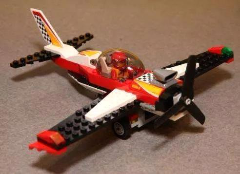
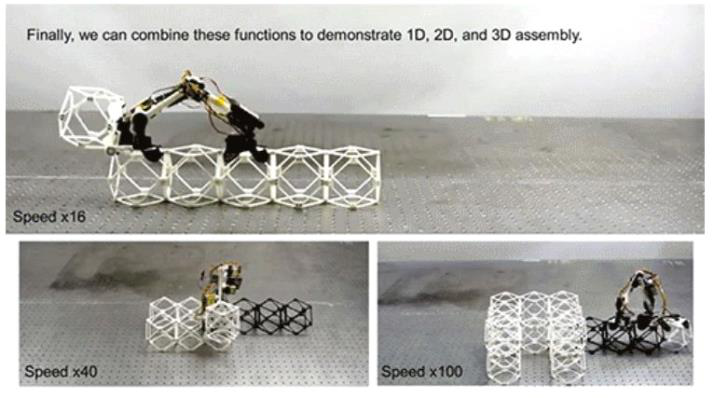
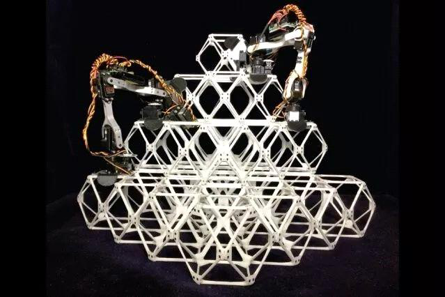
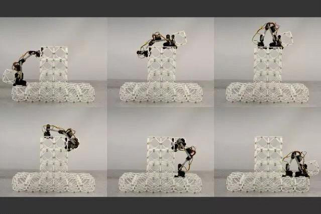

# 突破mit通过简单的机器人系统可批量相同小部件组装出整架飞机甚至整座建筑物
================================================================================

收录于合集

 

**导读**

如果你能制造出一架大型喷气式飞机，那么你就可以建造一座大楼。美国麻省理工学院研制出微型组装机器人"BILL-E"，只要通过简单的机器人系统，就能用批量相同的小部件组装出机翼、整架飞机，甚至整座建筑物。

 

作者：pumpkin酱

 就像孩子用小块的乐高积木组装出大型城堡、飞机模型一样，科研人员试图用一群微型机器人组建出真正的商务飞机、桥梁，甚至是整个建筑。\
\
 

 

**当最终组装变成了唯一组装**

通常我们乘坐的商用飞机都是分节制造的，由工厂a生产机翼、工厂b生产机身部分、工厂c生产尾翼部件......然后这些小部件会被送进大型货运飞机空运到中央工厂进行最终组装。\
那么如果，整架飞机是由大量相同的小部件组成，而这些小部件又全部由一群微型机器人组装而成呢？环节将被简化，最终的组装将成为唯一的组装。这正是麻省理工学院最近研究的机器人项目。**如今，这类机器人的原型版本已经可以组装小型结构，甚至可以作为一个团队一起构建更大的组件。**

 

图注：一组四个装配机器人正在建造一个三维结构。整群这样的机器人可以被用来创造大型结构，如飞机机翼或太空基地。\
\
目前，相关论文已经发表在10月份的《IEEE机器人与自动化》上，由杰奈特（Jenett）、格申菲尔德（Gershenfeld）、研究生阿梅拉·阿卜杜勒-拉赫曼（Amira Abdel-Rahman）和CBA校友肯尼斯·张（Kenneth Cheung SM \'07）博士共同撰写。肯尼斯·张博士在NASA的艾姆斯研究中心工作，在那里他领导了ARMADAS项目，设计可以用机器人组装建造的月球基地。

 

**休斯敦大学电子与计算机工程副教授亚伦·贝克尔(Aaron Becker)称这项研究结合了顶尖的机械设计、令人瞠目结舌的演示、新的机器人硬件和一个包含超过10万个元素的模拟套件。**

**新型机器人装配系统的运作**

"研究的核心是一种新型的机器人技术，我们称之为相对机器人。"格申菲尔德教授说。他解释称，在历史上，机器人技术分两大类：一类是由昂贵的定制组件制成，这些组件针对诸如工厂组装之类的特殊应用进行了精心优化；另一类是由廉价的批量生产的模块制成，性能要低得多。**然而，新的机器人是两者的完美替代。它的生产比前者简单得多，但性能比后者强得多。**\
**格申菲尔德教授认为，关键的区别在于机器人设备与其处理和操作的材料之间的关系。**新型机器人在应用中无法从结构中分离出来，它们可以作为一个系统协同工作。\
举个例子来说，虽然大多数移动机器人需要高度精确的导航系统来跟踪它们的位置，但新的装配机器人只需要跟踪它们相对于当前正在工作的被称为体素的小型子单元的位置。**每当机器人迈出一步进入下一个体素时，它都会根据当前所在的特定组件重新调整自己的位置感。**\
**实际上几乎任何物理对象都可以被重建为更小的三维碎片或体素。**而这些三维碎片和体素可以自己制作简单的支柱和节点。研究小组已经证明，这些简单的组建可以有效地分配负载。它们主要由开放空间组成，因此结构的总重量最小。**可以通过简单的组装器将这些单元拾取并放置在相邻的位置，然后使用内置于每个体素中的锁存系统将它们固定在一起。**

 

图注：两个原型装配机器人正在工作，将一系列称为体素的小单元组装成一个更大的结构。\
机器人本身就像一个小手臂，中间有两个铰链连接的长段，每个末端都有用于夹持在体素结构上的装置。这些简单的装置像尺蠖一样四处移动，通过反复打开和关闭V形身体来从一个移动到下一个，沿着一排体素前进。杰奈特将这种小机器人命名为"BILL-E"（向电影《机器人瓦力》致敬），意思是两足各向同性晶格移动探测器。

 

图注：机器人瓦力\
\
杰奈特已经构建了几个版本的汇编器作为概念验证设计，以及具有锁定机制的相应体素设计，可以轻松地将每个体素与其相邻体素连接或分离。他用这些原型演示了如何将积木组装成线性、二维和三维结构。"我们并没有在机器人中增加精度，精度来自结构，"杰奈特说："这不同于其他所有机器人。它只需要知道下一步该怎么做。"\
\
在组装部件的过程中，每个微型机器**人都可以在结构上计算步数。除了导航，这还可以让机器人纠正每一步的错误，从而消除了典型机器人系统的复杂性。它没有大多数常规的控制系统，但只要它按照步骤来，就可以明确位置。在实际的装配应**用中，由于阿卜杜勒-拉赫曼开发的控制软件可以让机器人加速，批量的这种部件可以一起工作来加快进程。

**机器人系统新领域**

这种装配系统的一个优点是可以通过组装与初始相同的机器人工艺轻松地进行维修。损坏的部分可以从结构上拆卸下来，并用新的部分替换，从而形成和原来一样坚固的结构。随着时间的流逝，该过程还可用于对系统进行修改或改进。

 

图注：一个装配机器人正在工作，将一个结构单元从一个正在施工的结构的顶部向下运送。\
格申菲尔德称，最终，这种系统可以用来建造整个建筑，特别是在太空、月球或火星等极端环境中。**这可以有效减少从地球运送大型预组装结构的需要。**取而代之的是，发送批量的微小部件，或者使用能够在最终目的地制造出这些小部件的系统，从当地材料中制造它们。\
这种利用简单机器人系统把相同的子单元组装成大型结构的方式，已经吸引了一些潜在用户的兴趣，包括美国宇航局、麻省理工学院在这项研究上的合作者，以及欧洲航空航天公司空中客车公司（Airbus SE）也帮助赞助了这项研究。\
德国布伦瑞克工业大学操作系统和计算机网络研究所所长桑德尔·费凯特（Sandor Fekete）没有参与这项工作，但他对这项研究表示了肯定：**"诸如此类的超轻数字材料为构建高效、复杂、大规模的系统提供了令人惊奇的视角，在航空航天应用中至关重要。"**\
**但装配这样的系统仍是一个挑战，费凯特说，他计划加入研究团队，进一步开发控制系统。**"这是使用小型简单机器人有望带来下一个突破的地方：机器人不会感到疲劳或无聊，而使用许多微型机器人似乎是完成这项关键任务的唯一方法。杰奈特和他的合作者们的这项极具独创性和智慧的工作，向建造可动态调节飞机机翼、巨大的太阳帆甚至重构太空基地的建设迈出了巨大一步。"\
格申菲尔德教授感叹，在研究过程中，我们感到自己正在探索混合材料机器人系统的新领域。

END

[]{.underline}[]{.underline}

**招聘内容编辑**

为更好的服务于广大粉丝，提供更优质全面的机器人行业内容，现**机器人大讲堂微信公众号面向粉丝招聘内容编辑一职，**具体要求如下：

 

**工作内容：**关注机器人领域前沿科技、行业动态和热点事件，负责机器人大讲堂原创内容生产、热点事件深度报道、行业专家企业家深度采访等。

 

**岗位要求：**1、有工科背景或从事工科编辑背景，机器人方向优先；2、文字功底较好，有新媒体编辑思维，具有一定英语翻译能力，对视频剪辑有一定的基础；3、具有创业精神和责任心，沟通能力强，踏实肯干；4、如应届生需毕业于知名重点大学。

 

**薪酬待遇：**不低于行业标准的薪酬福利五险一金+补贴与国内外一线大咖、行业翘楚面对面交流的机会

 

**简历投递：**投递邮箱：670749331@qq.com联系电话：15600089673

加入社群

**机器人大讲堂Rob社群开始招募啦！**如果您正在从事或想要从事机器人行业、想要学习这一方向，都欢迎您加入我们共同探讨机器人前沿科技。

 

另外，**腿足机器人、医疗机器人、工业机器人**专业讨论群正在招募中，欢迎各位专业领域的小伙伴加入。

 

在机器人大讲堂公众号对话框回复"**交流群**"获取入群方式！

招募作者

机器人大讲堂正在招募兼职内容创作者和专栏作家

**请将简历和原创作品投至邮箱：**LDjqrdjt@163.com  

我们对职业、所在地等没有要求，欢迎有兴趣有能力的朋友加入！

 

 

 

看累了吗？戳一下"在看"支持我们吧！

 

预览时标签不可点

 

微信扫一扫\
关注该公众号

[知道了]{.underline}

 

微信扫一扫\
使用小程序

[取消]{.underline} [允许]{.underline}

[取消]{.underline} [允许]{.underline}

： ， 。   视频 小程序 赞 ，轻点两下取消赞 在看 ，轻点两下取消在看 [\<From: https://mp.weixin.qq.com/s/hgjm3NdLLKDHMnL3PHYVig\>]{.underline}
PHYVig\>]{.underline}
