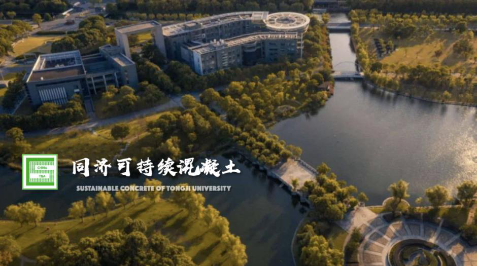

# eth通过数字化设计3d打印开发蛋壳模具实现更加自由的混凝土结构

「砼 · 视野」ETH Zurich通过数字化设计+3D打印开发"蛋壳"模具，实现更加自由的混凝土结构

星期三, 五月 17, 2023

4:49 下午

已剪辑自: [https://mp.weixin.qq.com/s?\_\_biz=MjM5NzUyODg3MA==&mid=2651267089&idx=1&sn=7e39e741685f5f1fb27f387b0fa1b641&chksm=bd2b14588a5c9d4e236401d9dae48dfbacc5905e18b7d98580c85384fadab68726a66c3c27b9&mpshare=1&scene=24&srcid=10294zzL32k0DavlWenZVY3a&sharer\_sharetime=1667020131058&sharer\_shareid=ff2a8143f2589bdc0dabe2e52541346b\#rd]{.underline}

 

 Sustainable Concrete of Tongji University 

**编者按**

瑞士苏黎世联邦理工学院（ETH Zurich）的研究人员将数字化设计和3D打印铸造方法相结合，设计了一种类似"蛋壳"的3D打印模具工艺，将熔融沉积建模(FDM)的3D打印工艺与快速硬化、按需设置的混凝土同步浇筑相结合，使该团队能够以更高效的方式生产复杂、自由形态的混凝土结构。此外，在连续浇筑过程中，快速硬化的混凝土可以用最小化的材料侧压力，允许创建具有复杂几何形状的混凝土结构。

 

这项研发突出了参数化设计和机器人制造相结合所带来的设计可能性，这使得设计师能够有效地塑造自由形式的混凝土构件，而传统的模板工艺往往属于劳动密集型且成本高昂。

 

研究人员表示："这种被称为'蛋壳'的新型制造工艺，允许制造非标、可以优化结构的混凝土构件，同时能够集成标准钢筋，并最小化的减少模板浪费。"

 

**为什么需要借助新的3D打印工艺**

**来筑造混凝土结构? **

 

混凝土是世界上使用最多的建筑材料，然而，为了让混凝土以自由的形态构筑建筑时，它需要由不同材质的模板进行支撑，因为它要从流体材料硬化过渡到有形的固体结构。但模板可能是昂贵的，几乎占材料成本的50%，甚至非标准元素会达到80%\~90%，这是目前业内较大的痛点之一。

 

尽管混凝土可以被塑造成任何形式，但正交结构仍然是标准和普遍推崇的。这意味着非标建筑使用了比实际需要的更多辅助材料，因此创造一种可替代的成型工艺成了很多人的需求。

 

**ETH Zurich的"蛋壳"方法论**

 

为了利用SDC（智能动态铸造）方法的优点，同时消除其缺点，ETH Zurich团队设计了他们的"蛋壳"概念。该新技术将大型机器人FDM 3D打印与SDC开发的按需设置数字铸造系统相结合，这项尝试允许通过使用超薄的外壳作为模板来创建更复杂的结构。

 

研究人员解释说:"通过打印蛋壳模板，可以在不丧失传统建筑结构性能的情况下，生产出更广泛的几何形状。"此外，同时进行3D打印模具和填充材料意味着结构在制造过程中不需要移动，从而减少了运输过程中造成的任何损坏风险。

 

** "蛋壳技术"为更可持续地应用混凝土结构铺平道路 **

 

ETH Zurich团队的建筑研究人员也曾与格拉马西奥·科勒(Gramazio Kohler)合作，通过数字化设计和机器人3D打印开发了"蛋壳亭"装置，该装置曾在德国维特拉设计博物馆展出，通过使用蛋壳技术，进行参数字化设计和计算，从而生成几何结构形状和3D打印的制造数据。

 

 

"蛋壳亭"结构构件的外层薄模板只有3\~5mm厚。模板材料是由玻璃纤维增强PET -G组成，部分材料也回收自之前使用过的"蛋壳"模板。根据ETH Zurich和格拉马西奥·科勒研究中心(Gramazio Kohler Research)的研究，打印四根柱子中的每根需要大约6个小时，而打印四个面板中的每个面板需要16个小时。常规钢筋用于加固楼板和柱，它们由可逆接头连接，因此可以将展馆拆开并组装在不同的位置。

 

这些元素由两种不同类型的混凝土铸造而成。一方面，柱子由快速凝固的混凝土浇筑而成，采用了数字控制浇筑工艺。快速凝固的混凝土将对模板的侧压力降至最低，因此可以使用薄的3D打印模板（"蛋壳模板"）。另一方面，楼板由传统的自密实混凝土浇筑而成，因为模板压力因高度低而受到限制，一旦混凝土完全固化，模板将被移除、清洗、粉碎，并重新组装，以便在新的3D打印中重复使用。

 

该设计突出了3D打印模板与传统加固和组装方法结合的前景。它展示了蛋壳技术如何作为一种工业可扩展系统用于高效材料的混凝土结构，并为建筑中更可持续地使用混凝土铺平了道路。

 

该项目强调了数字话设计工具和机器人制造相结合的设计可能性

 

蛋壳馆结构构件的薄模板只有3\~5mm厚

 

打印每一个柱子大约需要6个小时，

而打印每个面板大约需要16个小时

 

这些柱子由快速凝固的混凝土浇筑而成，

采用数字控制浇筑工艺

 

 
工艺

 

 
工艺

 

 
