# 移动机器人室内定位技术综述
===========================

收录于合集

点击上方"**小白学视觉**"，选择加\"**星标**\"或"**置顶**"

重磅干货，第一时间送达

 

对于移动机器人，定位技术是保证移动机器人轨迹/运动作业的前提技术，特别是跟踪作业的基础。

 

与自动驾驶车辆定位不同，小型移动机器人更需要的是定位精度。根据作业环境，小型移动机器人定位技术可以视为**室内定位系统（Indoor Location System, ILS）**。小型移动机器人定位技术不同于机械加工领域的定位技术，从关键词上可以明显区别"Location/Localization"与"Position/Positioning"。Localization 指的是机器人在作业空间内的自身的位置关系问题，position 是会指向更精密的点问题。

 

本文的主要内容包括：**室内定位测量原理（物理属性）\[1\]，室内定位技术，定位模型方法，定位算法，定位系统评价因子，基于惯导的定位系统，基于无线电网络的定位技术，集群定位算法。**

 

 

**室内定位测量原理**

 

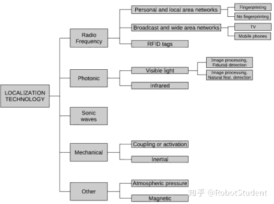 

**无线电频谱与电磁波**

（1）个人或区域互联网，包括IEEE 802.11, Ultra-Wideband (UWB)，ZigBee, 或者 Bluetooth。

-   **采指纹基定位方法**

> 邻近技术
>
> 贝叶斯统计匹配
>
> 极大似然估计
>
> 关联判决（Correlation discriminant kernel selection）
>
> 神经网络

-   **非采指纹基定位方法**

> 几何学

（2）区域广播网络，包括定位目的的网络，例如GPS/GNSS，以及具有定位功能多的网络，例如智能手机网络、电视广播信号。

-   电视信号

-   胞元网络（智能手机）

（3） RFID 标签（4）雷达**光子能场**（1）图像分析，自然特征提取与识别**（场景图片）**

-   移动相机系统

-   固定相机系统

（2）图像分析与特征点标记**（二维码定位）**

此外，还有**声波、机械能（惯性/接触）、地球磁场、大气压。**

 

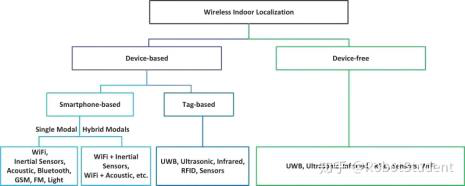 

无线电室内定位系统分类\[2\]

 

**室内定位技术**

 

室内定位服务系统Indoor Location Based Services (ILBS)可以简单地分为三类\[3\]：\
 

**1、网络系统：**基于无线网络

 

**2、惯性系统**：机载惯导系统预估定位

 

**3、混合系统**：融合无线网络与惯性系统的混合系统

-   RSS-IMU 混合系统

-   基于地图的混合系统

-   基于智能手机的混合系统

 

**室内定位模拟方法分类**

 

 

**1、angle of arrival(AoA) 技术**：根据到达信号角度

 

**2、time of arrival(ToA) 技术**：根据到达信号时间（类似雷达测距）

 

**3、fingerprinting 技术，即特征技术**

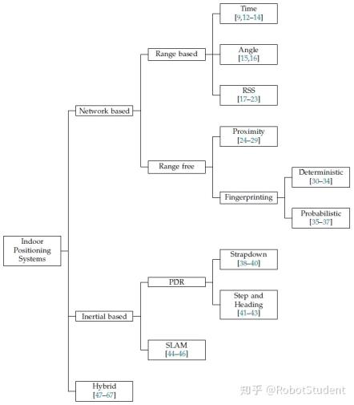 

 

**室内定位模拟算法**

 

**1、三角定位（Triangulation）**，需要借助固定基站或者已知基站位置信息，GPS等无线网络定位法。

**2、邻近（Proximity）**， 使用具有有限的感知范围和分析能力的传感器，RFID。

**3、场景分析（Scene analysis）**，利用场景画面中的特征完成定位分析，点云和3D重构技术，机器视觉。

**4、航位推算（Dead reckoning）**，基于先验信息推算出运动轨迹，惯导、捷联惯导。

### **定位算法**

按照文献\[5\]，基于静态传感器节点的定位技术广泛应用于移动机器人跟踪功能，定位算法可总结为：

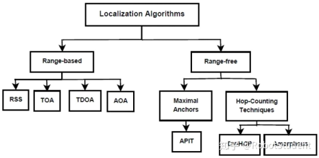 

 

**1、范围基定位（Range-based localization）**

 

-   time-of-arrival (TOA) -- based 定位. 联合最小二乘估计 the Least-Square Estimate

 

-   time-difference-of-arrival (TDOA) -- based 定位. 协同定位

 

-   Angle-of-arrival (AOA) -- based 定位.

 

-   received signal strength (RSS) -- based 定位，联合最大似然估计Maximum likelihood estimate

 

-   MDS Based 定位，联合奇异值分解 Singular Value Decomposition (SVD)

 

-   Channel Impulse Response Based fingerprinting 定位

### **2、无范围基定位（Range-free localization）**

-   Approximate Point in Triangle Test (APIT)

-   Centroid-based 定位

-   Monte-Carlo 定位

-   DV-Hop based 定位

-   Closer point based 定位

-   Based Coordinates (ABC) localization method

### **定位计算补偿方法Implementation methods**

**1、机器学习方法** Machine Learning Based Methods：

least square support vector machine and Gaussian processes ,Semi-supervised Laplacian regularized least squares method and HMM based RSS-EKF (Extended Kalman Filter) method using RSS

 

**2、集中和分布式方法**Centralized and Distributed Methods

 

**3、多传感器数据融合方法**Multi-Sensor Data Fusion Methods

 

**4、采指纹方法**Fingerprinting Based Methods

### **跟踪算法分类（Broad classification of tracking methods）：**

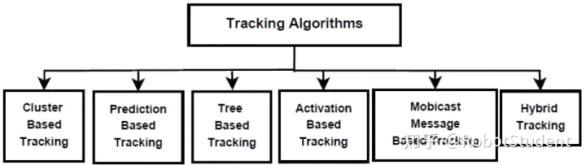 

**1、聚类跟踪算法 **Cluster-based tracking methods, dynamic clustering algorithm for target tracking

 

**2、预测跟踪算法** Prediction-based tracking methods

 

**3、树基跟踪算法** Tree-based tracking methods

 

**4、主动跟踪算法 **Activation-based tracking method

 

**5、Mobicast基跟踪算法** Mobicast-based tracking method

 

 

**室内定位方法评价**

 

 

 

 

1、精度与误差

2、环境适应性。场景对定位系统测量精度影响，一个高性能框架能够避免对重复定位差异

3、消耗：带宽、寿命、能耗、权重与额外设备

4、基站数量

 

 

**基于惯导的定位系统**

 

**惯性导航与定位技术可以分为两类：**  
--------------------------------------

-   捷联惯导系统Strapdown systems: 采用两次积分预测运动

-   步进与航向系统Step and Heading Systems (SHS): 通过表示步进长度与航向的惯性定位向量预测位置

参考下图，惯导定位系统通过二次积分获得定位信息\[6\]

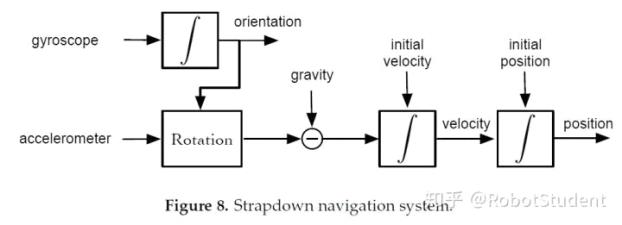 

一个经典的具有定位功能的移动机器人控制系统架构如下图所示，该系统通过无线电、里程计以及惯性测量单元实现自定位功能\[7\]。

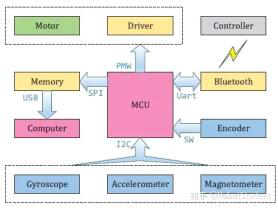 

微型惯性测量单元，包括陀螺仪、加速度计、磁偏角计、温度和气压等功能，通过物理模型和误差模型推算。

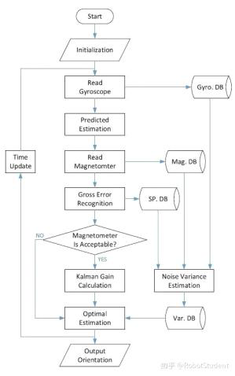 

**扩展卡尔曼滤波算法EKF与粒子滤波器是移动机器人群体定位中最为广泛，**尤其在RoboCup等机器人大赛\[7\]。

 

**基于无线电定位系统**

 

**最流行的室内无线电点位技术方法为RSSI定位算法，是采用AP终端设备组件的网络，通过检测信号功率推算距离，再利用定位模型获取定位信息，最常见的终端是ZigBee。**  
------------------------------------------------------------------------------------------------------------------------------------------------------------

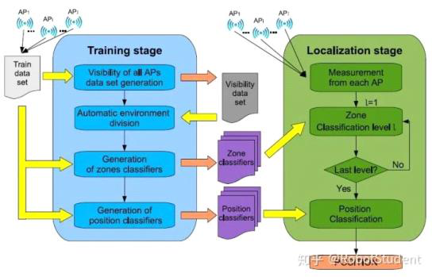 

参考\[8\]

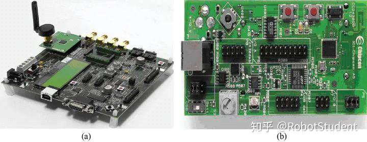 

基于ZigBee组件的微型定位系统

 

 

**集群定位系统**

 

参考文献\[9\]\[10\]，集群类机器人定位技术，不仅可以依靠静态基站进行定位，还可以利用机器人之间无线电终端辅助其它终端进行定位。\
 

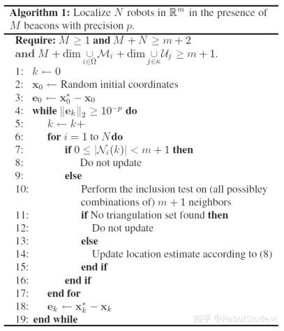 

算法1 \[9\]

因为集群定位存在很大的噪声干扰，因此需要对采集到的信息进行去噪处理，或者提高系统抗干扰能力，采用统计算法提高定位系统精度。如在文献\[10\]，采用了卡尔曼滤波器对定位优化。

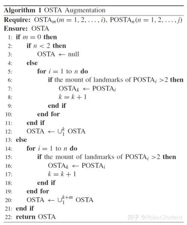 

文献\[10\]-算法1

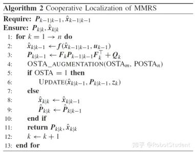 

文献\[10\]-算法2

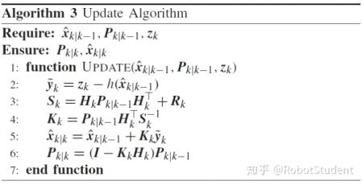 

文献\[10\]-算法3

**好消息！**

**小白学视觉知识星球**

开始面向外开放啦👇👇👇

 

 

 

 

**下载1：OpenCV-Contrib扩展模块中文版教程**\
**在「小白学视觉」公众号后台回复：扩展模块中文教程，即可下载全网第一份OpenCV扩展模块教程中文版，涵盖扩展模块安装、SFM算法、立体视觉、目标跟踪、生物视觉、超分辨率处理等二十多章内容。**\
**下载2：Python视觉实战项目52讲在「小白学视觉」公众号后台回复：Python视觉实战项目，即可下载包括图像分割、口罩检测、车道线检测、车辆计数、添加眼线、车牌识别、字符识别、情绪检测、文本内容提取、面部识别等31个视觉实战项目，助力快速学校计算机视觉。**\
**下载3：OpenCV实战项目20讲在「小白学视觉」公众号后台回复：OpenCV实战项目20讲，即可下载含有20个基于OpenCV实现20个实战项目，实现OpenCV学习进阶。**\
 

**交流群**\
 

 

**欢迎加入公众号读者群一起和同行交流，目前有SLAM、三维视觉、传感器、自动驾驶、计算摄影、检测、分割、识别、医学影像、GAN、算法竞赛等微信群（以后会逐渐细分），请扫描下面微信号加群，备注："昵称+学校/公司+研究方向"，例如："张三 + 上海交大 + 视觉SLAM"。请按照格式备注，否则不予通过。添加成功后会根据研究方向邀请进入相关微信群。请勿在群内发送广告，否则会请出群，谢谢理解\~**

 

 

 

预览时标签不可点

 

微信扫一扫\
关注该公众号

[知道了]{.underline}

 

微信扫一扫\
使用小程序

[取消]{.underline} [允许]{.underline}

[取消]{.underline} [允许]{.underline}

： ， 。   视频 小程序 赞 ，轻点两下取消赞 在看 ，轻点两下取消在看 [\<From: https://mp.weixin.qq.com/s/lwQICleXYPTb3heJp0kzWw\>]{.underline}
