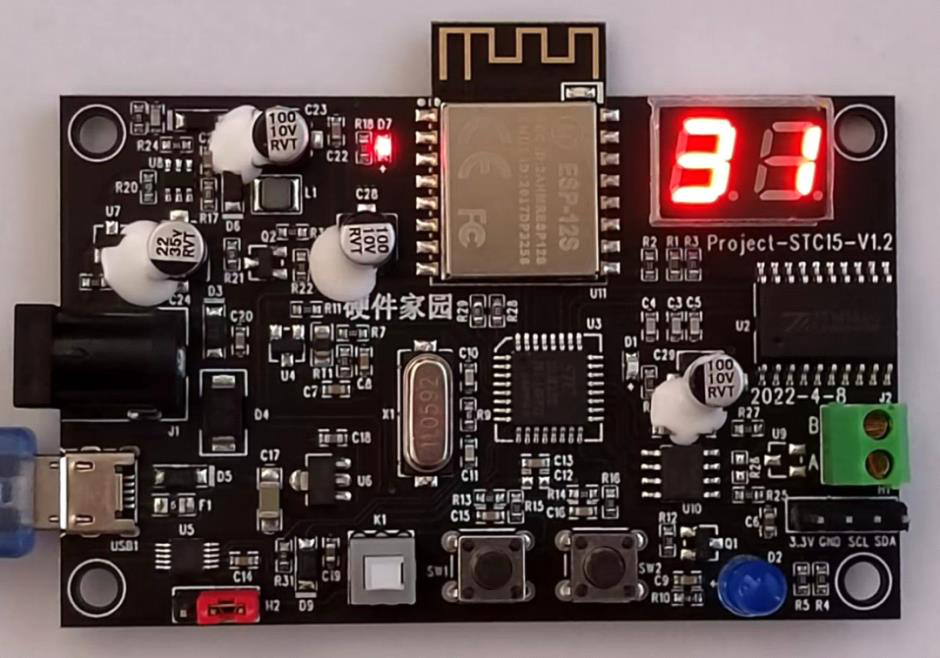

# 单片机代码手把手在线编程与调试___第九讲

单片机代码手把手在线编程与调试 - 第九讲

星期三, 五月 17, 2023

4:50 下午

 

已剪辑自: [https://mp.weixin.qq.com/s?\_\_biz=MjM5MDE2MTM5MQ==&mid=2247530163&idx=1&sn=83171c9cd90f6793908e9f92fb5bb588&chksm=a64b3633913cbf25a183e52b71b0abc4d9b8d83f7108872fea2881e853621f4395ee28029bc4&mpshare=1&scene=24&srcid=0104bpzxU42WOVDIqoKyLYwy&sharer\_sharetime=1672825038585&sharer\_shareid=ff2a8143f2589bdc0dabe2e52541346b\#rd]{.underline}

、

 

 

就喜欢你关注我～

 

 

第九讲

 

硬件平台1：STC8G基础仿真板

硬件平台2：STC15低功耗实战板

硬件平台3：STM32物联网实战板

 

 

英文全称，Pulse-Width Modulation，脉冲宽度调制。是利用微处理器的数字输出来对模拟电路进行控制的一种非常有效的技术。

PWM可用于LED调光，在几k至十几k的频率下，通过调整占空比，快速改变灯亮暗的时间，利用人眼的余晖效应，达到调整LED亮度的目的。

 

二阅读STC15手册 - PWM部分\
 

 

三PWM控制LED亮度在线编程

**现场编程**

 

① 添加PWM外设文件 - .c/.h

② 封装PWM外设，完成功能

③ 测试PWM外设

 

**现场观察**

技术专题班 - 单片机代码在线编程与调试qq群

 

 

  

 

**单片机产品实战项目教学，开源项目，开发工具，技术资料以及更多原创技术文章，请关注微信公众号。**

 

扫描二维码

获取更多精彩

硬件家园

扫描二维码

获取更多精彩

单片机实战教学

 

 

讲师：刘杰，软硬件工程师，十多年单片机产品开发经验。长期进行单片机实战项目教学与部分专题技术教学。

 

**\~\~O(∩\_∩)O\~\~  **

**帅哥美女，不求打赏，请点赞，点击在看  **

**\~\~O(∩\_∩)O\~\~**
