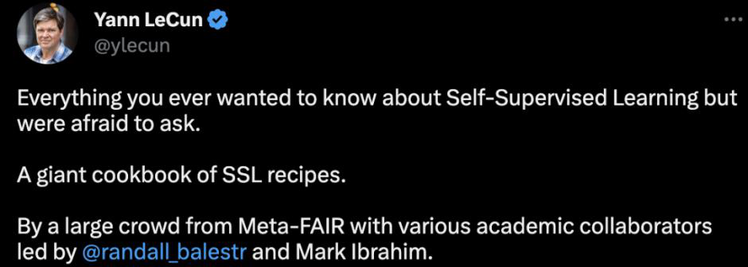

# lecun_70页长篇巨作自监督学习葵花宝典手把手教你学会

LeCun 70页长篇巨作！自监督学习「葵花宝典」，手把手教你学会

星期三, 五月 17, 2023

4:50 下午

已剪辑自: [https://mp.weixin.qq.com/s?\_\_biz=MzI3MTA0MTk1MA==&mid=2652324603&idx=2&sn=e0bc51e70e00dd43743adbf37c68b0ef&chksm=f124360ac653bf1c05193251b96c5b03f7f2a2338c50c210c7f93a7f96f28561023c5463dd59&mpshare=1&scene=24&srcid=0427oosRUbD3Qj6KxefNJOc1&sharer\_sharetime=1682545757654&sharer\_shareid=ff2a8143f2589bdc0dabe2e52541346b\#rd]{.underline}

 

编辑：编辑部

##### **【新智元导读】**自监督学习入门指南，LeCun 70页论文都讲透了。

 

一本自监督学习全套攻略来了！

今天，Yann LeCun、田渊栋等机构的研究者共同发表了一篇70页论文「自监督学习的食谱」。

LeCun称，你曾经想知道，却又不敢问的自监督学习内容全在这儿了。

 

先来看看这篇论文阵容有多强大，除了Meta AI的研究员，还汇集了纽约大学、马里兰大学、加利福尼亚大学戴维斯分校、蒙特利尔大学等6所大学研究人员的智慧。

可想而知，这篇论文含金量有多足了。

论文地址：https://arxiv.org/pdf/2304.12210.pdf

自监督学习（SSL），被称为人工智能的暗物质，是推进机器学习发展的一条有希望的道路。

然而，就像烹饪一样，SSL是一门精致的艺术，有很高的门槛。

尽管人们对许多组件非常熟悉，但成功地训练一个SSL，需要做出从假设任务，到训练超参数等一系列令人眼花缭乱的选择。

这篇最新论文的目标就是，降低进入SSL研究的门槛，像烹饪书方式一样提供最新的「SSL食谱」。

Meta的研究科学家田渊栋表示，如果你想做SSL研究，就来看看这本书吧。

70页巨长论文看似让人劝退，但其实参考文献就占了26页。

SSL烹饪指南

  
--

这篇论文究竟讲了什么内容，先来看看满屏糊脸的目录。

正如论文作者所称，要成功烹饪，你必须首先学习基本的技巧：切菜、炒菜等。

第一部分主要介绍什么是SSL，重要性，以及写这本「食谱」的主要原因。

第二部分讲了SSL的家族和来源，给出了常用词汇，从自我监督学习的基本技巧开始手把手教你。

其中包括：-SSL的起源-深度度量学习家族：SimCLR/NNCLR/MeanSHIFT/SCL-自蒸馏家族：BYOL/SimSIAM/DINO-典型相关分析家族：VICReg/BarlowTwins/SWAV/W-MSE-掩码图像建模-自监督学习的理论统一：SSL理论研究；表征的维度坍缩-预训练数据\
 

方法有了，接下来，厨师必须学会熟练运用这些技巧，做出一道美味的菜肴。

这不仅需要学习现有的食谱，还要会自己组合食材，并会评估这道菜。

因此，第三部分就是重中之重了。

这部分主要介绍了常见的训练方法，包括超参数的选择，如何使用组建，以及评估方法。

-数据增强的作用：multi-crop的作用-projector的作用-SSL的统一先验还是SSL在不平衡数据上的失败-教师学生架构具体策略：移除平均教师的作用；projector在自标记SSL中的作用-标准超参数的作用：小批量大小的作用；学习率（调度器）和优化器的作用；重量衰减的作用；Transformer注意事项-高性能掩码图像建模技术-评估SSL模型：带标签评估；无标签评估；超越分类；视觉评估-提速训练：分布式训练；用FFCV和其他加速训练更快；加速视觉Transformer的训练第四部分：将自监督学习扩展到图像和分类之外-其他数据域的策略-将多个模式纳入SSL训练-用本地化方法构建密集预测任务的特征提取器\
 

在此，作者还分享了前沿的研究人员关于常见训练配置，以及陷阱的实用技巧。

最后，文章总结道，自监督学习（SSL）为提高机器智能建立了一个新的范式。

尽管取得了许多成功，但SSL仍然是一个令人生畏的领域，其中包含了许多复杂的实现方法。

由于研究的快速发展和SSL方法的广泛应用，要了解这个领域仍然具有挑战性。

这对于那些最近加入该领域的研究者和从业者来说是一个问题，从而为SSL研究和部署创造了很高的进入门槛。

作者希望这个实用指南能够帮助降低这些壁垒，使任何背景的好奇研究者都能探索各种方法，了解各种调整参数的作用，并获得在SSL领域取得成功所需的技能。

AI暗物质

  
--

2021年，LeCun曾在自家博客上发文首次提出，自监督学习是「人工智能暗物质」这一概念。

一直以来，人工智能系统在标记数据中学习取得了很大的进展。然而，这些模型仅在训练专家模型时表现得非常好，应用非常有限。

实际上，给世界上所有东西贴上标签是无法穷尽的。这就不得不另辟蹊径，许多研究者发现，监督学习是构建更智能「多面手」模型更有力的方法。

如果AI系统能够收集到比训练数据集更深入、更细致的现实理解，最终能够实现接近人类智能水平的智能。

我们认为，自监督学习是在人工智能系统中构建这种背景知识和近似常识形式的最有前途的方法之一。

SSL从数据本身获得监督信号，通常利用数据中的底层结构。自监督学习的一般技术是预测任何未观察到的，或隐藏的输入部分 (或属性) 。

此外，还可以预测，视频中过去或未来的帧(隐藏数据)和当前的帧(观察数据)。

由于SSL使用的是数据本身的结构，所以它可以实现跨模式的能力，比如（视频、音频），以及跨大型数据集利用各种监督信号。

在计算机视觉领域，自监督学习通过在10亿张图像上训练的SEER等模型，推动了数据规模的扩大。

SSL计算机视觉方法已经能够匹配，或在某些情况下超过模型训练的标记数据，甚至也包括竞争基准ImageNet。

此外，自监督学习也被成功地应用在其他形式，如视频、音频和时间序列。

自监督学习定义了一个基于未标记输入的前提任务，以产生描述性和可理解的表示。

在自然语言中，一个常见的SSL目标是在文本中掩盖一个词去预测周围的词。这种目标预测是为了鼓励模型来捕捉文本和词语之间的关系，并且不需要任何标签。

相同的SSL模型表示可以在一系列下游任务中使用，比如翻译文本、汇总、甚至生成文本等任务。

可见，SSL使人工智能系统能够从巨量的数据中学习，这对于识别和理解更微妙、更不常见的世界表示模式很重要。

网友热评

  
--

一位网友对自己博士要做的领域产生疑问，向LeCun求助：

「还值得攻读人工智能博士学位吗？我想做医学领域的多模态诊断模型。但随着最近新模型的涌现，我担心会被大公司悄悄地超越，或者因没有做出任何重大贡献而浪费时间。」

在LeCun看来，

1\. 大多数好的想法仍然来自学术界。你只管做自己的。没有必要去超越一个强大的基准。

2\. 做的研究远离工业界占主导地位的大规模应用就可以了

3\. 你认为谁在工业界做人工智能研发？依旧是博士们。

我认为 「暗物质g」代表了本世纪MI/GI的主流方法，SSL是其中的一个先驱。其背后有着严肃的科学，这是Brain Cantwell Smith在他2019年的书中论证的一个核心主题。

从LLaMa的开源，再到LeCun自剑盾学习攻略，Meta在开源上做了很多。

网友称赞，这段时间，Meta在生成式人工智能和自我监督学习方面做出了巨大贡献。对SSL总结工作非常好，非常感激。

参考资料：https://arxiv.org/abs/2304.12210https://twitter.com/ylecun/status/1650798206283051009

 

 

 

 
