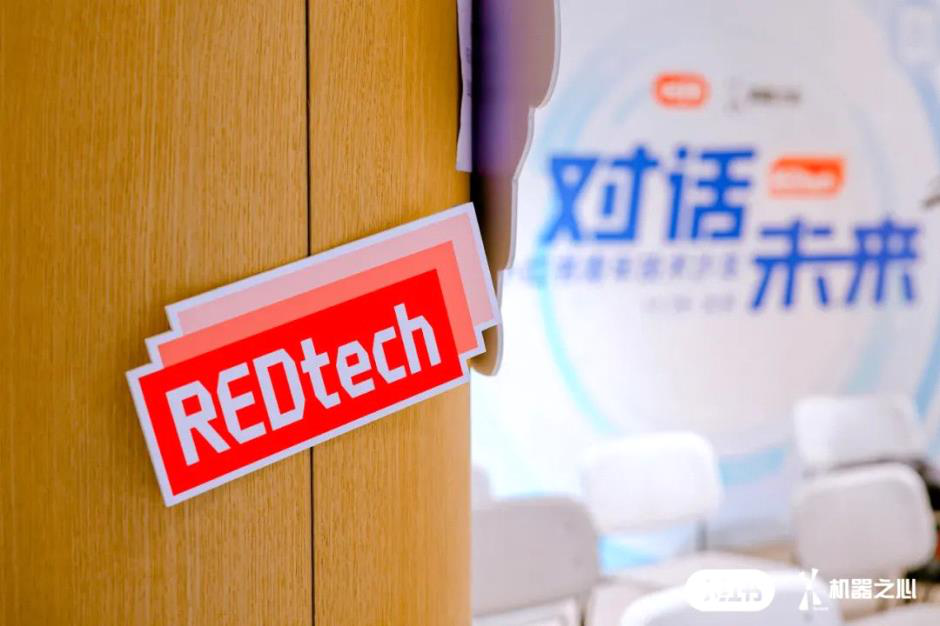
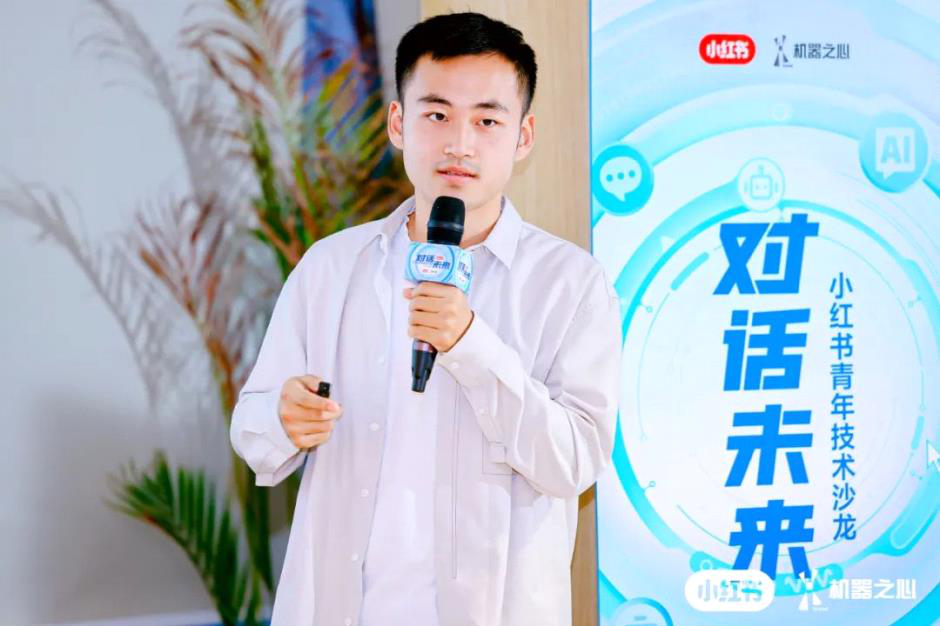

# 火了一整年的多模态学习在工业界的落地和实践进展到底怎么样了

火了一整年的多模态学习，在工业界的落地和实践进展到底怎么样了？

星期三, 五月 17, 2023

4:49 下午

已剪辑自: [https://mp.weixin.qq.com/s?\_\_biz=MzA3MzI4MjgzMw==&mid=2650861827&idx=2&sn=40f171169b1d313bb5002f5807d68caa&chksm=84e5357db392bc6bc983df14aa30466a42a11d13d76479df1573f25761d469a3edb23d45b994&mpshare=1&scene=24&srcid=1123S3KxoJzs1PfwyZhSpmhF&sharer\_sharetime=1669217707301&sharer\_shareid=ff2a8143f2589bdc0dabe2e52541346b\#rd]{.underline}

在小红书，看见多模态学习的无限可能。

 

随着 NLP 和 CV 的日益融合，多模态学习越来越受到学界和业界的重视。在 DALL-E、Stable Diffusion 等文本生成图像跨模态应用成熟之后，围绕多模态学习、AIGC 等议题的讨论热度持续攀升。\
 

当然，还有很多问题需要进一步探索：比如，多模态学习在哪些任务上还有极具前景的应用潜力？多模态技术在真实场景中的泛化受到哪些限制？

 

11 月 19 日，小红书 REDtech 青年技术沙龙 - 北京站圆满收官。在这场活动上，数位顶尖学者、小红书技术团队大神和青年学子们齐聚一堂，对多模态技术、AIGC、青年人才职业发展等热门议题进行了深入讨论。

出席本次沙龙的嘉宾包括小红书社区部多媒体智能算法负责人张德兵、中国科学院自动化研究所研究员、博士生导师张兆翔，北京智源人工智能研究院研究员曹越，此外，本场沙龙还为即将投身业界的高校学子特别设置了嘉宾对谈、自由交流等环节。北京师范大学人工智能学院黄华教授与小红书技术副总裁风笛。为青年人才们提供了很多有益的学术研究指导与建议。\
 

 

**多模态衍进之路**\
**多模态学习的本质，可以理解为从包括文本、图像、视频、音频等不同模态的信息中学习并且提升自身算法。此前，对于不同模态的数据，大家使用的是不同的网络架构，比如 CV 领域使用 Convolution，NLP 领域使用 Transformer，图领域使用图网络。**\
**多模态学习的发展是如何打破「分界线」，促使人工智能走向统一的？作为本场沙龙的学界代表之一，北京智源人工智能研究院研究员曹越从理论研究的角度切入，回溯了多模态的衍进之路。**\
 

 

曹越的研究领域包括基础模型、自监督学习、多模态学习。在清华大学取得博士学位之后，曹越加入了微软亚洲研究院视觉计算组。期间参与了多项重要研究，包括 Swin Transformer、GCNet、SimMIM 与 VL-BERT 等。2021 年，Swin Transformer 获得了 ICCV 最佳论文奖---马尔奖。\
他认为，从建模的角度看，当前的人工智能领域在逐渐走向统一。\
在机器学习时代，这种统一表现在范式上。很久之前，对于不同任务，研究者需要实现手动设计规则来完成任务。后来，模型可以从历史数据中进行学习，并且进行预测。在这个过程中，研究者需要做的是针对不同的任务设计相应的模型、损失和算法。到了深度学习时代，这种统一更多体现在架构上。不同任务都开始使用深度神经网络，包括 CNN、RNN、LSTM 等。\
曹越表示，在一系列变革之后，架构和预训练过程还有待统一。对于不同模态的数据而言，大家会使用不同基础架构单元，比如对于图片会使用卷积神经网络，对于文本则使用 Transformer，二者的表征学习过程是不同的。这种规则也在发生变化。\
在视觉领域，卷积神经网络在很长一段时间都占据主导地位。2017 年后，Transformer 大放异彩，一些研究人员致力于将其应用到计算机视觉中。学术界发现 Transformer 的网络结构设计可以几乎不经过任何改变直接应用到视觉信号。于是不管是自然语言处理还是视觉类任务，都开始使用 Transformer 作为基础架构单元。这方面也有很多代表作，比如 ViT、DeiT、Swin Transformer 等。\
同时，模型的预训练方法逐渐统一。视觉领域的训练往往需要大量人类标注的语言，而语言学习过程中的自监督预训练不需要额外进行标注。借助这种方式，视觉模型也可以利用几乎无限的数据进行预训练模型之后，并在一系列下游任务中取得非常瞩目的性能提升。这方面的代表作有BEiT、SimMIM、MAE等。\
下一步会走向何方？曹越认为，通用模型时代或将到来，预训练模型无需微调就可以处理不同模态的输入，包括语言、视频和图像等，并且能够完成不同的任务。\
小红书的多模态实践\
在学术界不断取得前沿突破的同时，多模态技术也走进了工业界，逐渐落地生根。作为近年来国内发展最迅速的移动互联网平台之一，数亿量级的搜推流量、跨越多个模态的海量数据集、AI 智能化辅助 UGC 创作、基于多云的高可用基础架构、融合用户 - 商品 - 内容的深度理解及表征学习...... 这样的生态带来了很多前沿的技术挑战，小红书已经成为了多模态相关技术的绝佳落地场和领先实践场，为小红书的技术人提供了广阔的成长空间。\
本场沙龙上，小红书社区部多模态智能算法负责人张德兵分享了《小红书多模态智能创作技术与应用》相关主题内容。张德兵本科毕业于浙大丘成桐数学英才班，长期关注 CV / NLP / 音频 / 多模态 / 智能创作等相关技术，并推动 CV、多模态等技术在安防、零售、体育等 TO B 场景和短视频、广告等 C 端场景的多项业务落地。\
 

他在分享中提到，每天都有很多普通创作者在小红书上真诚分享和记录自己的生活，但是「创作」并不是一件特别容易的事。尤其是对于小红书社区的 UGC 属性而言，普通用户在如何进行视频表达的时候，会遇到拍摄的视频缺乏亮点、学不会复杂的剪辑过程等等阻碍。\
如何以技术手段克服这些挑战，帮助用户更好地记录生活、表达生活，也是小红书技术团队认真考虑的问题。\
目前，在小红书，多模态智能创作已经在助力更多普通人进行高效的内容创作，比如

智能模板、一键成片、一键添加闪光点等功能。

 

以上图的视频和图文模板为例，在制作内容的时候，用户并不需要有特别专业的剪辑能力、创作能力，只要仿照类似的模板指引，就可以非常便捷地制作类似的内容。在多模态技术的加持下，小红书还提供了基于文案寻找相关素材的辅助功能，加上智能配乐即可得到想要的结果。\
解决这些挑战并不容易。因此，小红书一直以来都在深耕相关底层技术，特别是多模态技术。在沙龙现场，张德兵深入介绍了小红书多模态智能创作技术的整体框架：\
 

 

为了实现更好的辅助创作效果，小红书技术团队打造了一条比较复杂的技术链路，从基础架构、基础 AI 能力到端云协同的操作。此外，为了跟设计师有很好的协同，团队还做了大量提效工具，让设计师和 AI 的合作更加密切，更好地还原亮点效果，支撑各种各样的上游应用场景。\
小红书技术团队的布局分三部分：视觉维度；音频维度；多模态维度。视觉技术层面，包括目标精细分割、智能补全、稳定光流、深度估计；音频技术层面，包括 ASR、TTS、音乐生成。此外，特别值得关注的是多模态技术的应用。\
 

鉴于小红书站内有非常多优质图文数据、笔记评论以及外部开源语料，团队基于大规模中文语料库和高质量的图文数据，做了小红书版本的多元场景跨模态预训练模型。在基础的训练模型版本上，团队结合具体场景去进行进一步的优化。张德兵介绍说，除了文案推荐之外，视觉元素和音乐之间的关联、歌词之间的关联、内容和模板之间的关联都是各种各样多模态形式，其关联性都可以通过跨模态匹配来建模。而且用户使用过程中会留下越来越多的行为信号，这些信号也可以用来持续优化算法，提升用户体验。

还有一个方向是内容生成。对于最近热门的AIGC方向，小红书技术团队也在做一些尝试，一个很典型的方式是基于文本描述来搜索或者生成内容，另外如何基于用户提供的素材来进行更好的个性化创作也是个很有趣的方向。\
 

**当自动驾驶遇见「多模态」**\
**正如上述内容所说，视频、图像、文字、语音这些我们日常接触到的信息形式都可以算作模态。而从理论上说，模态的范围要比我们的感知能力更广泛，比如利用传感器获得的雷达、红外线等感应数据也属于模态信息。**\
**这类模态信息在自动驾驶场景中更为常见。在本场沙龙上，中国科学院自动化研究所研究员张兆翔教授分享了《面向自动驾驶场景的多源融合视觉感知》相关内容。**\
 

张兆翔教授现为中国科学院自动化研究所研究员、博士生导师。他的主要研究方向包括视觉场景理解、类脑认知与学习等，在 TPAMI、IJCV、JMLR、CVPR 等本领域顶刊顶会发表论文 100 余篇，担任过 CVPR、ICCV、AAAI、IJCAI、ACM MM 等知名国际会议的领域主席。\
在当下炙手可热的自动驾驶行业，多源融合视觉感知是非常重要的技术路线。张兆翔表示，自动驾驶场景的感知本质上是多模态、多任务的。比如视觉感知存在不同场景，这些场景中的尺寸、视角可能又各不相同。一直以来，张兆翔致力于探索模型的自适应性，包括如何解决标注问题、如何适配场景等问题。\
在分享中，他介绍了一项代表性研究：三叉戟网络 TriNet（Trident Network for Object Detection）。这项研究探索了让一个通用模型借助不同的分支类型去刻画尺度，分别适应解决小目标、中型目标、大目标的问题。\
随后，张兆翔亦介绍了自己在图像分割领域的研究心得。相比于小红书技术实践中常见的人形分割，现实场景中的分割任务更加多样，比如帽子、水杯、路灯等物体。为了降低大量数据标注所带来的成本问题，他和团队将点级标注用于弱监督的全景分割。与完全监督方法所使用的密集的像素级标签不同，点级标注只为每个目标提供一个单点作为监督，大大减少了标注负担。\
 

*这项研究《Pointly-Supervised Panoptic Segmentation》亿发表在 ECCV 2022 上。*\
*多源融合视觉感知的对象不仅包括图像，还包括点云，其场景不仅在车上，还包括各种各样智能设备，甚至是扫地机器人。面对大量非结构化的原始数据，张兆翔也尝试引入 Transformer 架构，实现方法上的创新。在一篇 CVPR 2022 论文中，他提出了空间稀疏的单步长 Transformer 结构，完成了主干网络的空间稀疏化，提升了物体检测性能。*\
*「大咖面对面」：给青年人的研究建议*\
*聆听完最前沿的技术分享之后，在本次沙龙的压轴环节，北京师范大学人工智能学院黄华教授、小红书技术副总裁风笛两位前辈分别从学界和业界角度出发，开展了一场关于「AI 技术提升与实力升级」的对谈。*\
 

多模态学习、AIGC 都属于当下比较火的方向，也引发了大量技术人才的关注。那么，作为一名青年研究者，如何看待瞬息万变的研究热点呢？\
风笛表示，真正做出好的产品需要的是专注于用户价值和产品体验。对于新的技术、新的模型方法，保持关注、了解到有哪些新的东西即可，不一定非要追逐热点。\
黄华教授表示，从研究者个人角度出发的话，追热点也不是必须的。因为热点是随时变化的，当热点出现的时候，你往往追不到它，同时也会有很多其他人在追。换个角度说，即使你现在做的工作不是热点，但两三年后也许会变成热点。况且从研究角度来讲，很多学术思想是相通的。\
还有一些话题，也是在场青年学子非常关心的。比如，当前 AI 领域什么样的人才是最紧缺的？是技术研究型，还是落地应用型？基于这样的需求，学界和业界又该如何助力 AI 人才的培养呢？针对这些问题，两位嘉宾分别给出了自己的建议。\
在黄华教授看来，人工智能的理论研究很重要，但是对企业来说，更重要的是落地，所以两种人才都是被需要的。对于 AI 相关专业的学生来说，如果说想去到工业界，就可以尽量多做点技术类的项目，如果想在学术界深造，就多做一些理论方面的工作。\
高校的人才培养模式和企业界需求存在差异，学术界追求的是发表高水平论文，而企业要求的是能解决实际问题。现在教育界提倡的是「研究真问题、真研究问题」，想要解决好这个问题，就需要学界和业界合作。做理论研究或许可以不考虑实际需求，但也有一种说法，做理论的人如果不了解工程问题，理论也不会做得特别好，因为真正有价值的理论问题通常是要能够解决实际问题的。\
风笛则更多根据小红书的经验，从企业界的角度出发介绍了青年技术人才成长与培养的路径。他提到，企业对具备技术落地能力的人才需求会更多一些，但是同时也会需要少量基础研究类人才。特别地，像小红书这样的企业会很关注对于数据和算力的挖掘，这个方向上还需要更多的优秀 AI 人才来共同突破。\
小红书作为一家 UGC 视频分享平台，拥有非常特殊的海量的多模态数据集，在信息检索、信息推荐、信息理解，特别在智能创作相关技术，以及底层多模态学习、统一表征学习等方向上，都能提供非常重要的研究源头：数据。\
这恰好弥补了学术界研究普遍缺少的要素------对于很多做人工智能方向研究的实验室来说，挑战基本不在于硬件设备的条件，缺少的是真正能够为数亿用户所使用的应用场景，以及这些场景产生的真实数据。很多工作难以与真实用户做交互，更多是基于可能存在偏差的历史数据进行研究。而数据集和真实场景，都是小红书本身具备的优势。此外，小红书还能提供比较强大的算力资源。\
此外，对于优秀的应届毕业生，小红书从人才培养机制上进行了精心的设置，包括从融入职场到成长为行业技术人才全周期的的详细培养方案。\
 

入职之后，小红书技术团队会通过薯光计划、Mentor 机制等方式，帮助应届生成为真正的技术人。小红书从内部精选了一批绩优资深工程师组成 Mentor 池，每位应届生都会有专属的 Mentor 手把手带教，帮助应届生在实践中找到擅长的技术方向。\
在小红书技术团队中，很多成员都拥有谷歌、BAT 等海内外一线大厂的工作经历。他们也会将这些经验沉淀下来，传承给每一位入职小红书的应届生。\
在专业能力培养上，小红书技术团队会设置各种技术交流形式，比如由公司内部技术领域专家授课答疑的「技术 101 课程」、定期内部技术分享、公司内部学术牛人组织的「论文领读会」以及定期的高校及重点实验室交流等，帮助他们尽早接触到更为前沿的工业级技术，实现更好的成长。\
此外，小红书技术团队对于年轻人是非常友好的，随着小红书的不断发展，有非常多的技术场景给予了同学完整参与乃至扮演重要角色的机会，以往已经有多位技术应届生获得了连续晋升。\
伴随着小红书社区的高速增长，小红书技术团队所能提供的人才成长空间，比以往任何时候都更加广阔，也正在等待更多优秀 AI 青年学子的加入。\
小红书 2023 届校招仍有相关岗位开放内推，欢迎有志于此的你扫码参与～\
 

© THE END 转载请联系本公众号获得授权投稿或寻求报道：content@jiqizhixin.com
.com
