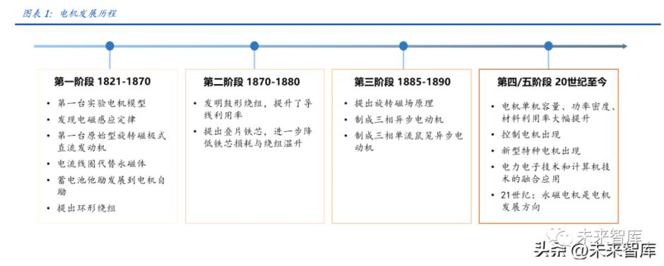

# 一电机技术日趋成熟伺服电机和步进电机是行业主流
======================================================

**1.1 历经 200 年技术更迭与产业磨砺，电机逐步走向成熟**

"电机"广义上来说包括电动机、发动机和原动机等所有可实现电能、机械能相互转化 的装臵，但通常情况下所谓电机指的是电动机。电动机也称马达，它的作用是将电能转 化为机械能，产生驱动力矩，作为用电器和机械设备的动力源。电机发展至今已有 200 多年的历史，其发展历程可分为以下四个重要阶段。

第一阶段：基本理论建立，直流电机产生（1821-1870）。1821 年法拉第制成了世界上 第一个实验电机的模型，并在 1831 年发现了电磁感应定律。1832 年皮克西利用磁铁和 线圈的相对运动，制成了一台原始型旋转磁极式直流发动机，这就是现在直流发电机的 雏形。1834-1870 年期间，发电机领域产生了三项重大发明和改进，即永磁体转变到电 流线圈、西门子兄弟从蓄电池他励发展到发电机自励、格拉姆提出环形绕组，此后发电 机与电动机的可逆原理被广泛接受，两者同步发展。

第二阶段：直流电机趋于成熟，交流电机开始受到关注（1870-1880）。1873 年，海夫 纳阿尔泰涅克发明了鼓形绕组，提高了导线的利用率。1880 年爱迪生提出采用叠片铁芯， 进一步降低了铁芯损耗与绕组温升。鼓形电枢绕组和有槽叠片铁芯结构一直沿用至今。随着直流电机的广泛应用，其固有缺点也很快暴露出来，主要问题在于远距离输电、电 机换向存在困难，因此 19 世纪 80 年代后，人们注意力逐渐向交流电机方向转移。

第三阶段：交流电机诞生并不断向前发展（1885-1890）。1885 年加利莱奥费拉里斯提 出了旋转磁场原理，并研制出厂二相异步电动机模型，1886 年移居尼古拉〃特斯拉也独 立地研制出二相异步电动机。1889 年多利沃多勃〃罗沃利斯基制成一台三相交流单鼠笼 异步电动机，与单相和两相系统相比，三相系统效率高、用铜少，电机性价比、容量体 积比和材料利用率均有明显改进。交流电机的研制和发展，特别是三相交流电机的研制 成功为远距离输电创造了条件，把电工技术提高到一个新的阶段。

第四阶段：电机理论和设计、制造技术逐步完善（20 世纪至 21 世纪）。进入 20 世纪， 工业的高速发展不断对电机提出新的要求，而自动化方面的特殊需要则使控制电机和特 种电机迅速发展。同时，这一时期电机理论不断丰富，材料和冷却技术不断改进，交、 直流电机的单机容量、功率密度与材料利用率都有显著提高。

第五阶段：永磁电机是 21 世纪电机发展方向（21 世纪至今）。进入 21 世纪，专用性、 轻量化、高性能是电机行业发展方向。在专门化的基础上，专用电机的节电潜能很大。而永磁电机控制性能好，节能且体积小，可通过频率的变化调速，又容易做成低速直接 驱动等优点，在医疗器械、视听产品、计算机、数控机床、电动车辆、航空航天产品等 领域得到广泛应用。同时轻量化需求下，属于永磁伺服电机中的小功率的空心杯电机等 微型电机开始得到各个行业的重视。

 

**1.2 人形机器人新增电机需求，伺服电机在众多分类中脱颖而出**

电机种类繁多，按用途可分为动力电机和控制电机两大类，动力电机功率较大，侧重于 电机的启动、运行和制动方面的性能指标，而控制电机输出功率较小，侧重于电机控制 精度和响应速度等指标。动力电机：按运动方式，可分为旋转电机和直线电机。旋转电机按电压性质分为直流电 机与交流电机，其中直流电机按内部有无碳刷可分为有刷电机和无刷电机两种；交流电 机按结构可分为同步电机和异步电机，按相数不同可分为三相交流电机和单相交流电机。交流电机按其转子结构不同，还可分为笼型和绕线转子型，其中笼型三相异步电动机为 应用最广的动力电机。控制电机：根据控制方法与用途的不同，可分为步进电机、伺服电机、测速电机、力矩 电机（也叫直驱电机）等，其中步进电机是一种电脉冲信号转换成角位移或者线位移的 电动机，每一个脉冲信号，对应的有一个角度，转速与脉冲频率有关。整体看，控制电 机相较于动力电机，增加了控制电路，但电机部分与动力电机并无本质区别，仍可按动 力电机的分类方式进行划分。

伺服和步进电机是控制电机下的主要产品，其中伺服电机优势更加明显。步进电机是一种将电脉冲信号转换成相应角位移或线位移的电动机，每输入一个脉冲信号，转子就转 动一个角度或前进一步，其输出的角位移或线位移与输入的脉冲数成正比，转速与脉冲 频率成正比。伺服电机则是一种补助马达间接变速装臵，其可以控制速度，位臵精度非 常准确，伺服电机分为直流和交流伺服电动机两大类，其主要特点是当信号电压为零时 无自转现象，转速随着转矩的增加而匀速下降。在数字控制的发展趋势下，运动控制系 统中大多采用步进电机或全数字式交流伺服电机作为执行电动机。两者在控制方式上相 似（脉冲和方向信号），但在使用性能和应用场合上存在着差异。步进电机通常为开环控 制，易出现失速或与控制器失去同步的情况。伺服电机为闭环控制，通过实时的闭环信 号反馈来调整，实现更精密的控制。综合来讲，伺服电机在控制精度、低频特性、过载 能力、速度响应等许多性能方面都优于步进电机，更适用于工业自动化、机器人等领域， 但步进电机具备性价比优势，在一些要求不高的场合仍可使用。

 

人形机器人新增更多电机需求，伺服电机和步进电机均具备适配性。特斯拉预计在 9 月 30 日的特斯拉第二个人工智能日（AI Day）发布人形机器人产品，人形机器人有望催生 更大的电机用量需求。从电机用量来看，单台人型机器人电机用量超 40 个，而对于所 使用的电机产品而言，具备更高控制精度并广泛使用于工业机器人、通用自动化领域的 伺服电机将是未来人形机器人的主要配臵。此外，对于步进电机而言，其在人形机器人的眼睛部位具备较好适配性，目前现有学术研究和实验设计中，在机器人仿生眼中使用 步进电机是较为理想和可靠的选择，因为仿生眼在需要具有人类一样的视觉功能，并且 体积较小，要求驱动摄像头的驱动机构具备小体积并能提供各自的两个自由度运动 （180°），而步进电机可以实现无位臵传感器的位臵控制，并保证平稳运行，因此在人 形机器人眼部安装步进电机具备较好适配性。
