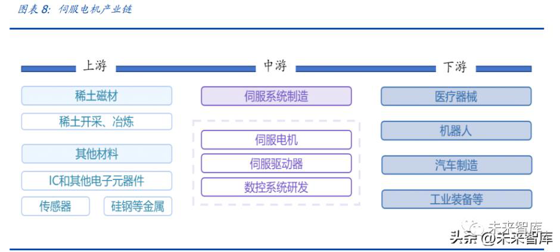
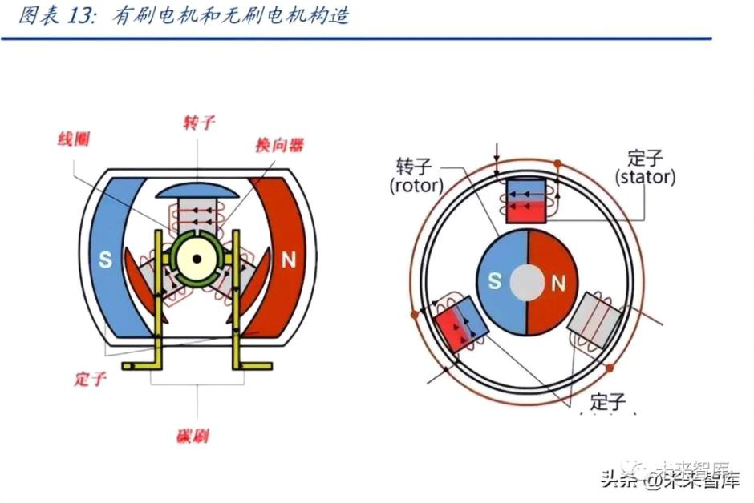
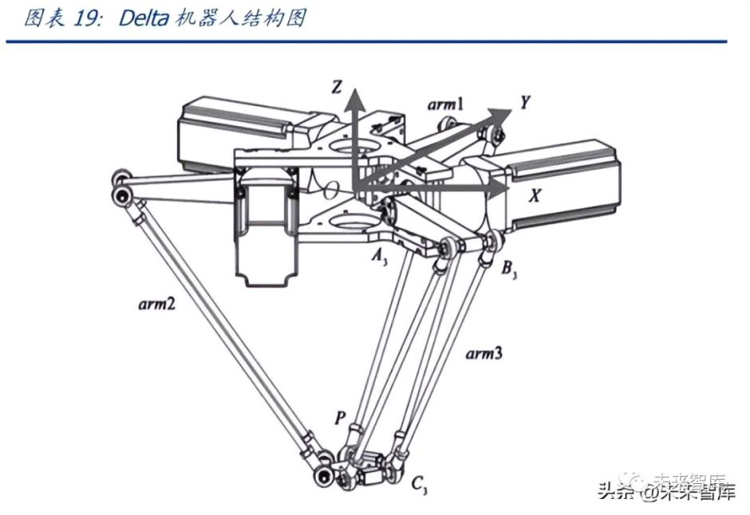
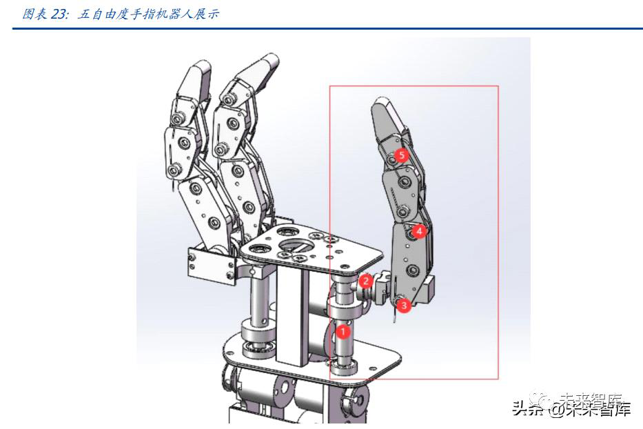

# 二人形机器人大时代来临伺服电机需求有望爆发
==================================================

**2.1 伺服电机种类众多，高效+轻量化+微型化产品是未来发展方向**

伺服电机产业链层次明晰，稀土磁材是必备原材料。伺服电机产业链涉及稀土磁材、电 子原器件、伺服系统制造、机器人等，上游来看，伺服电机行业的上游主要是稀土磁材 和电子零部件等其他材料，稀土磁材是伺服电机制造过程中必需的重要原材料。中游来 看，除伺服电机制造以外，伺服系统还包括伺服驱动器制造以及数控系统研发等环节。下游来看，伺服电机可以广泛应用于医疗器械、机器人制造、汽车制造和工业装备制造 等领域，具备广阔的应用前景。

 

国内伺服电机市场规模近 200 亿元，汇川技术引领国产替代浪潮。近看来，我国伺服电 机市场规模稳步增长，根据工控网数据，2021 年我国伺服电机市场约 169 亿元， 2017-2021 年 CAGR 约为 10%，受到下游工业机器人、医疗器械、电子制造设备等产业 扩张的影响，伺服电机在新兴产业应用规模也不断增加。从竞争格局上看，汇川技术已 占领国内龙头地位，根据 MIR DATABANK 的数据显示，2021 年上半年，国产品牌中， 汇川技术在国内市场份额首次排名第一，市占率达 15.9%，除汇川外，排名靠前的电机 厂商依然以日本和中国台湾为主，包括日本安川（11.9%）、台湾台达（8.9%）、日本松下（8.8%） 和日本三菱（8.3%），行业 CR5 为 53.8%，集中度较高。但从国内其他厂商竞争力角度 看，在汇川引领下，众多国内电机企业开始奋起直追，包括禾川科技、江苏雷利、鸣志 电器在内的众多国内品牌都推出自己成熟的伺服电机产品，并开始在市场上崭露头角。

从分类上看，普通伺服电机、舵机和空心杯电机是主要类型。普通的伺服电机主要分为 直流伺服电机和交流伺服电机，其中直流电机是将直流电能转换为机械能，其按励磁方 式分为永磁、他励和自励 3 类，此外，对于直流电机而言，其还可以按照有无电刷（碳 刷）分为有刷直流伺服电机和无刷直流伺服电机。

 

碳刷：碳刷是用于电机的换向器或滑环上，作为导出导入电流的滑动接触体。其导 电，导热以及润滑性能良好，并具有一定的机械强度和换向性火花的本能，几乎所 有的有刷电机都使用碳刷，它是有刷电机的重要组成部件。根据有无碳刷，直流伺 服电机分为有刷电机和无刷电机，有刷电机成本低，结构简单，控制容易，需要维 护，但由于维护不方便（换碳刷），产生电磁干扰，为了提高直流电机的使用寿命、运转稳定性以及降低直流电机的噪声和电磁干扰，无刷直流电机有逐步取代有刷电 机的趋势。对于交流伺服电机来说，一般不用恒磁场，所以用不着换向器，也就无 须电刷，故其也是无刷电机一种，分为同步和异步电机。

空心杯电机是直流电机的特殊形式。伺服电机中还存在一种直流永磁的伺服控制电 机，即空心杯电机，其体积较小且效率较高，属于微特电机的一种。空心杯电动机 由机壳、线圈、后盖、磁体和换向器组成，线圈看起来像一个水杯，故称空心杯， 其在结构上突破了传统电机的转子结构形式，采用的是无铁芯转子，也叫空心杯型 转子，这种转子结构彻底消除了由于铁芯形成涡流而造成的电能损耗，同时其重量 和转动惯量大幅降低，从而减少了转子自身的机械能损耗。此外，根据有无电刷， 空心杯电机亦可分为有刷空心杯电机和无刷空心杯电机。

以空心杯电机为代表的新型电机具备高效、轻量化、微型化等特点，其亦是伺服电机的 未来发展方向。在全世界节能环保理念广泛普及的背景下，高效率环保节能电机变成全 世界电机产业发展规划的共识，空心杯电机、直流无刷电机、伺服电缸等电机均具备更 高功率密度，符合绿色环保和低碳理念，未来在耗电量大、使用频率高的家电、机器人 等领域还将逐步渗透。此外，工业机器人、家用电器等设备越来越趋于高效节能化、小 型化及智能化，电机作为执行元器件的重要组成部分，对轻量化、微型化和响应速度的 要求也越来越高。以无槽无刷电机为例，近来年无刷直流电机已越来越多地替代有刷直 流电机，尤其在高速和长使用寿命的应用场景中，而无刷直流电机的铁芯为了安放电子 绕组，一般采用开槽设计，而铁芯的齿槽在磁场中会产生齿槽转矩，造成电机转矩波动、振动和嗓音，影响电机在速度控制系统中的低速性能和精度。因此无槽设计的无刷直流 电机逐渐被开发出来，与传统有槽无刷电机相比，其具备体积更小、成本低、功率密度 更高、过载能力更强等多个优点。整体看，我们认为，以空心杯电机、伺服电缸、无槽 无刷电机等为代表的新型电机在技术路径上正逐步向高效率、轻量化、低成本的方向持 续突破，这种技术导向有望成为一种产业发展趋势，各类产品也将在在机器人、家电、 汽车等领域进一步加速渗透。

 

**2.2 仿真人形结构带动伺服电机用量迎来指数级增长**

特斯拉 Bot 即将推出，人形机器人带来更大想象空间。特斯拉预计在 9 月 30 日的特斯 拉第二个人工智能日（AI Day）发布人形机器人产品。这款机器人运用了特斯拉最先进 的 AI 技术，基于特斯拉在自动驾驶领域的技术积累进行开发，被称为是 2022 年最重要 的产品开发项目，甚至可能比汽车业务更重要。从已公布的参数看，特斯拉人形机器人 主要配臵包括：1）身高 5 尺 8 寸（约 1.73 米）；2）头部带有显示屏，用以展示信息；3）采用 Autopilot 的摄像头作为视觉感知传感器，共八个摄像头；4）采用 FSD Computer 作为计算核心；5）脖子、胳膊、手、腿、躯干累计搭载了 40 个机电传动器；6）搭载 多相机神经网络、基于神经网络的规化、自动标记、算法训练等；7）以轻量材料打造， 最高时速达 5 英里/小时。

单台人形机器人电机用量超 40 个，较传统工业机器人的电机用量大幅增长。从传统工 业机器人看，其可以分为多关节、SCARA、delta、协作机器人几大类，我们按照其各自 的自由度（关节数量）进行细分，多关节机器人和协作机器人多以六轴为主，单台六轴 机器人的六个自由度对应 6 台电机需求，SCARA 机器人拥有三个互相平行的旋转轴和一 个线性轴，故 4 个自由度对应 4 台电机，delta 机器人为并联结构，由三条从动臂组成， 对应 3 台电机，同时在旋转末端执行器位臵配备第四台电机，目前新一代的 Delta 机器 人一般是用直驱力矩电机取代伺服电机的设计，但数量上看单台机器人电机用量仍为 4 个。而特斯拉 Optimus 将搭载约 40 个电机，实现对颈部、手臂、手指、躯干、腿部等 部位的控制，电机数量较传统工业机械人和服务机器人有大幅提升。

 

工业机器人：伺服电机用量需求保持稳定增长。根据 MIR 数据，2021 年我国工业 机器人销量为 25.7 万台，其中多关节/SCARA/delta/协作机器人占比分别为 61.9%/29.1%/6.0%/3.0%。假设各类机器人销量占比保持基本稳定，预计 2025 年 我国工业机器人销量有望突破 45 万台。同时，我们做出如下假设：1）假设多关节 机器人和协作机器人均为六轴机器人；2）delta 机器人均采用伺服电机而非新一代 的力矩电机；3）按照多关节/SCARA/delta/协作机器人的单台伺服电机用量 6/4/4/6 台进行计算。在此假设下，预计 2025 年我国工业机器人电机用量有望超过 240 万 台，整体需求保持稳定向上增长。

人形机器人：伺服电机需求量呈指数级增长，产业链迎来黄金时代。人形机器人关 节预计在 40 个以上，我们按照 40 个关节数量计算，对应 40 台电机用量，包括颈 部、手臂、手指、躯干、腿部等各个部位，我们在人形机器人销量达到 100 万台的 中性假设下，预计对应人形机器人电机用量达到 4000 万台，较传统工业机器人电 机需求量大幅增长。考虑到不同部位配臵的电机功率、大小存在差异，其价格也存 在差异，我们假设单台电机均价 1200 元，则单台人形机器人电机价值量有望达到 4.8 万元，按 100 万台销量计算，人形机器人有望带来 480 亿的增量市场空间。

**2.3 人形机器人手指关节自由度提升，空心杯电机具备较强契合度**

更加灵活的应用场景驱动下人形机器人手指应具备更高的自由度。人形机器人的重点在 于替代人的部分工作场景，同时进行更好的交互以辅助人进行工作，因此其会面临更加 多样化、更加复杂的应用场景，故赋予其手指关节更高自由度使得其具备抓取、传递等 基本功能是关键。考虑到人形机器人的仿真性，其手指关节处需要配备体积小且能输出 较大力的电机。我们认为，具备节能、灵敏且体积较小的空心杯电机和将伺服电机与丝 杠集成的模块化产品电缸，天然适配于人形机器人手指关节。

 

空心杯电机：优点明显，与人形机器人完美适配。空心杯电动机属于微型直流永磁 伺服电动机，它可以利用永磁铁产生磁场，从而实现直流供电。与传统电机的不同 之处在于，空心杯电机结构为转子无铁芯，转子无铁芯的结构设计一是可以降低电 机质量，二是可以降低电机的机械损耗，便于延长电机寿命，从根本上杜绝了因铁 芯而产生的铁耗，提升效率。空心杯电机可以分为无刷空心杯电机和有刷空心杯电 机，作为高效率的能量转换装臵，优点明显：1）节能性：能量转换效率高，其最大 效率一般在 70%以上；2）控制特性：起动、制动迅速，响应极快，在高速运转状 态下，可以方便地对转速进行灵敏的调节；3）运行稳定且十分可靠，转速波动很小， 能够容易的控制在 2%以内；4）重量轻，体积小：空心杯电动机的能量密度大幅度 提高，与同等功率的铁芯电动机相比，其重量、体积减轻超过三分之一。由于空心杯电动机克服了有铁芯电动机不可逾越的技术障碍，其在军事、各类工业产品、高 科技、民用电器等各领域应用广泛。而对工业机器人、仿生义肢等，空心杯电机凭 借其快速响应的随动系统能够很好发挥作用。对于人形机器人而言，空心杯电机除 快速响应外，体积小、重量轻、节能等各种特点都符合人形机器人需要，随着人形 机器人大时代来临，空心杯电机有望迎来需求爆发。

海外品牌占据高端市场，国内产品性价比优势明显。由于空心杯电机属于微特电机 的一种，而微特电机属于技术密集行业，其兴起于瑞士，发展于日本，而后随技术 扩散逐步向发展中国家转移，因此我国的空心杯电机产品较国外还存在一定差距。从微特电机的下游看，信息处理、家用电器和武器、航空等领域占据主要份额，而 目前在 IT 微特电机领域，日本企业相对领先，其中硬盘主轴电机是技术含量较高 的微电机，Nidec（电产）、inebea（美蓓亚）都是代表厂商，手机用线性震动电机 仅 SEMCO（三星电机）等少数企业可以供货。在汽车微特电机领域，同样是日本 企业主导市场，Nidec（电产）、ASMO（阿斯莫）、Mitsuba （三叶）、Denso（电装） 占据主要市场份额，空心杯电机作为电机的新的发展方向，国外厂商也纷纷加强产 品布局，如 Maxon（瑞士）、Faulhaber（德国）等著名微电机厂商都已经大量申请 空心杯电机相关的专利技术。目前，国内厂商在微特电机，尤其是空心杯电机领域 开始奋起直追，不断加速国产替代，从价格上看，国内厂商微特电机产品价格在几 百元不等，且性能上开始逐步收敛国外同类型产品，性价比优势凸显。

 

人形机器人有望带动空心杯电机用量大幅增长。考虑到空心杯电机体积较小，更易 于装配在机器人小关节处，保守假设下，我们假设空心杯电机仅用在人形机器人手 指关节处，且仅考虑三根手指装配空心杯电机（一只手臂），则单台机器人所需空心 杯电机数量为 6 台，中性假设人形机器人销量达到 100 万台，对应空心杯电机需求 量为 600 万台。

**2.4 伺服电缸符合人形机器人降能耗目标，产品需求有望持续推升**

动力问题是机器人的核心问题，波士顿动力采用液压执行器进行辅助驱动。波士顿动力 早期机器人主要是电机通过齿轮驱动连杆机构，对于没有载荷要求的机器人而言足够， 但 BigDog 这类以内燃机为动力且需搭载较大负荷的机器人产品系统能耗高，能量的多 次转换、多环节传递造成了大能量损失，原有设计方案无法满足。为了提高机器人运行 的效率、减小功率消耗以及提高运动稳健性，波士顿动力通过判断关节承受的载荷类型 和大小，以选择适当的液压或电动制动器，使得机器人的功率消耗最低。但从其动力来 源看，最主要依靠的驱动方式仍为液压驱动，在腿部上肢和下肢的连接处采取的多以液 压执行器为主，相比于纯电动执行器，在降功耗、提效率上仍存在一定不足。

 

伺服电缸：有望替代液压执行器，完美符合人形机器人产品需求导向。伺服电缸是 将伺服电机与丝杠一体化设计的模块化产品，将伺服电机的旋转运动转换成直线运 动。伺服电缸通过结构上的改造将伺服电机自身优势转变成精确速度控制，精确位 臵控制和精确推力控制，从而实现高精度直线运动。从优点上看，伺服电缸能够快 速与 PLC 等控制系统连接，实现高精密运动控制，同时具备噪音低，节能，干净， 高刚性，抗冲击力，超长寿命，操作维护简单等优势，并且可以适应在恶劣环境下 的工作，广泛适用于造纸行业，化工行业，汽车行业，电子行业，机械自动化行业， 焊接行业等各领域。对于人形机器人而言，伺服电缸的节能、轻量化特点相比于液 压驱动具备较好的优势，符合特斯拉本身的电动化导向，也符合人形机器人产品未 来的要求。

伺服电缸契合人形机器人未来多方位的应用场景，需求量有望随之提升。伺服电缸 高精密运动控制的特点符合人形机器人的要求，同时低噪、节能、高刚性以及能够 适应恶劣环境工作的特点符合当前用户端对人形机器人应用场景的期望。从产品适 配上看，伺服电缸主要针对人形机器人膝关节、肘关节和肩关节的连接处，起到辅 助驱动的作用，使用伺服电缸相比于采用液压执行器，在控制成本的同时，也能够 降低机器人的重量，降低耗电量。我们按照保守情况做出预测，假设伺服电缸仅用 在人形机器人膝关节、肘关节和肩关节三处使用，则单台机器人所需伺服电缸数量 为 6 台，中性假设人形机器人销量达到 100 万台，对应空心杯电机需求量为 600 万 台。
