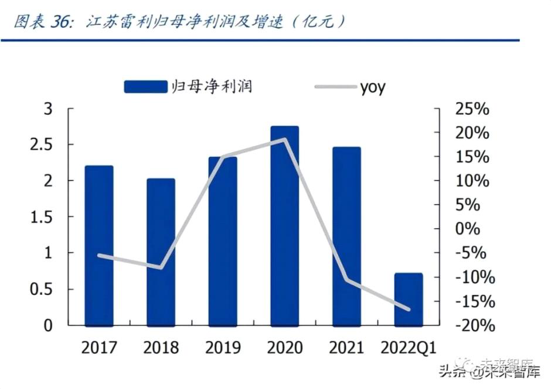

# 三重点公司分析
====================

**3.1 江苏雷利：中高端微特电机领军企业**

公司是全球家用微特电机领军企业，通过外延并购切入医疗器械、新能源汽车零部件、 工控等高景气赛道，打开新的成长空间。通过横向拓展应用领域，公司 2021 年实现收 入 29.2 亿元，同比增长 20.5%，收入增速边际改善。公司经过多年经营，已成为全球 知名的微特电机供应商。公司借鉴海外龙头经验，通过并购等方式切入医疗器械、新能 源、工控等高端应用场景。2021 年公司"多应用领域"战略成效显著，实现了工控市场 的重大突破，同时新能源、医疗器械领域也取得快速增长，实现营业收入 29.2 亿元，同 比增长 20.5%，收入增速边际改善。

 

家用电机为基本盘，工控、医疗、新能源等高毛利产品快速放量。公司基本盘为家用电 机及组件，包括空调、冰箱、洗衣机等电机和组件，2021 年家用电机及组件（空调+冰 箱+洗衣机）收入为 16.4 亿元，占总收入比重 64.0%。工控产品主要为丝杆电机、无刷 电机及组件，主要应用于工业设备的阀门电机等，2021 年实现收入 2.95 亿元，同比增 长 60%。汽车零部件主要为汽车水泵、汽车电机及冲压件，医疗及运动健康电机及组件 主要为丝杆电机、跑步机电机及组件。从毛利率来看，工控、医疗等产品相较于传统家 电产品毛利率更高，有利于公司产品结构优化。

**3.2 鸣志电器：混合式步进电机龙头，加码无刷电机打造解决方案供应商**

公司是全球领先的电机及驱动系统制造商，在步入电机、伺服系统、无刷电机、空心杯 电机及驱动系统等方面实现了深入布局。其中混合式步进电机产品在全球市场一直享有 较高的市场地位，占据全球 10%以上市场份额，打破了日本企业对混合式步进电机的垄 断。从股权结构看，公司实控人为常建鸣先生，持有鸣志投资 90%股权，目前公司已形 成了以控制电机、驱动控制系统为核心，贸易代理及工业互联网等业务协同发展的业务 架构，其中鸣志国贸和鸣志美洲控股等核心子公司加速了公司全球范围内的业务布局。

业绩稳定增长，2021 年增长提速。公司深耕运动控制领域二十余年，业绩增长稳健， 2017-2020 年营业收入 CAGR 为 10.8%，归母净利润 CAGR 为 6.6%。2021 年公司布局 的工厂自动化、医疗器械、生化分析、移动服务机器人等新兴、高附加值领域业务成效 显著，通用自动化、驱动控制系统类业务也取得快速成长，实现营业收入 27.1 亿元，同 比增长 22.7%；实现净母净利润 2.8 亿元，同比增长 39.3%。2022 年以来受疫情影响， 业绩增速有所下滑。

 

加码无刷电机，公司着力打造电机与丝杠一体化设计的模块化产品，优势明显。2020 年，公司通过变更募集资金投资约 0.62 亿元设立"无刷电机的新增产能项目"，项目达 产后将形成新增年产 227 万台高标准无刷电机的生产能力，预计将为公司新增营业收入 约 2.5 亿元/年。2021 年公司无刷电机业务实现营收 1.1 亿元，同比增长 81.5%，主要 源于产能的稳步提升以及得益于在移动服务机器人、高端医疗仪器等应用领域的增长。此外，公司自 2015 年开始组建精密直线传动系统业务，专注于打造电机与丝杠一体化 设计的模块化产品，目前公司精密直线传动系统业务聚焦重点行业，努力扩大存量市场 份额，通过持续完善平台化产品在增量市场上获得竞争优势，2021 年公司精密直线传动 系统业务实现营业收入 7310 万元，较上年同期增长 73.6%。整体看，公司"运动控制 器+电机驱动器+控制电机+精密直线传动系统"的组合形成了完整的运动控制业务系统， 标志着公司在自动化领域真正向解决方案级供应商的目标迈进。

（本文仅供参考，不代表我们的任何投资建议）

 

**来源 \| 未来智库**

**排版 \| 麦子**\
 

 

\-\-\-\-\-\-\-\-\-\-\-\-\-\-\-\--END\-\-\-\-\-\-\-\-\-\-\-\-\-\-\-\-\-\--

 

[]{.underline}[]{.underline}

 

**更多精彩**

[＊机器人+纺织真的是一门好生意吗？]{.underline}\
 

[＊雷军跟马斯克学"做人"，小米首款人形机器人是「商业操作」还是「技术延伸」？]{.underline}

[＊继大疆之后，这个拥有万亿级市场的空中赛道，有望颠覆世界交通！]{.underline}

[＊遨博在淄博市建立协作机器人生产基地，将进一步建立协作机器人产业链智慧工厂]{.underline}

[＊世界机器人大会 \| 协作机器人新势力强势来袭，后发先至背后秘诀全幕揭露！]{.underline}

[＊宇树亮相2022世界机器人大会，130只机器狗现场表演，背后彩蛋大揭秘]{.underline}

[＊2022世界机器人展｜达闼重磅发布智能执行器2.0和双臂机器人]{.underline}

[＊家庭服务机器人的切入点到底在哪？1999元，支持语言交互，商汤找到了吗？]{.underline}

[＊iRobot被收购，中国企业要背锅？挤泡沫后，服务机器人行业崛起正当时]{.underline}\
 

[＊零部件价格上调，引发明显连锁效应，2022机器人涨价风暴正在形成！]{.underline}

[＊定了！核酸检测机器人第三类医疗器械单独注册，全新采购法发布]{.underline}

[＊"轮腿"技术增强自控力，漫步车有望在火星"撒点野"]{.underline}

[＊视比特｜AI+3D视觉快递包裹分拣机器人，助力物流行业智能化升级]{.underline}

[＊一造科技｜发布全球首台元宇宙3D打印机]{.underline}

[＊一睹为快｜艾利特展示工站全在这了！]{.underline}

[＊协作移动机器人概念全新解析，软件赋能，开放未来]{.underline}

[＊"传统x科技"的碰撞 艾灸智能理疗新突破]{.underline}

[＊干货满满，KUKA AMR如何实现360°安全"小心机"？]{.underline}

[＊"稳"赢"芯"机遇∣节卡机器人牵手半导体龙头 构建中国智造"芯"格局]{.underline}

[＊活检交给机器人，你敢吗？天津大学等团队研发"小胶囊"采集样本稳准狠]{.underline}

 

 

**加入社群**

**欢迎加入【机器人大讲堂】读者讨论群， **共同探讨机器人相关领域话题，共享前沿科技及产业动态。

 

教育机器人、医疗机器人、腿足机器人、工业机器人、服务机器人、特种机器人、无人机、软体机器人等专业讨论群正在招募， 关注机器人大讲堂公众号，发送" **交流群 **"获取入群方式！

 

**招募作者**

机器人大讲堂正在招募【兼职内容创作者】，如果您对撰写机器人【科技类】或【产业类】文章感兴趣，可**将简历和原创作品投至邮箱： **[LDjqrdjt@163.com]{.underline}  

 

我们对职业、所在地等没有要求，欢迎朋友们的加入！

 

 

 

 

 

 \
 \
\
 

看累了吗？戳一下"在看"支持我们吧！

预览时标签不可点

 

微信扫一扫\
关注该公众号

[知道了]{.underline}

 

微信扫一扫\
使用小程序

[取消]{.underline} [允许]{.underline}

[取消]{.underline} [允许]{.underline}

： ， 。   视频 小程序 赞 ，轻点两下取消赞 在看 ，轻点两下取消在看 [\<From: https://mp.weixin.qq.com/s/3y7WJ5QWURhbpRfAz7XccQ\>]{.underline}
RfAz7XccQ\>]{.underline}
