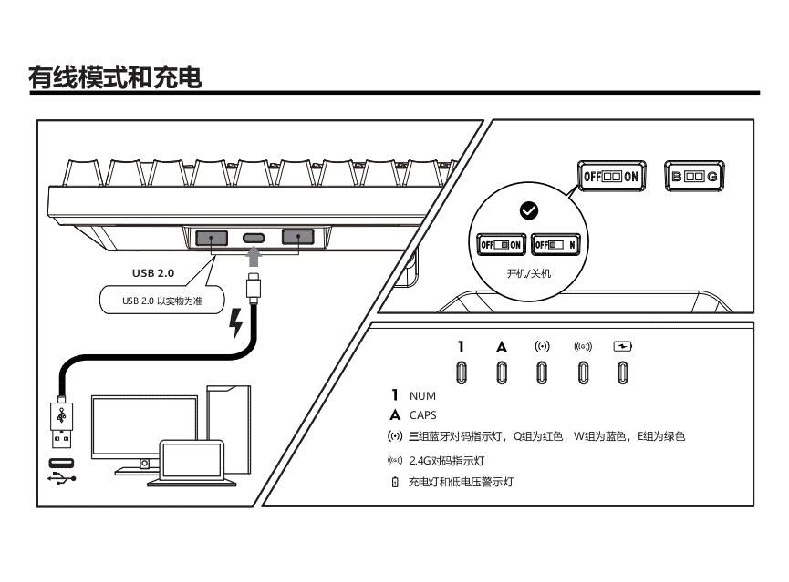
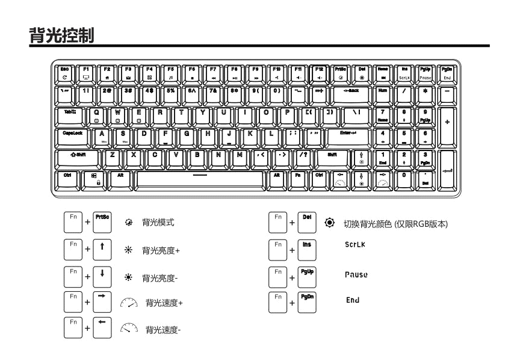

# 机械键盘设置

RK机械键盘-说明书

 

 

 

 

 

 

 

 

 

 

 

科普：什么是按键宏录制？ 通过按键宏录制，可实现一个按键自动完成多个按键的触发。例如：普通模式下游戏技能需要依次按下多个按键来实现，但通过宏录制，可以让一个按键自动连续操作，大大提升游戏的操作性能。

 

Fn+A/S Win和IOS系统切换

 

Fn+Tab 开启/关闭宏按键

按键宏录制仅在游戏模式下生效，使用前请切换至游戏模式

 

Fn+Z/X/C 支持三组按键宏录制/切换

长按3秒：设置按键宏录制 短按：开启/关闭相应的按键宏录制。

 

按键宏录制方法：

按下Fn+Tab开启宏按键

选择一组按键宏录制，比如Fn+Z。

长按Fn+Z三秒，此时指示灯持续闪烁，表示已进入宏录制。（若无反应，则表示未正确进入游戏模式，请重复步骤一）

依次点击需要录制的按键触发顺序，最多支持32连击。

再次长按Fn+Z三秒，此时指示灯停止闪烁，则表示已保存并退出。

以此类推，重复以上步骤，Fn+Z/XC 可设置三组不同的按键宏录制。

如何使用已录制好的按键宏录：

按下Fn+TAB开启宏按键

选择Z/X/C三组中已设置好的宏按键，点击即可触发对应宏按键功能。

其他按键功能

Fn+空格 长按3秒，恢复出厂设置

Fn+Win 关闭/开启Win键

Fn+Caps Caps/左Ctrl互换

Fn+Tab 开启/关闭宏按键

 

\<\<RK100.pdf\>\>

 
