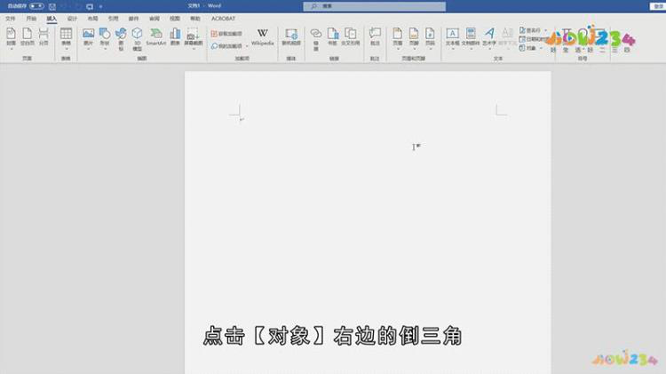
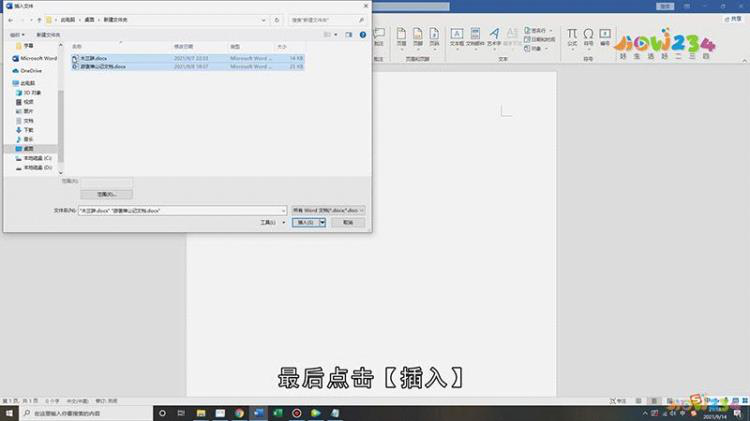

# word合并方法

2023年3月18日

12:13

 

首先在桌面上新建一个空白文件夹，把需要合并的两个word文档拖进文件夹，然后再打开一个word空白文档，在主页菜单中选择【插入】，然后找到【对象】，点击【对象】右边的倒三角；

 

并在下拉菜单中选择【文件中的文字】，在弹出的【插入文件】对话框中，点击左侧的【桌面】，找到存放两个word文档的【新建文件夹】，选中第一个文档后再按【ctrl+A】全选，最后点击【插入】，这样就将两个word文档合并到一起了；

 
