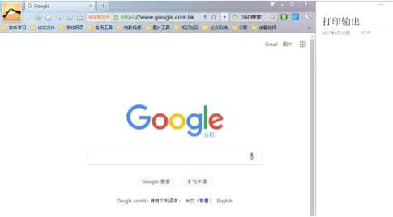
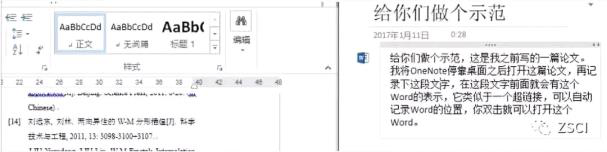
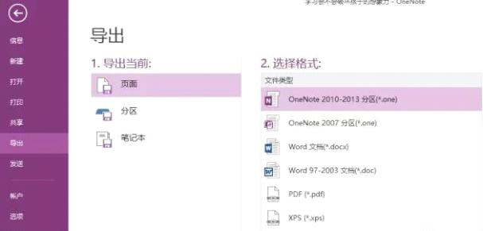
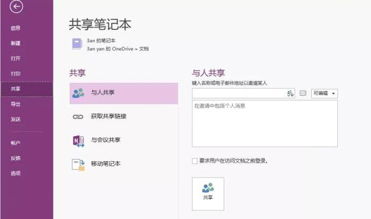
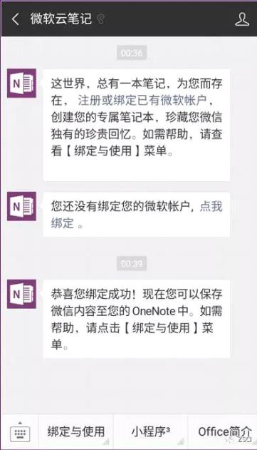
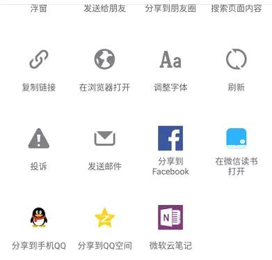
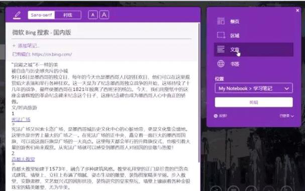

# 11个功能介绍

2022年9月19日

13:40

 

**自动停靠到桌面**

OneNote 直接给我们提供了停靠到桌面的功能

你可以单击【视图】-【新建停靠窗口】

 

**光学字符识别**

截取下你需要的部分图片，插入 OneNote，右击图片-【复制图片中文本】，就可以实现自动将图片上的文字变为文本。

**自动记录文件地址**

比如：我之前写的一篇论文，我现在想在 OneNote 中记录下当时写论文时的思路，只要打开这篇论文并且将 OneNote 停靠桌面，你在 OneNote 中记录时，OneNote 就会自动记录下你的论文地址，并且生成一个 Word 图标，这个类似于超链接，你双击就可以打开这篇论文了。

 

**将笔记导成 Word 或者 PDF**

方法：选中【笔记】→【点击文件】→【选择需要导出的格式导出】

 

**多人协作笔记**

 

**将资料导入到 OneNote**

**①微信篇：微信关注公众号「微软云笔记」**

关注微软官方的公众号后，绑定你的微软账号。

看到需要做笔记的微信文章，点击右上角，点击微软云笔记即可同步保存到你的 OneNote。

 

 

 

**②网页篇：Chrome 扩展插件**

onenote 有一款好用的插件\-- Clip toOneNote，这个插件可以帮你一键摘取任何网页中的内容到 OneNote。

这款插件提供了四种模式供你选择：

「整页」模式相当于长截图，会自动帮你把整个网页的内容保存成长图；

「区域」模式下你可以根据需要自定义截取图片；

「文章」模式会帮你提取网页的文字图片，整理成一篇文章；

「书签」模式会帮你保存网页地址。

 
