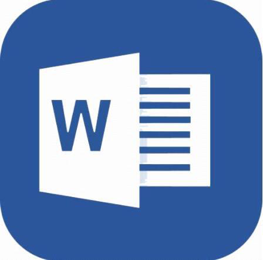

# word文档域有哪些功能

Word文档域有哪些功能

星期四, 十二月 15, 2022

12:40 下午

 

已剪辑自: [https://www.i8ku.com/2022/47318.html]{.underline}

　　对于word大家都不会陌生，不过很多朋友还是对word的域功能不太了解，下面小编为大家介绍下word域主要有哪些功能。

 

　　一、利用域代码实现个性化功能

　　Word除了以功能命令的方式使用域以外，用户还可以使用域代码实现许多个性化功能。

　　1.设置特殊页码

　　（1）一页两版文档的页码设置

　　机关的公文和学校的试卷页面一般分为两栏，每栏算作文档的一页并在其下方印刷页码和页数。

　　假如你想让页码和页数的计算"自动化"，可以将光标插入第一页（其实是第一页的左栏）下面的"第页"中间。按下Ctrl+F9组合键2次插入域特征字符"{{}}"，然后输入"={Page}\*2-1}"。按照相同方法，在第二页（其实是第一页的右栏）下面输入"{={Page}\*2}"。

　　以后凡是页面左边一栏下面的页码，均按"{={Page}\*2-1}}"的格式输入；而页面右面一栏下面的页码，则按"{={Page}\*2}"的格式输入。即奇数栏下面的页码等于当前页数乘2减1，而偶数栏下面的页码等于当前页数乘2。当页码全部输入完毕后，选中页脚中的任意一个页码，用鼠标右键单击并在出现的菜单中选择"更新域"命令，即可在每页的"第页"内显示正确的页码。

　　如果你要在"共页"直接插入总页数，可以按上面介绍过的方法在"共页"中间插入"{={SectionPages}\*2}"，当你执行"更新域"操作后，即可显示"共x页"字样。

　　（2）同一页面的两种页码设置

　　报告或论文集是由许多篇文档汇集而来，既需要说明某一页在当前文档中的页码，又需要说明该页在整个文集中的页码，这就出现了同一页面设置不同页码的情况，利用域很容易解决这个问题。

　　假如某文档在文集中的起始页码为66（即自身的页码序列是1），那么它在文集中的页码和在文档中的页码可以按以下步骤设计：

　　首先单击"视图→页眉和页脚"菜单命令，然后在页面中让光标停留在页眉处，输入"第页"。将光标移动到"第页"中间按下Ctrl+F9键输入"{ }"，接着在{ }中间输入"Page"，按下Shift+F9组合键即可获得该页在文档中的页码设置。

　　接下来把光标移动到页脚，先输入"总第页"字样，在把光标移动到"页"字前面。连续按下Ctrl+F9组合键2次插入域特征字符"{{}}"。然后把域代码写成"{=65+{Page}}"，更新后即可获得该页在文集中的页码"总第66页"。

　　只要文集中的每一篇文档都照此办理，就可以每一页在文档中的页码以及在文集中的页码了。

　　2.显示文档信息

　　（1）显示文档的名称和位置

　　在局域网或公用电脑上存储的文件往往很难知道它的保存位置，利用域代码就能很快显示出相应的信息。先将光标移动到需要显示文档名称和位置处，单击"插入→域"菜单命令，在出现的对话框中的"类别"下拉列表中选择"文档信息"选项，在"域名"下拉列表中选择"FileName"域。然后选中"域选项"下的"添加路径到文件名"选项，单击"确定"按钮即可在光标位置看到完整的文件名及其路径了。

　　注意：如果是一篇还处于编辑状态，并没有保存的文档，即使按上述方法操作也只能显示文档的名称，必须将它保存后在文档名称处单击鼠标右键，在出现的菜单中选择"更新域"命令方可正确显示文档名称和保存路径。

　　另外，你也可以在光标插入位置按下Ctrl+F9组合键插入域特征字符"{}"，然后输入"FileName \\p"域代码，按下Shift+F9组合键更新域，就可以看到文件名及其完整路径了。

　　（2）即时显示文档大小

　　假如你想在编辑文档时看到它的大小，可以在文档的页眉或其他位置输入"文档大小：K字节"字样，然后把光标移动到"K"字符前。按下Ctrl+F9组合键插入域特征字符"{}"，然后输入"FileSize k"（"FILESIZE"后要输入一个空格），其中"k"表示以千字节为单位来显示文档大小，最后选中已经输入的域代码更新即可看到结果。如果要以兆字节为单位来显示文档大小，只要把域代码中的开关由"k"改为"m"即可。

　　（3）显示文档中的字符数

　　编写文档过程中，用户常常需要及时了解文档的字符数。如果在文档中插入统计文档字符数的域代码，一旦文档的字符数量发生了变化，用户只要更新域即可显示出结果。先在光标位置输入"字符数："字样，将光标移至冒号后按下Ctrl+F9组合键插入域特征字符"{}"，然后输入"NumChars"，更新后即可看到当前文档的字符数。如果要在文档中显示文档的字数，只需在域特征字符内输入"NumWords"即可。

　　（4）显示文档模板名称和路径

　　任何一个Word文档都是建立在模板基础上的，Word允许用户创建和使用各种模板。如果在文档中显示所用的模板名称和路径，可以给文档管理和交流带来很大方便。在光标位置输入"文档模板名称和路径："字样，将光标移至冒号后按下Ctrl+F9组合键插入域特征字符"{}"，然后输入"Template \\p"（开关"\\p"表示显示模板文件的路径），更新后即可看到当前文档模板的名称和路径。

　　（5）自动更新文档日期和时间

　　某些文档要求记录送交或打印的日期和时间，采取手工输入的方法不仅欠准确，而且操作也比较麻烦。为此，你可以在文档的某一位置插入"文档完成日期和时间："字样，按下Ctrl+F9组合键插入两个域特征字符，并分别输入"Time \\@ "yyyy'年'M'月'd'日'""和"Time \\@ "AMPMh时m分""，更新后即可看到相应的效果。

　　采用上面的方法插入文档的日期和时间，如果希望每次打印时都能自动更新，可以单击"工具→选项"菜单命令，在出现的对话框中单击"打印"选项卡，把"打印选项"中的"更新域"选项选中即可。

　　3.信息输入自动化

　　（1）设置输入提示语

　　多人合作编写的文档定稿后需要输入姓名等文字，"Fill-in"域可以在文档中设置输入提示语，从而方便用户的输入。

　　单击"插入→域"菜单命令，在出现的对话框中先单击"类别"下拉列表，选择"邮件合并"选项，然后在"域名"列表中找到"Fill-in"。在对话框的"域属性"、"提示"框内输入"请填写姓名"之类的文字，选中"对提示的默认反应"选项，并在后面的框中输入相同文字。单击"确定"按钮完成。

　　此后，用户可以单击"请填写姓名"，然后在其中输入指定的内容，完成后删除其中不需要的文字即可。也可以用鼠标右键单击"请填写姓名"，在出现的菜单中选择"更新域"就会弹出对话框让你输入具体内容。

　　（2）使用域代码给公式编号

　　许多人编辑文档中的公式一直采用手工编号方法，它的最大缺点是一旦增加或删除了公式，所有的编号就需要重新修改一遍。利用"Seq"域可以实现文档公式的自动编号，而且可以在文档的其他地方引用。

　　假如我们要在公式后面插入"（1）"这样的编号，可以采用以下方法：先输入括号并将光标放在其中间，然后按下Ctrl+F9组合键插入域特征字符"{}"，输入"SEQ tp"。其中"tp"为标识符，它的用途是为要编号的项目指定的名称。该名称必须以字母开头，可以含有字母、数字和下划线，但不能超过40个字符也不能使用中文。输入完成后只要按下F9键，则编号"（1）"就会显示在公式后面。接下来重复上面的操作，就可以给公式顺序编号（2）、（3）、（4）、（5）了。

　　（3）自动插入页首标题

　　如果你的文档需要在每一页的页眉打印具有"标题 3"级别的标题，可以采用"StyleRef"域。单击"视图→页眉和页脚"菜单命令，进入页眉编辑状态。按下Ctrl+F9组合键插入域特征字符"{}"，输入"StyleRef "标题 3""，更新后每一页文档中第一个"标题3"级别的标题就会出现在页眉中。如果你要打印其他级别的标题或内容，只需修改域开关（"标题 3"）中的内容即可。

　　至于当前文档存在何种样式，可以打开"样式和格式"任务窗格，在"显示"下拉列表中选择"有效样式"，即可从"任务窗格"中看到。

　　（4）制作字典式页眉

　　字典式页眉可在每一页的顶部打印页的第一和最后一个文本，如人员名单中的第一个和最后一个姓名。单击"视图→页眉和页脚"菜单命令，进入页眉编辑状态。单击"插入→域"菜单命令，在出现的对话框中单击选中"类别"下的"链接和引用"，在"域名"下找到"StyleRef"域，单击"选项"按钮，打开"域选项"对话框。选中"样式"选项卡下的"默认段落字体"选项，单击"添加到域"按钮。

　　然后按相同方法操作一次，在"确定"之前请单击"域代码"按钮，在出现的对话框中再单击"选项"按钮。选中"域选项"对话框"域专用开关"选项卡中的"\\l"，单击"添加到域"按钮，完成后单击"确定"关闭对话框即可。其中域开关"\\l"可以使此域从页的底部开始寻找第一个"默认段落字体"样式的文本。

　　此后该页中第一个回车符前和最后一个回车符前的文本就会被添加到页眉中。

　　（5）自动插入"自动图文集"词条

　　通常情况下我们都是使用"插入→自动图文集"菜单命令向文档插入词条，下面让我们自动给文档插入"自动图文集"词条。

　　假设你的文档中定义一个名为"手指"的自动图文集词条（可以是文字也可以是图片），你只要在文档的合适位置按下Ctrl+F9组合键插入域特征字符"{}"，输入"AutoText "手指""，更新后即可在光标位置看到自动图文集词条。域代码引号中的"手指"是你定义好的自动图文集词条。

　　4.文档特殊格式

　　（1）正规分数格式

　　对于正规的数学试卷或论文等文档，分数不能采用"3/5"这种格式，必须使用这种正规的分数格式。如果你感觉调用公式编辑器有点大材小用，可以使用"EQ"域实现。首先在光标处按下Ctrl+F9组合键插入域特征字符"{}"，输入"EQ \\f（3，5）"，域代码中的"f（，）"是EQ域的分数开关，"，"前后的两个字符分别位于分数线的上下。域代码"{ EQ \\f（3，5） }"更新后的结果就是。

　　（2）概括结构图

　　在物理、语文等学科知识的讲解中，常常需要创建如""的概括结构图。常规方法不容易使各行文字排列的很紧密，利用EQ域就可以达到比较完美的效果。首先在光标处按下Ctrl+F9组合键2次，插入域特征字符"{{}}"，输入"EQ 牛顿第一定律 \\b \\lc\\ {（\\a \\al \\co （牛顿第一定律，牛顿第二定律，牛顿第三定律））"。其中"\\a \\al \\co 牛顿第一定律，牛顿第二定律，牛顿第三定律）"可以使三大定律排成一个单列三行的数组。关键在于开关"\\b \\lc\\{（）"，其中"\\b"是括号开关，默认用圆括号扩住"（）"内的对象。而开关"lc\\{"修改\\b开关，使默认的圆括号变为左大括号"{"，从而产生上面所示的效果。这种方法的好处是相关文字是一个整体，不会像绘图工具那样发生文字对不齐的问题。

　　二、利用域在Word中实现计算功能

　　为了方便用户在表格中执行求和、求平均值等常规计算，在Word提供了SUM等18个函数，这种功能也是通过域实现的。

　　1.计算表格行或列

　　（1）计算表格行

　　假如需要计算表格行数据的平均值，如果存放计算结果的空白单元格在数据行的右边，可以把光标插入紧靠数据右端的空白单元格。按下Ctrl+F9组合键把域特征字符"{}"插入单元格，然后在大括号中间输入"=Average（left）"，完成后按下F9键更新，即可获得计算结果。

　　如果存放计算结果的空白单元格位于数据行的左边，只须按上述方法在紧靠数据左边的单元格中插入公式"=Average（right）"即可。

　　（2）计算表格列

　　计算表格列的方法和计算表格行非常相似，如果我们要计算某列中所有数据的平均值，而存放计算结果的空白单元格位于数据上面。只要按上述方法在其中插入公式"=Average（above）"，然后更新即可获得结果。如果存放计算结果的空白单元格位于数据下面，只要把公式修改为"=Average（below）"即可。

　　如果需要执行的计算是求和、寻找最大值、最小值等，只要把上述公式（域代码）中的函数名称改为Sum、Max和Min等即可。如果所计算的行或列中含有英文字母和汉字，则计算中均把它们当作"0"处理。

　　2.计算任意单元格

　　假如计算对象不是存放在连续的数据行或列中，我们可以把表格看成一个Excel表格，也就是表格左边第一列是A列、第二列是B列......，表格自上而下分别是第1行、第2行......。再按照类似Excel的公式构造原则进行计算，下面以Sum函数和If函数为例进行介绍。

　　（1）对任意单元格求和

　　假设表格第一行左起第一至三单元格（即A1、B1、C1）存放着"36 580"、"18 580"和"26 980"，第二行第三个单元格（即C3）存放着"52 360"，第四行第五个单元格（即E4）存放着"36 190"。你只需在存放计算结果的单元格中输入"{=Sum（A1:C1，D2，E4）}"，更新域后即可获得计算结果。如果被计算的数据发生了变化，只要对域进行更新就可以获得正确的结果。

　　（2）If函数的判断求和

　　表格的第一列（A）存放着"姓名"，第二列（B）存放着"岗位工资"的数值，第三列（C）存放着"技能工资"的数值。假如"岗位工资"高于1 800元的员工需要额外加上200元的补贴，可以在第四列的空白单元格中输入"{=If（B2》1800，Sum（B2:C2，200），Sum（B2:C2））}"。该公式经过更新以后，若B2、B3等单元格中的数值大于1 800，则执行"Sum（B2:C2，200）"，也就是将B2、C2中的数值和200相加；若B2、B3等单元格中的数值小于1 800，则执行"Sum（B2:C2）"，也就是将B2、C2中的数值相加。

　　注意：除上面介绍的方法在单元格中插入公式（域代码）以外，还可以单击"表格→公式"菜单命令，在出现的对话框中进行设置；或者打开"域"对话框选中"域名"下的"Formula"项，再单击"公式"按钮，都可以打开"公式"对话框插入所需的公式。

　　以上内容便是word域的主要作用了，大家了解了吗？如果大家常用office的话，可以关注office学习网，里面有更多的精彩教程带给大家。
