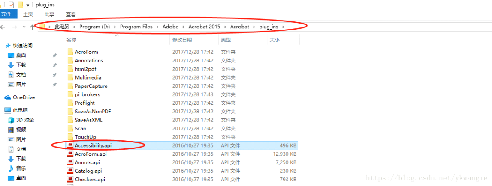

# adobe_acrobat_pdf文件翻页时卡顿

Adobe Acrobat PDF文件，翻页时卡顿

2023年9月17日

15:01

 

-   删除特定的整合API

进入到Adobe Acrobat的安装目录

一般是C:\\Program Files\\Adobe\\Acrobat \<version number\>\\Acrobat\\plug\_ins

删除accessibility.api

重启Adobe Acrobat

 

 
 
