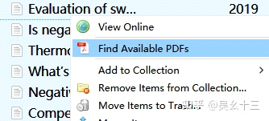

英文文献批量导入Zotero

2022年11月12日

2:40

 

使用情形：

要开题了或者想要了解某个领域，手中有一篇综述Review(只要是文章都行)，觉得在文章的参考文献References，一篇一篇手动去查找再下载非常麻烦。

 

使用工具：

网站：Connected Papers \| Find and explore academic papers

2\. 软件：Zotero

 

步骤：

打开网站，输入文献查找即可；或者在Zotero进行如下操作，这个界面怎么出来的可见另一篇文章。

2\. 在网站上点击Download，即可下载所有相关文献的bib。

 

3\. 在Zotero→file→Import将bib导入，两个Import选项都可。

 

4\. 选中导入的所有条目，右键选择Find available PDFs，即可获得(下载)所有文献。

 
